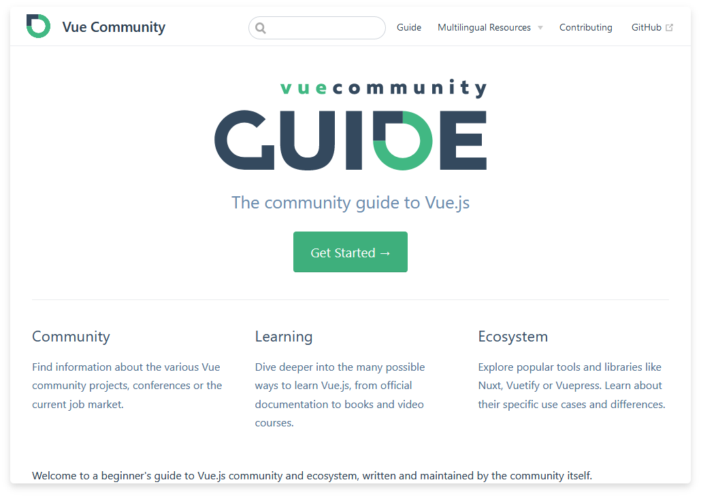
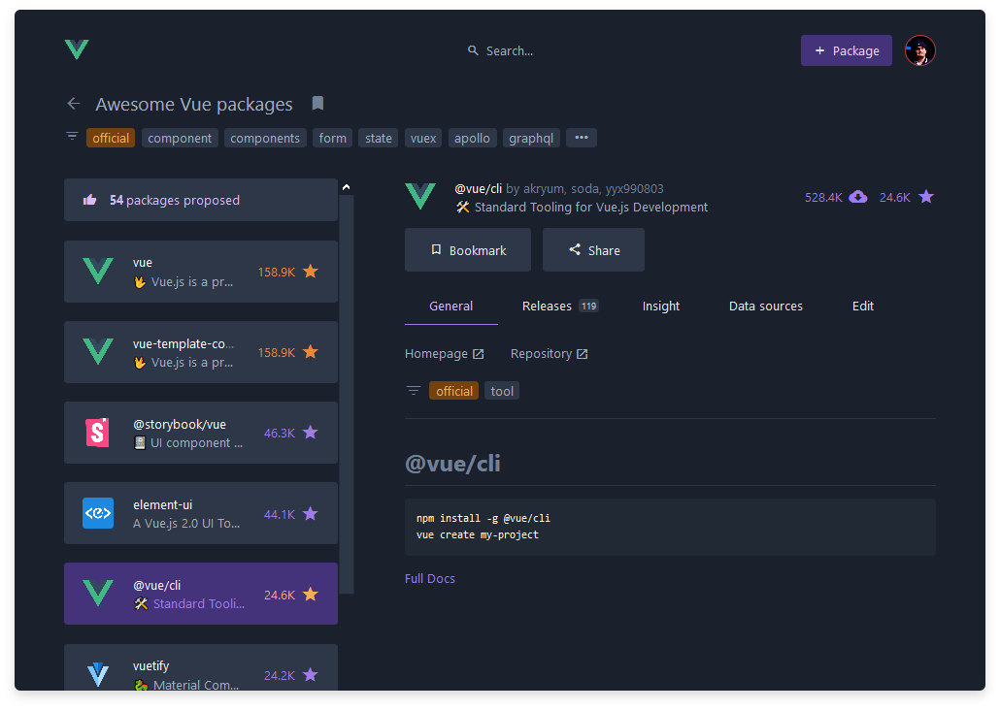

   
  
   
   

## Awesome Vue.js 

# [Vue Community Guide](https://vue-community.org/)

Find resources about the Vue community, learning and the ecosystem.

- [Meetups & Events](https://vue-community.org/guide/community/meetups.html)
- [Social Media](https://vue-community.org/guide/community/social-media.html)
- [Job Market](https://vue-community.org/guide/community/job-market.html)
- [Articles & Tutorials](https://vue-community.org/guide/community/vue-3.html)
- [Learning Vue](https://vue-community.org/guide/learning/official-documentation.html)
- [Online Courses](https://vue-community.org/guide/learning/learning-platforms.html)
- [Video Cources](https://vue-community.org/guide/learning/courses.html)
- [Books](https://vue-community.org/guide/learning/books.html)
- [Blogs](https://vue-community.org/guide/learning/blogs.html)
- [Podcasts](https://vue-community.org/guide/learning/podcasts.html)
- [Code editors & Tools](https://vue-community.org/guide/ecosystem/editors-and-tools.html)
- [Boilerplates](https://vue-community.org/guide/ecosystem/boilerplates.html)
- [Documentation Platforms](https://vue-community.org/guide/ecosystem/documentation.html)
- [Hosting](https://vue-community.org/guide/ecosystem/hosting.html)
- [Build tools](https://vue-community.org/guide/ecosystem/build-tools.html)
- [Projects worth mentioning](https://vue-community.org/guide/ecosystem/projects-worth-mentioning.html)

# [AwesomeJS Vue](https://awesomejs.dev/for/vue/)

Crowdsourced packages and libraries collections for Vue. Find the right libraries or components for your project!

- [Vue packages](https://awesomejs.dev/for/vue/)
- [Vue CLI packages](https://awesomejs.dev/for/vue-cli/)
- [Vue packages](https://awesomejs.dev/for/vue/)
- [Nuxt packages](https://awesomejs.dev/for/nuxt/)
- [Vuepress packages](https://awesomejs.dev/for/vuepress/)
- [Gridsome packages](https://awesomejs.dev/for/gridsome/)

 
 
 

