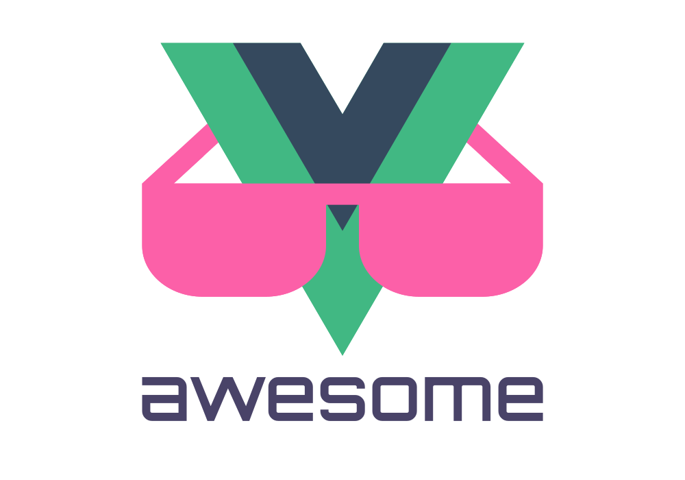

   
  
   
   

## Awesome Vue.js 

> A curated list of awesome things related to Vue.js

- [Resources](#resources)
    - [Official Resources](#official-resources)
    - [External Resources](#external-resources)
    - [Job Portal](#job-portal)
    - [Community](#community)
    - [Conferences](#conferences)
    - [Podcasts](#podcasts)
    - [Youtube Channels](#youtube-channels)
    - [Official Examples](#official-examples)
    - [Tutorials](#tutorials)
    - [Examples](#examples)
    - [Books](#books)
- [Projects Using Vue.js](#projects-using-vuejs)
  - [Open Source](#open-source)
  - [Commercial Products](#commercial-products)
  - [Apps/Websites](#appswebsites)
  - [Interactive Experiences](#interactive-experiences)
  - [Enterprise Usage](#enterprise-usage)
  - [A11y](#a11y)
- [Components & Libraries](#components--libraries)
  - [UI Components](#ui-components)
    - [Table](#table)
    - [Notification](#notification)
    - [Loader](#loader)
    - [Progress Bar](#progress-bar)
    - [Tooltip](#tooltip)
    - [Overlay](#overlay)
    - [Parallax](#parallax)
    - [Icons](#icons)
    - [Menu](#menu)
    - [Carousel](#carousel)
    - [Charts](#charts)
    - [Time](#time)
    - [Calendar](#calendar)
    - [Map](#map)
    - [Audio / Video](#audio--video)
    - [Infinite Scroll](#infinite-scroll)
    - [Pull-to-refresh](#pull-to-refresh)
    - [Markdown](#markdown)
    - [PDF](#pdf)
    - [Tree](#tree)
    - [Social Sharing](#social-sharing)
    - [QR Code](#qr-code)
    - [Search](#search)
    - [Miscellaneous](#miscellaneous)
    - [Tabs](#tabs)
    - [Form](#form)
      - [Picker](#picker)
        - [Date Picker](#date-picker)
      - [Select](#select)
      - [Slider](#slider)
      - [Drag and Drop](#drag-and-drop)
      - [Autocomplete](#autocomplete)
      - [Type Select](#type-select)
      - [Color Picker](#color-picker)
      - [Switch](#switch)
      - [Masked Input](#masked-input)
      - [Rich Text Editing](#rich-text-editing)
      - [Image Manipulation](#image-manipulation)
      - [File Upload](#file-upload)
      - [Context Menu](#context-menu)
      - [Miscellaneous](#miscellaneous-1)
      - [CSV](#csv)
      - [Comment System](#comment-system)
    - [Canvas](#canvas)
    - [Link Preview](#link-preview)
    - [Tour](#tour)
  - [UI Layout](#ui-layout)
  - [Frameworks](#frameworks)
    - [Responsive](#responsive)
    - [Mobile](#mobile)
    - [Component Collections](#component-collections)
    - [Admin Template](#admin-template)
    - [Server-side rendering](#server-side-rendering)
    - [Static website generator](#static-website-generator)
    - [Other](#other)
  - [UI Utilities](#ui-utilities)
    - [Event Handling](#event-handling)
    - [Responsive Design](#responsive-design)
    - [Form](#form-1)
      - [Validation](#validation)
    - [Scroll](#scroll)
    - [Routing](#routing)
    - [Lazy Load](#lazy-load)
    - [Pagination](#pagination)
    - [Animation](#animation)
    - [Meta Tags](#meta-tags)
    - [Portal](#portal)
    - [Filters](#filters)
    - [SVG](#svg)
    - [Miscellaneous](#miscellaneous-2)
    - [WebGL](#webgl)
    - [Page Visibility](#page-visibility)
    - [Printing](#printing)
  - [Utilities](#utilities)
    - [Typescript](#typescript)
    - [HTTP Requests](#http-requests)
    - [i18n](#i18n)
    - [Custom Events](#custom-events)
    - [Persistence](#persistence)
    - [State Management](#state-management)
      - [Redux](#redux)
      - [Mobx](#mobx)
      - [Vuex Utilities](#vuex-utilities)
    - [GraphQL](#graphql)
    - [Concurrency Management](#concurrency-management)
    - [Code Style](#code-style)
    - [CSS](#css)
    - [Asset Management](#asset-management)
    - [Page Navigation](#page-navigation)
    - [Miscellaneous](#miscellaneous-3)
    - [Web Workers](#web-workers)
    - [JSX](#jsx)
    - [Migration](#migration)
    - [Web Sockets](#web-sockets)
    - [Payment](#payment)
      - [Stripe](#stripe)
      - [Plaid](#plaid)
  - [Integrations](#integrations)
  - [Dev Tools](#dev-tools)
    - [Inspect](#inspect)
    - [Docs](#docs)
    - [Test](#test)
    - [Source Code Editing](#source-code-editing)
      - [Atom](#atom)
      - [Sublime Text](#sublime-text)
      - [Vim](#vim)
      - [Visual Studio](#visual-studio)
      - [Brackets](#brackets)
      - [Intellij](#intellij)
      - [Emacs](#emacs)
      - [Kate](#kate)
  - [Scaffold](#scaffold)
    - [Client](#client)
    - [Universal](#universal)
    - [Server](#server)
    - [Electron](#electron)
    - [Parts](#parts)
  - [Runtime](#runtime)
    - [Command Line / Terminal](#command-line--terminal)
  - [Prerendering](#prerendering)

# Resources

### Official Resources

- [Official Guide](http://vuejs.org/guide/)
- [API Reference](http://vuejs.org/api/)
- [GitHub Repo](https://github.com/vuejs/vue)
- [Release Notes](https://github.com/vuejs/vue/releases)
- [Style Guide](https://vuejs.org/v2/style-guide/)
- [Vue.js News](https://news.vuejs.org/)

### External Resources

- [Vue.js資料まとめ(for japanese)](https://gist.github.com/hashrock/f575928d0e109ace9ad0) by @hashrock
- [Vue.js Newsletter](http://vue-newsletter.com/) - Weekly dose of handpicked Vue.js news
- [Vue.js Tips](http://vuetips.com) - Tips to become a better Vue.js developer
- [Vue.js Wikipedia](https://en.wikipedia.org/wiki/Vue.js)
- [Vue.js Radar](https://www.vuejsradar.com) - Curated newsletter + site covering new Vue.js releases/contributions.
- [Vue News](https://vuenews.io) - Social website focusing on the latest Vue.js news and information.
- [Vue Curated Resources](https://hackr.io/tutorials/learn-vue-js) - Recommended Vue.js courses and tutorials.
- [BuiltForVue](https://builtforvue.com) - NPM Mirror of all Vue.js components and packages.

### Job Portal

- [Vue.js Jobs - VueJobs](https://vuejobs.com/) - A Vue.js job portal to hire or get hired for all your Vue.js jobs.

### Community

- [Twitter](https://twitter.com/vuejs)
- [Official Forum](http://forum.vuejs.org/)
- [vue-requests](https://github.com/vuejs/vue-requests) - Request a Vue.js module you wish existed or get ideas for modules
- [VueJS Iran - Telegram Channel & group (group link available in channel bio)](https://telegram.me/vue_js)
- [vueslack - 2300+ registered users worldwide](https://vueslack.slack.com/)
- [Vue Land - Discord chat server](https://vue-land.js.org/)
- [VueJS Russia - Telegram Group [Russian]](https://t.me/vuejs_ru)
- [VueJS Viet Nam - Facebook group](https://www.facebook.com/groups/vuejsvietnam/)
- [VueJS Spanish - Slack Group](https://slack.vue-es.org/)
- [VueJS Korean - Slack Group](https://vuejs-korea.signup.team/)
- [VueJS Thailand - Facebook Group](https://www.facebook.com/groups/VuejsThailand/)
- [VueJS Brasil - Telegram Group [Portuguese]](https://t.me/vuejsbrasil)
- [VueJS Brasil - Facebook Page [Portuguese]](https://www.facebook.com/vuejsbrasil/)
- [VueJS Brasil - Facebook Group [Portuguese]](https://www.facebook.com/groups/vuejsbr/)
- [VueJS en español - Facebook Group [Spanish]](https://www.facebook.com/groups/vue.es/)
- [VueJS India 🇮🇳  - Discord chat server](https://goo.gl/mYXKUv)
- [VueJS Indonesia - Telegram Group [Indonesian]](https://t.me/vuejsid)
- [VueJS Hong Kong - Facebook group](https://www.facebook.com/groups/887185518120024)

### Conferences

- [VueConf](http://conf.vuejs.org)
- [Vue.js London](http://vuejs.london)
- [VueConf US](http://vueconf.us)

### Podcasts

- [Full Stack Radio #30 (11-23-2015)](http://www.fullstackradio.com/30)
- [JavaScript Jabber #187 (11-25-2015)](https://devchat.tv/js-jabber/187-jsj-vue-js-with-evan-you)
- [Changelog #184 (11-27-2015)](https://changelog.com/184/)
- [Software Engineering Daily (12-29-2015)](http://softwareengineeringdaily.com/2015/12/29/front-end-javascript-with-evan-you/)
- [JavaScript Air 016 (03-30-2016)](https://javascriptair.com/episodes/2016-03-30/)
- [Codecasts #2 - Falando Sobre Vuejs e Web Components (2016-08-19) [pt-BR]](https://soundcloud.com/codecasts/2-falando-sobre-vuejs-e-web-components)
- [Full Stack Radio #50 (09-21-2016)](http://www.fullstackradio.com/50)
- [和 Vue.js 框架的作者聊聊前端框架开发背后的故事 [zh-CN]](http://teahour.fm/2015/08/16/vuejs-creator-evan-you.html)
- [MW S04E08 - Vue.js with Evan You and Sarah Drasner (04-27-2017)](https://modernweb.podbean.com/e/mw-s04e09-evan-yu-sarah-drasner/)
- [Request For Commits #12 - Crowdfunding Open Source (Vue.js) (06-15-2017)](https://changelog.com/rfc/12)
- [The Web Platform Podcast 132: Vue.js (07-27-2017)](http://thewebplatformpodcast.com/132-vuejs)
- [JavaScript Jabber #276 with Maximilian Schwarzmüller (08-29-2017)](https://devchat.tv/js-jabber/jsj-276-vue-js-maximilian-schwarzmuller)
- [Animating VueJS with Sarah Drasner(Software Engineering Daily 01-12-2017)](https://softwareengineeringdaily.com/2017/12/01/animating-vuejs-with-sarah-drasner/)
- [Views on Vue (weekly podcast on Vue started 03-06-2018)](https://devchat.tv/views-on-vue)
- [The Official Vue.js News Podcast](https://news.vuejs.org/)

### Youtube Channels
 - [VueNYC](https://www.youtube.com/vuenyc)
 - [VueConf EU](https://www.youtube.com/channel/UC9dJjbYeXjirDYYVfUD3bSw)

### Official Examples

- [Basic Examples](http://vuejs.org/guide/)
- [Vue.js TodoMVC](https://github.com/vuejs/vue/tree/dev/examples/todomvc)
  - [CoffeeScript Version](https://github.com/anfelor/TodoMVC-CoffeeScript-and-Vue.js)
- [**Vue.js HackerNews Clone**](https://github.com/vuejs/vue-hackernews)
- [**Vue.js 2.0 HackerNews Clone**](https://github.com/vuejs/vue-hackernews-2.0)

### Tutorials

- [Vue.js screencasts](https://laracasts.com/series/learn-vue-2-step-by-step) on Laracasts
- [What's New in Vue.js 1.0](http://www.sitepoint.com/whats-new-in-vue-js-1-0/) on Sitepoint
- [Vuejs 2 Authentication Tutorial](https://auth0.com/blog/vuejs2-authentication-tutorial/) on Auth0 blog
- [Create a GitHub File Explorer Using Vue.js](https://scotch.io/tutorials/create-a-github-file-explorer-using-vue-js) on Scotch.io
- [Vue.js Tutorial](http://vegibit.com/vue-js-tutorial/) on Vegibit
- [Vue.js build set-up from scratch with webpack, vue-loader and hot reload](http://skyronic.com/2015/12/28/vue-project-scratch/)
- [Vuex basics: Tutorial and explanation](http://skyronic.com/2016/01/03/vuex-basics-tutorial/)
- [Vuex introduction video - James Browne from London Vue.js Meetup #1](https://www.youtube.com/watch?v=l1KHL-TX3qs)
- [Vue.js 中文系列视频教程](https://laravist.com/series/vue-js-1-0-in-action-series) on Laravist
- [Vue.js: The Basics](http://coligo.io/vuejs-the-basics/) on Coligo.io
- [VueJs: Components](https://coligo.io/vuejs-components/) on Coligo.io
- [Dynamic Components in Vue.js](https://coligo.io/dynamic-components-in-vuejs/) on Coligo.io
- [Develop a Reactive Invoice App using Vue.js](http://craigmckenna.com/develop-a-reactive-invoice-app-using-vue-js/) on craigmckenna.com
- [Understanding Filters in Vue.js](http://coligo.io/vuejs-filters/) on Coligo.io
- [Hybrid App Example with Laravel and Vue.js in Portuguese](https://www.youtube.com/watch?v=TGSJjDahlrQ) by @vedovelli
- [Creating a Markdown Editor with VueJs and GitHub's API](http://coligo.io/markdown-editor-vuejs/) on Coligo.io
- [Building a Real-Time Web Analytics Dashboard with NodeJs, Socket.io, and VueJs](http://coligo.io/real-time-analytics-with-nodejs-socketio-vuejs/) on Coligo.io
- [Vue.js Introduction Turkish Language](http://oguzhan.in/vue-js-ile-uygulama-gelistirme/) on oguzhan.in
- [Vue.js VideoTutoral Series in Spanish (3-8-2016)](https://www.youtube.com/watch?v=IlFk3cyRB0Y&list=PLM-Y_YQmMEqD2EWfWpSbiV3WgShRRW3FE&index=7) on YouTube by Juan Andrés Núñez
- [Building a Bookmarking App with Electron, VueJs, and Firebase](http://coligo.io/bookmarking-app-electron-vuejs-firebase/) on Coligo.io
- [Learn Vuex by Building a Notes App](https://coligo.io/learn-vuex-by-building-notes-app/) on Coligo.io
- [Vue.js Screencast Series in Spanish](https://styde.net/curso-de-vue-js/) on Styde.net
- [**讲解Vue.js 官网 中文-含代码、百度云、youtube**](https://github.com/bhnddowinf/vuejs-learn) on bhnddowinf
- [Exploring Real Time Apps with VueJS, ES2015 and Webpack](https://blog.pusher.com/exploring-real-time-apps-with-vuejs-es2016-and-webpack/) on Pusher
- [Vue.js in Bahasa Indonesia](https://www.sekolahkoding.com/track/belajar-vue-js) on sekolahkoding.com
- [Building a Mobile App with Cordova and Vue.js](https://coligo.io/building-a-mobile-app-with-cordova-vuejs/) on Coligo.io
- [Vue.js from Scratch Series in Russian](https://www.youtube.com/playlist?list=PL5r0NkdgM0UOxb4Hl81FV5UIgexwTf8h7) on YouTube by .dev
- [Створення сервісу для зберігання файлів з Flask, RethinkDB та Vue.js, ч. 1](http://codeguida.com/post/526/) Ukraine
- [VueJS 2 French tutorial](https://www.youtube.com/playlist?list=PLjwdMgw5TTLW-mAtlR46VajrKs4dep3y0) Français par Grafikart
- [Jayway Vue.js 2 workshop. Build an e-commerce site with vue-router, vuex and vue-resource](https://github.com/jayway/vue-js-workshop)
- [How to Create Great VueJS Applications Using Wijmo Controls](http://wijmo.com/blog/how-to-create-great-vuejs-applications-using-wijmo-controls/)
- [**讲解Vue.js 2 官网 中文-含代码、百度云、youtube**](https://github.com/bhnddowinf/vuejs2-learn) on bhnddowinf
- [Vue.js Cheatsheet: Server-side Applications, Router, Vuex Store, GraphQL and more](https://www.gitbook.com/book/xpepermint/vue-js-cheatsheet/details) by [@xpepermint](https://twitter.com/kristijansedlak)
- [Medium like Image Loading with Vue.js](https://www.theodo.fr/blog/2016/10/medium-like-image-loading-with-vue-js/)
- [How to Use Vuex in a Laravel Spark Project](https://metricloop.com/blog/how-to-use-vuex-in-a-laravel-spark-project) on [Metric Loop](https://metricloop.com/blog)
- [How To Set Up Modules in Vuex](https://metricloop.com/blog/how-to-set-up-modules-in-vuex) on [Metric Loop](https://metricloop.com/blog)
- [Learn Vue 2: Step By Step](https://laracasts.com/series/learn-vue-2-step-by-step) on Laracasts
- [Vue.js 中文教程](http://javascript.ctolib.com/docs/read/vue-js-c-index.html)
- [Up and Running with the Vue.js 2.0 Framework](https://www.sitepoint.com/up-and-running-vue-js-2-0/) on SitePoint
- [How to make API Calls with Vuex](https://metricloop.com/blog/how-to-make-api-calls-with-vuex) on [Metric Loop](https://metricloop.com/blog)
- [How to Use Vuex to Build a Feature](https://metricloop.com/blog/how-to-use-vuex-to-build-a-feature) on [Metric Loop](https://metricloop.com/blog)
- [Vue.js 2.0 Fundamentals](https://www.youtube.com/playlist?list=PLwAKR305CRO_1yAao-8aZiQnBqJeyng4O) on YouTube by DevMarketer
- [Vuex For The Clueless — The Missing Primer On Vue’s Application Data Store](https://medium.com/js-dojo/vuex-for-the-clueless-the-missing-primer-on-vues-application-data-store-33fa51ffc3af#.2j25xpfui)
- [Real-time Grid Component Laravel, Vue.js, Vuex & Socket.io](https://www.youtube.com/watch?v=Jxefsv5Zqkw&t=3s)
- [VueJS 2 - The Complete Guide (incl. Vuex) - Udemy Tutorial](https://www.udemy.com/vuejs-2-the-complete-guide)
- [Develop Web Apps with Vue.js](https://egghead.io/courses/develop-web-apps-with-vue-js) on [egghead.io](https://egghead.io/)
- [Vue.js 2 - Getting Started](https://www.youtube.com/playlist?list=PL55RiY5tL51p-YU-Uw90qQH419BM4Iz07)
- [Vue.js 2 & Vuex (Basics)](https://www.youtube.com/playlist?list=PL55RiY5tL51pT0DNJraU93FhMzhXxtDAo)
- [Türkçe VueJS Eğitim Videoları](https://www.youtube.com/playlist?list=PLa3NvhdFWNipwk1KXeUpVQnAiAfuBw4El) on YouTube by [Fatih Acet](http://fatihacet.com)
- [Building a JSON Tree View Component in Vue.js from Scratch in Six Steps](https://devblog.digimondo.io/building-a-json-tree-view-component-in-vue-js-from-scratch-in-six-steps-ce0c05c2fdd8#.738ok0l4p) on [digimondo devblog](https://devblog.digimondo.io/) by [Arvid Kahl](https://www.twitter.com/arvidkahldev)
- [Let's Vue! - OpenLecture 2017.01 in Russian](https://youtu.be/7pmw5gvWAf8) on YouTube by Illya Klymov ([@xanf](https://github.com/xanf/))
- [Bootstrapping your first Vue.js application using vue-cli](https://afropolymath.svbtle.com/bootstrapping-your-first-vue-js-project/) by [@afropolymath](https://twitter.com/afropolymath)
- [Build vue-hackernews-2.0 from Scratch](https://github.com/Detachment/Build-vue-hackernews-2.0-from-scratch) by [@ Detachment](https://github.com/Detachment)
- [Role Based Authorization for your Vue.js and Nuxt.js Applications Using vue-kindergarten](https://medium.com/@JiriChara/role-based-authorization-for-your-vue-js-and-nuxt-js-applications-using-vue-kindergarten-fd483e013ec5#.kp81np177)
- [Complete Vue.js Application Tutorial - Creating a Simple Budgeting App with Vue](http://matthiashager.com/complete-vuejs-application-tutorial) by [@matthiaswh](https://github.com/matthiaswh)
- [Vue.js Tutorial: A Prerendered, SEO-Friendly Example](https://snipcart.com/blog/vuejs-tutorial-seo-example)
- [Vue.js Introduction For People Who Know Just Enough jQuery To Get By](https://medium.com/@mattrothenberg/vue-js-introduction-for-people-who-know-just-enough-jquery-to-get-by-eab5aa193d77)
- [Fetching Data from a Third-Party API with Vue.js and Axios](https://www.sitepoint.com/fetching-data-third-party-api-vue-axios/)
- [Fun Projects with Vue 2 (Video)](https://www.packtpub.com/web-development/fun-projects-vue-2-video) by Peter van Meijgaard, Packt. (April 2017)
- [Vue JS: Simultaneously Running Express and Webpack Dev Server](https://medium.com/dailyjs/vue-js-simultaneously-running-express-and-webpack-dev-server-292f4a7ed7a3) on Medium by Henrik Fogelberg
- [Vue JS 2 Tutorials](https://www.youtube.com/playlist?list=PL4cUxeGkcC9gQcYgjhBoeQH7wiAyZNrYa) on Youtube by [The Net Ninja](https://www.thenetninja.co.uk)
- [Add a headless CMS to VueJs in 5 Minutes](https://www.storyblok.com/tp/add-a-headless-CMS-to-vuejs-in-5-minutes)
- [vue 架构中的 Watcher](https://github.com/dengwanc/dengwanc.github.io/issues/11)
- [Building Your First App With Vue.js](http://tutorialzine.com/2016/08/building-your-first-app-with-vue-js/)
- [5 Practical Examples For Learning Vue.js](http://tutorialzine.com/2016/03/5-practical-examples-for-learning-vue-js/)
- [Migrating from KnockoutJS to VueJS](https://jes.al/2017/05/migrating-from-knockoutjs-to-vuejs/) by [@jesalg](https://twitter.com/jesalg)
- [Create a quiz with Vue.js](https://medium.com/@rap2h/create-a-quiz-with-vue-js-ed1e8e0e8294) by [@rap2h](https://twitter.com/rap2h)
- [Vue.js: Getting Started](https://ecofic.com/courses/vue-getting-started/) by [@chadcampbell](https://twitter.com/chadcampbell)
- [Vue.js 2 & Firebase - Building Real Time Single Page Web Applications](https://www.youtube.com/watch?v=we4zuQIXmnw)
- [Vue.js 2 & Vue-Resource - Real-World Application With External API Access](https://www.youtube.com/watch?v=p-7Zi9xYt2M)
- [Interactive Vue.js Screencasts For Beginners](https://scrimba.com/playlist/playlist-38)
- [Vue.JS ile NASA API'ını Kullanarak Veri Çekme](https://www.youtube.com/watch?v=uC5b2VDATDU) on YouTube by [Ali GÖREN](https://aligoren.com)
- [Web development with Vue.js 2 (Video)](https://www.packtpub.com/web-development/web-development-vuejs-2-video) by Olga Filipova, Packt. (June 2017)
- [Build a realtime chart with VueJS and Pusher](https://blog.pusher.com/build-realtime-chart-with-vuejs-pusher/)
- [Intro to Vue, repo for Frontend Masters Course](https://github.com/sdras/intro-to-vue)
- [Vue Guide on CSS-Tricks](https://css-tricks.com/guides/vue/)
- [Using Typescript in your VueJS app](https://medium.com/coding-blocks/using-typescript-in-your-vue-app-c4aba0bbc8bc)
- [Vue.js视频系列，免费、入门、实战](http://nodelover.me/courses) on nodelover
- [Vue.js 预览](https://ninghao.net/course/4256) on ninghao.net
- [Vue.js: Development Machine Setup](https://www.ecofic.com/about/blog/vue-dev-machine-setup/) by [@chadcampbell](https://twitter.com/chadcampbell)
- [Building a Vue v2 JS app using Vue-router](https://www.liquidlight.co.uk/blog/article/building-a-vue-v2-js-app-using-vue-router/) by [@mikestreety](https://twitter.com/mikestreety)
- [Build your own carousel with Vue](https://medium.com/@davidatomhernandez/how-to-a-simple-carousel-with-vue-138715d615d7) by [@Atom_Hernandez](https://twitter.com/Atom_Hernandez)
- [Unit Testing Vue.js Components with the Official Vue Testing Tools and Jest](https://alexjoverm.github.io/series/Unit-Testing-Vue-js-Components-with-the-Official-Vue-Testing-Tools-and-Jest/) by [@alexjoverm](https://twitter.com/alexjoverm)
- [Creating Vue.js Transitions & Animation: Live Examples](https://snipcart.com/blog/vuejs-transitions-animations) by [@udyuxdev](https://twitter.com/UdyUXDev)
- [Creating Custom Vue.js Plugins](https://alligator.io/vuejs/creating-custom-plugins/)
- [Async in VueJS part 1](https://medium.com/js-dojo/async-in-vue-js-part-1-28d96f751a2e)
- [Async in VueJS part 2](https://medium.com/js-dojo/async-in-vuejs-part-2-45e81c836e38)
- [Using localStorage with Vuex store without a plugin](https://www.mikestreety.co.uk/blog/vue-js-using-localstorage-with-the-vuex-store) by [@mikestreety](https://twitter.com/mikestreety)
- [Using props for accessing URL parameters within components with Vue Router](https://www.youtube.com/watch?v=ESg0k2zdME4) by [@mikestreety](https://twitter.com/mikestreety)
- [Deploy Vue.js — SSR(Vuetify) on Production with Pm2 and Nginx](https://medium.com/@kamerk22/deploy-vue-js-ssr-vuetify-on-production-with-pm2-and-nginx-ec7b5c0748a3)
- [Testing Vue Components](http://testingvue.com) on [laracast](https://laracasts.com/series/testing-vue)
- [Building a Full Stack Web App with Vue.js and Express.js](https://www.youtube.com/watch?v=Fa4cRMaTDUI&t=) by [@CodyLSeibert](https://twitter.com/CodyLSeibert)
- [Vue.js 2 Recipes (Video)](https://www.packtpub.com/application-development/vuejs-2-recipes-video) by Peter van Meijgaard, Packt. (September 2017)
- [Getting Started with Vue.js](https://sabe.io/tutorials/getting-started-with-vue-js) on [Sabe.io](https://sabe.io/)
- [Building Your First Advanced CRUD Application with Vue 2 (Video)](https://www.packtpub.com/web-development/building-your-first-advanced-crud-application-vue-2-video) by Peter van Meijgaard, Packt. (July 2017)
- [프론트엔드 개발자를 위한 Vue.js 입문서](https://joshua1988.github.io/web-development/vuejs/vuejs-tutorial-for-beginner/)
- [누구나 다루기 쉬운 Vue.js (Video)](https://www.inflearn.com/course/vue-pwa-vue-js-%EA%B8%B0%EB%B3%B8/) on [Inflearn](https://www.inflearn.com/) by [Captain Pangyo](https://joshua1988.github.io/)
- [Build a Vue.js Blog in 2 hours tops](https://snipcart.com/blog/vuejs-blog-demo#tutorial) on [Snipcart](https://snipcart.com/)
- [Getting Started with VueJS 2](https://www.udemy.com/getting-started-with-vue-js) by Sachin Bhatnagar [@sachinbee](https://www.twitter.com/sachinbee) on [Udemy](https://udemy.com/)
- [Getting Started with Vuex: Managing State in Vue.js](https://sabe.io/tutorials/getting-started-with-vuex) on [Sabe.io](https://sabe.io/)
- [Vue2 ACL using CASL](https://medium.com/@sergiy.stotskiy/vue-acl-with-casl-781a374b987a) by Sergii Stotskyi
- [JavaScript Choice Made Easy - Angular v. React v. Vue (Video)](https://www.packtpub.com/application-development/javascript-choice-made-easy-%E2%80%93-angular-v-react-v-vue-video) by Daniel Kmak, Packt. (November 2017)
- [Vuejs 2.5+ Authentication Tutorial using Auth0](https://www.storyblok.com/tp/how-to-auth0-vuejs-authentication) on Storyblok blog
- [GraphCMS beginners guide with Vue](https://graphcms.com/docs/getting-started/beginners_guide_with_vue/) on GraphCMS
- [Vue.js debugging in Chrome and VS Code](https://github.com/Microsoft/vscode-recipes/tree/master/vuejs-cli) This recipe shows how to use the Debugger for Chrome extension with VS Code to debug Vue.js applications generated by the Vue CLI.
- [Getting Started with Vue JS 2 (Video)](https://www.packtpub.com/web-development/getting-started-vue-js-2-video) by Sachin Bhatnagar, Packt. (January 2018)
- [Building a movie app interface with Vue.js](https://hackernoon.com/building-a-movie-app-interface-with-vue-js-cdc8aeb5db0b) by Hassan Djirdeh, [@djirdehh](https://twitter.com/djirdehh)
- [Let’s Build a Custom Vue.js Router](https://hackernoon.com/lets-build-a-custom-vue-js-router-7de634be87c4) by Hassan Djirdeh, [@djirdehh](https://twitter.com/djirdehh)
- [Getting started with Vue, Webpack 4 & Babel](https://medium.com/@BjornKrols/getting-started-with-vue-webpack-4-babel-edd3e577421e) by Bjorn Krols, [@KrolsBjorn](https://twitter.com/KrolsBjorn)
- [How to add Bootstrap 4 to your Vue project](https://medium.com/@BjornKrols/integrating-and-customising-bootstrap-4-in-vue-js-cbc29ba7688e) by Bjorn Krols, [@KrolsBjorn](https://twitter.com/KrolsBjorn)
- [How to add Semantic UI to your Vue project](https://codeburst.io/how-to-add-semantic-ui-to-your-vue-project-cc8c4783a673) by Bjorn Krols, [@KrolsBjorn](https://twitter.com/KrolsBjorn)
- [How to add ESLint to your Vue project](https://codeburst.io/tutorial-how-to-add-eslint-to-your-vue-js-project-ccfb84fab9) by Bjorn Krols, [@KrolsBjorn](https://twitter.com/KrolsBjorn)
- [How to make content dynamic via URL query parameters in Vue](https://medium.com/@BjornKrols/tutorial-dynamic-content-via-url-query-parameters-in-vue-js-d2df19b66633) by Bjorn Krols, [@KrolsBjorn](https://twitter.com/KrolsBjorn)
- [How to enable history mode for AWS S3 hosted Vue applications](https://medium.com/@BjornKrols/how-to-enable-history-mode-for-aws-s3-hosted-vue-applications-3bf40d51d9a7) by Bjorn Krols, [@KrolsBjorn](https://twitter.com/KrolsBjorn)
- [A basic introduction to debugging Vue applications using breakpoints](https://medium.com/@BjornKrols/a-basic-introduction-to-debugging-vue-applications-using-breakpoints-2ef76ce419f2) by Bjorn Krols, [@KrolsBjorn](https://twitter.com/KrolsBjorn)
- [Building a Library Management app with Vue, Firebase and Scaffoldhub](https://vue-firebase.com/tutorial.html) By Felipe Lima [@fpastorelima](https://twitter.com/fpastorelima)
- [Build a Vue.Js E-Commerce App with ButterCMS Headless Backend](https://snipcart.com/blog/vuejs-ecommerce-headless-buttercms)
- [MASTER VUE.JS](https://vueschool.io/)
- [Build a voting application with Go and Vue.js](https://pusher.com/tutorials/voting-app-go-vuejs)
- [Build a collaborative painting app using Vue.js](https://pusher.com/tutorials/collaborative-painting-vuejs)
- [Build a realtime payment dashboard with Stripe](https://pusher.com/tutorials/realtime-payment-dashboard-stripe)
- [Build a cryptocurrency tracker using Vue.js](https://pusher.com/tutorials/cryptocurrency-tracker-vue)
- [Build a design feedback app using Vue.js](https://pusher.com/tutorials/design-feedback-vuejs)
- [Developing a Single Page App with Flask and Vue.js](https://testdriven.io/developing-a-single-page-app-with-flask-and-vuejs)
- [Accepting Payments with Stripe, Vue.js, and Flask](https://testdriven.io/accepting-payments-with-stripe-vuejs-and-flask)
- [API Driven Development With Laravel and VueJS (Free Course)](https://serversideup.net/courses/api-driven-development-laravel-vuejs/) on serversideup.net
- [Managing State in Vue.js](https://medium.com/fullstackio/managing-state-in-vue-js-23a0352b1c87) by Hassan Djirdeh, [@djirdehh](https://twitter.com/djirdehh)

### Examples
  - [Starter Application with JWT Auth + sample backend API in Laravel](http://forum.vuejs.org/topic/39/starter-application-with-jwt-auth-sample-backend-api)
  - [Node Webkit + Vue example](https://github.com/brandonjpierce/node-webkit-boilerplate) by @brandonjpierce
  - [Vue Samples](https://github.com/superlloyd/VueSamples) by @superlloyd
  - [HackerNews clone with vue.js + vue-router](https://github.com/kazupon/vue-router-hackernews) by @kazupon
  - [**Electron + Vue example**](https://github.com/bradstewart/electron-boilerplate-vue) by @bradstewart
  - [Single page application example (Vue + Voie)](https://github.com/inca/voie-example) by [Boris Okunskiy](https://github.com/inca)
  - [Begin - Task Manager SPA written in Vue + Lumen](https://github.com/rajabishek/begin) by [Raj Abishek](https://github.com/rajabishek)
  - [Vue Mini Shop](https://github.com/BosNaufal/vue-mini-shop) by [BosNaufal](https://github.com/BosNaufal)
  - [Vue SoundCloud](https://github.com/mul14/vue-soundcloud) by [mul14](https://github.com/mul14)
  - [Feature Requests (Laravel + Vue Combo)](https://github.com/haydenbbickerton/feature-requests-app) by [haydenbbickerton](https://github.com/haydenbbickerton)
  - [Vue Cookbook (Vue1.0 + express)](https://github.com/yjj5855/node-vue-server-webpack) by [@yjj5855](https://github.com/yjj5855): A demo first screen rendering of a service
  - [Strong Together](https://github.com/websemantics/strong-together) - A starter project to build single page Vue.js apps as stand-alone or for Laravel / Laravel Spark projects, based on Browserify and Semantic-ui) by [WebSemantics](https://github.com/websemantics)
  - [vuetest: an ad admin web with user auth, bootstrap ui, uploader, WYSIWYG editor in iframe](https://github.com/sjerrys/vuetest)
  - [**vue-shopping**](https://github.com/andylei18/vue-shopping) by [andylei18](https://github.com/andylei18)
  - [**Vue-cnodejs,060**](https://github.com/shinygang/Vue-cnodejs) by [@shinygang](https://github.com/shinygang)
  - [**vue-zhihu-daily**](https://github.com/hilongjw/vue-zhihu-daily) by [hilongjw](https://github.com/hilongjw)
  - [jwt-example](https://github.com/PetervMeijgaard/jwt-example) by [@petervmeijgaard](https://github.com/petervmeijgaard)
  - [**VueChess**](https://github.com/gustaYo/vue-chess) -Multiplayer online chess game  by [gustaYo](https://github.com/gustaYo)
  - [Ngexplorer-vuejs-client](https://github.com/gustaYo/ngexplorer-vuejs-client) -Vue client for [Ngexplorer](https://github.com/gustaYo/ngexplorer-MEAN)   by [gustaYo](https://github.com/gustaYo)
  - [Vue 2048 (Vue + Webpack)](https://pengfu.github.io/vue-2048/) by [@pengfu](https://github.com/pengfu): Popular 2048-Game implemented using Vue,Webpack,Sass,ES6
  - [Vue Simple PWA](https://github.com/BosNaufal/vue-simple-pwa) by [BosNaufal](https://github.com/BosNaufal)
  - [Tour of Heroes (Vue 2.0)](https://github.com/aweber1/tour-of-heroes-vue2): A Vue 2.0 port of the Angular 2.0 [Tour of Heroes](https://angular.io/docs/ts/latest/tutorial/) demo app. Highlights: ES6/7, render functions, JSX, [revue](https://github.com/revue/revue) (redux bindings for Vue), [vue-router](https://github.com/vuejs/vue-router), [Airbnb eslint](https://github.com/airbnb/javascript/tree/master/packages/eslint-config-airbnb-base), webpack. by [@aweber1](https://github.com/aweber1)
  - [vue-table-pagination](https://github.com/echoVic/vue-table-pagination) A table with pagination by [echovic](https://github.com/echovic)
  - [Feathers and Vue 2.0 Blog Admin Demo](https://github.com/delay/feathers-vue-blog-admin-demo) Demo for using Feathers with Vue 2.0. It includes authentication, vue-router, vue-infinite-loading and roles by [delay](https://github.com/delay)
  - [vue-zhihudaily-2.0](https://github.com/cs1707/vue-zhihudaily-2.0) Zhihudaily demo built with Vue 2.0, vue-router & vuex, with server-side rendering. by [cs1707](https://github.com/cs1707)
  - [vue-demo-todolist](https://github.com/fishenal/Todos_Vuejs) a simply vue2.0 demo built with Vue 2.0, vue-cli. by [fishenal](https://github.com/fishenal)
  - [**vue-AdminLte**](https://github.com/liujians/vue-adminLte-vue-router) by [liujians](https://github.com/liujians)
  - [**Vue(2.0) + Node.js: A blog content manage system (CMS)**](https://github.com/ycwalker/CMS-of-Blog) by @ycwalker
  - [ngexplorer-quasar](https://github.com/gustaYo/ngexplorer-quasar) -Implementation of [Ngexplorer](https://github.com/gustaYo/ngexplorer-MEAN) with [quasar framework](https://github.com/rstoenescu/quasar-framework) by [gustaYo](https://github.com/gustaYo)
  - [zhihu-daily-vue](https://github.com/moonou/zhihu-daily-vue) a zhihu daily base on vue2.0 by [moonou](https://github.com/moonou)
  - [loopback-vue](https://github.com/qxl1231/generator-loopback-vue) loopback+vue+vue-resource,ionic-app,vue page分页功能,authenticate 权限控制,accesstoken机制,credentials,CI,docker  [qxl1231](https://github.com/qxl1231)
  - [**vue-s3-dropzone**](https://github.com/kfei/vue-s3-dropzone) A Vue.js drag-and-drop component uploads files to AWS S3 serverlessly
  - [**easy-vue**](https://github.com/TIGERB/easy-vue) a easy example using the vue to implement easy web with vue 2.0, vuex 2.0, vue-router 2.0, vue-infinite-scroll 2.0, vue-progressbar 2.0 by [TIGERB](https://github.com/tigerb)
  - [Vuex Events Messaging Demo](https://github.com/metricloop/vuex-events-messaging-demo) by [Metric Loop](https://metricloop.com/blog)
  - [vue-memo](https://github.com/akifo/vue-memo) a simple demo build with Vue.js(>2.x.), vue-router(>2.x.), vuex(>2.x.), vuex-router-sync@next(>3.x.) and Firebase(>3.6.x) by [akifo](https://github.com/akifo)
  - [Resume Vue](https://github.com/ChangJoo-Park/Resume-Vue) JSON based Resume based on Vue 2.0 by [ChangJoo Park](https://github.com/ChangJoo-Park/)
  - [**App example with JWT Authentication**](https://github.com/Angarsk8/phoenix_vuejs_authentication_example) developed with [**Phoenix Framework**](http://phoenixframework.org), **Vue** and **Vue Router** ([_**demo**_](https://phoenix-vue-auth.herokuapp.com)) by [@Angarsk8](https://github.com/Angarsk8)
  - [Sample CRUD app with router in Vue 2.0](https://github.com/shershen08/vue.js-v2-crud-application) by [@shershen08](https://github.com/shershen08)
  - [ASP.NET Core Vue.js server-side rendering sample](https://github.com/mgyongyosi/VuejsSSRSample) by [@mgyongyosi](https://github.com/mgyongyosi)
  - [**vuefire-quickstart**](https://github.com/sejr/vuefire-quickstart) - Documented Firebase integration w/ webpack and eslint, by [@sejr](https://github.com/sejr).
  - [**hello-vue-django** Vue.js and Django integration starter project with hot code reload](https://github.com/rokups/hello-vue-django)
  - [**Real Time Social News App**](https://github.com/Angarsk8/loopa-news) developed with [**Phoenix**](http://phoenixframework.org), **Vue**, **Vue Router** and **Vuex** ([_**demo**_](https://loopa-news.herokuapp.com)) by [@Angarsk8](https://github.com/Angarsk8)
  - [**vue-calculator**](https://github.com/CaiYiLiang/simply-calculator-vuejs) a simply calculator built with Vue 2.0, vue-cli(webpack-simple). by [CaiYiLiang](https://github.com/CaiYiLiang)
  - [**Wikipedia-viewer**](https://github.com/CaiYiLiang/vue-demos/tree/master/wikipediaViewer-vuejs) A simple wikipedia-viewer page built with vue2.x ,vue-router,vue-cli(webpack-simple) and ajax(jsonp). by [CaiYiLiang](https://github.com/CaiYiLiang)
  - [**vue2.x-douban**](https://github.com/superman66/vue2.x-douban) A simple of douban movie build with vue2.x,vue-router and axios(豆瓣电影). by [Superman](https://github.com/superman66)
  - [**vue-laravel-example**](https://github.com/jcc/vue-laravel-example) Vue - Laravel - Example is a simple example to set Vue with Laravel. by [Jiajian Chan](https://github.com/jcc)
  - [**vue-foundation**](https://github.com/hal0gen/vue-foundation) A demo app integrating VueJS with [**Zurb Foundation**](https://github.com/zurb/foundation-sites), built using the webpack vue-cli f
  - [aspnetcore-Vue-starter](https://github.com/MarkPieszak/aspnetcore-Vue-starter) A VueJS 2 starter template as part of an asp.net MVC dotnetcore project. This template includes the VueJS client app and a backend API controller.
  - [**vue-reddit-app**](https://github.com/yujiahaol68/reddit-app) A Reddit SPA [_**demo**_](https://yujiahaol68.github.io/reddit-app/) built with **Vue 2.X** , **Vue Router 2** , **Vuex** and **axios**. Using Muse-UI and vue-cli webpack template by [@yujiahaol68](https://github.com/yujiahaol68)
  - [**vue-music-qq**](https://github.com/pluto1114/vue-music-qq) A qq-music project is based on vue-cli. The pages are simple and smooth
  - [NavigationTab with Vue-Redux and Plain VueJSX](https://github.com/ShuvoHabib/Vue-JSX-and-Vue-Redux-Navigation-Tab)  Navigation Tab with both plain Vue JSX and Vue + Redux Binding
  - [Veggie Map](https://veggiemap.herokuapp.com/) An interactive demo using Vuejs + Vue router + Leaflet and Firebase
  - [vuejs-d3](https://github.com/johnnynotsolucky/samples/tree/master/vuejs-d3) examples how to use d3 for visualisations.
  - [vue-twitter-client](https://github.com/YuheiNakasaka/vue-twitter-client) A Twitter Client App build with Vue 2.X, Vuex, electron-vue and Electron
  - [**Douban**](https://github.com/jeneser/douban) Awesome douban Example created with **Vue2.x** + **Vuex** + **Vue-router** + **vue-resource**. by [jeneser](https://github.com/jeneser)
  - [Storyblok vuejs-boilerplate](https://github.com/storyblok/vuejs-boilerplate) - Integrates Storyblok's Component System, allows to create editable Websites.
  - [Vuexpresso](https://github.com/Ethaan/vuexpresso) - A boilerplate using VueX, Vue-Router, Vue-Apollo, webpack, GraphQL, Apollo-client, express and mongo
  - [Vue.js with Sails.js example project](https://github.com/ndabAP/vue-sails-example) - This project is for those who are new to single-page applications and want to learn through a real example.
  - [**Vue.js & Pyramid web framework app**](https://github.com/eddyekofo94/pyramidVue.git) - A boilerplate using Pylons Pyramid webframework backend Vuejs webpack2, vue-router, yarn(packet manager)
  - [vue-feathers-chat](https://github.com/ErickPetru/vue-feathers-chat) A sample realtime chat made with Vue in frontend and Feathers in backend, but using just Socket.IO-Client for the communication
  - [vue-xplan](https://github.com/JackGit/xplan/) A rotating earth demo page created with Vue and three.js
  - [**vueSocketChatRoom**](https://github.com/Chanran/vueSocketChatroom) A socket chat room using vue2.x,vuex2.x,vue-router2.x,vux2.x,socket.io
  - [vue-tetris (Use Vue, Vuex, Immutable to code Tetris)](http://binaryify.github.io/vue-tetris/) by [@Binaryify](https://github.com/Binaryify): Use Vue, Vuex, Immutable to code Tetris.
  - [route-planner-vue](https://kasheftin.github.io/route-planner-vue/) by [@Kasheftin](https://github.com/Kasheftin): The tool for planning routes with multiple sortable layers, draggable directions, markers and shapes on google map.
  - [MyDiary-Vue](https://github.com/ssshooter/MyDiary-Vue/blob/master/README.En.md) A diary application build with Vue 2.X which is also have contact and todolist function
  - [VueJS Example Projects](https://github.com/vue-project) on Github by [Ali GÖREN](https://aligoren.com)
  - [todo-mvc-webpack](https://github.com/voluntadpear/todomvc-vue-webpack) by [voluntapear](https://github.com/voluntadpear) TodoMVC implementation on Vue 2 using the webpack-basic template with examples showing vuex, vue-router, central event bus and VueFire.
  - [Chess Storybook Example](https://github.com/gustaYo/vue-chess-storybook) with Vue 2.0 by [gustaYo](https://github.com/gustaYo)
  - [Vue Weather Notifier](https://github.com/sdras/vue-weather-notifier) A small sample animation app with SVG and Vuex
  - [Nuxt Type](https://github.com/sdras/nuxt-type) An example Vue project with Nuxt for routing/SSR to demo page transitions
  - [VueBlog](https://github.com/wmui/vueblog) A blog system supporting service side rendering by [wmui](https://github.com/wmui)
  - [Cinemateka](https://github.com/Piterden/cinemateka) - An example of SPA made with Vue v1 & Laravel 5. Film & events schedule. Russian comments.
  - [vue-2.x-boilerplate](https://github.com/the6thm0nth/vue-2.x-boilerplate) - A simple and small starter kit for a Vue project Vuex + vue-router
  - [vue-minesweeper](https://github.com/rhapsodyn/vue-minesweeper) - A deadly simple minesweeper game with vuejs by [rhapsodyn](https://github.com/rhapsodyn)
  - [X-Flowchart-Vue](https://github.com/OXOYO/X-Flowchart-Vue) - A flowchart editor with SVG and Vue by [OXOYO](https://github.com/OXOYO)
  - [koa-vue-notes-web](https://github.com/johndatserakis/koa-vue-notes-web) - A fleshed-out SPA using Koa 2.3 on the backend and Vue 2.4 on the frontend. Includes fully featured user-authentication components, CRUD actions for the user's notes, and Vuex store modules.
  - [Vuejs Shopping Cart](https://github.com/ittus/vuejs-firebase-shopping-cart) - Shopping cart example using Vuejs and Firebase
  - [PokedexVueJs](https://github.com/rchung95/PokedexVueJs) by @rchung95
  - [vuefire-auth](https://github.com/aofdev/vuefire-auth) A Vuefire Vue2-Auth-Email Verification with Firebase
  - [vuefire-realtimedatabase](https://github.com/aofdev/vuefire-realtimedatabase) A Vuefire Vue2-RealtimeDatabaseCRUD with Firebase
  - [vuefire-storage](https://github.com/aofdev/vuefire-storage) A Vuefire Vue2-Storage with Firebase
  - [Vue2-PWA-Blog](https://github.com/deepak-singh/vue-blog-pwa) by @deepak-singh
  - [vue-firebase-auth-vuex](https://github.com/aofdev/vue-firebase-auth-vuex) A Vue2 Firebase Authentication with Vuex and support Progressive Web Apps
  - [vue-chart-stater-kit](https://github.com/joshua1988/vue-chart-starter-kit) Quick starter using Vue Router, Vue Chart, Element-UI
  - [vue2.0-demos](https://github.com/qianyinghuanmie/vue2.0-demos) using mint-ui, Element-UI,And have Some demos（select city and so on）
  - [conway](https://github.com/edge/conway) Conway's Game of Life in Vue.
  - [vuex-feature-scoped-structure](https://github.com/igeligel/vuex-feature-scoped-structure) An example application of the feature scoped vuex application structure
  - [vuex-examples](https://github.com/ooade/vuex-examples) - Simple Examples on using Vuex to build Real World Apps
  - [vue-vuex-todomvc](https://github.com/bahmutov/vue-vuex-todomvc) - Example TodoMVC Vue.js app with Vuex store and server backend via REST and full set of E2E tests using [Cypress.io](https://www.cypress.io/) test runner.
  - [vuejs-sqljs-boilerplate](https://github.com/skysign/public/tree/master/vue.js/boilerplate/vuejs-sqljs-boilerplate) - This is a boilerplate to use both Vue.js and sql.js together
  - [X-WebDesktop-Vue](https://github.com/OXOYO/X-WebDesktop-Vue) - The WebDesktop system based on Vue by [OXOYO](https://github.com/OXOYO)
  - [vuejs-music-player](https://github.com/Jamaks/vuejs-music-player) - A Vue.js lite music player
  - [Vue.js Best Practices Example Project](https://github.com/sarneeh/vuejs-example-stock-trader) - A best practices example project using Vue.js + Vue Router + Vuex + Vuelidate
- [Vue.js [ONE] client](https://github.com/jasscia/one) - [ONE] client wirtten with Vue2.5
- [Vue.js 2.5 with vue-cli v3 including authentication with auth0](https://github.com/DominikAngerer/auth0-vue) by Dominik Angerer, Storyblok
- [Skeleton Vue+TypeScript](https://github.com/SierraSoftworks/vue-template) - TypeScript, VueJS, ElementUI, Vue Router, Vuex, Material Icons, BrowserSync, Dockerfile
- [**PENV Starter**](https://github.com/jesalg/penv-starter) by [@jesalg](https://twitter.com/jesalg) - A basic example of how to use VueJS, Express and PostgreSQL in conjunction.
- [vue-relay-examples](https://github.com/ntkme/vue-relay-examples) - A collection of example applications using vue-relay.
- [laravel-vue-boilerplate](https://github.com/alefesouza/laravel-vue-boilerplate) - A Laravel 5.5 SPA boilerplate with a users CRUD using Vue.js 2.5, Bootstrap 4, TypeScript, Sass, Pug and Jest.
- [Vue Design System](https://github.com/viljamis/vue-design-system) - An open source boilerplate for building UI Design Systems with Vue.js.
- [Vue Bulma Demo](https://github.com/faisaltheparttimecoder/bulma-vuejs-demo-website) - A simple demo website to check out Bulma / Vue JS & express in conjunction.
- [Starter application ready for production with TypeScript, vuex, vue-router, HMR and more](https://github.com/kadro/vue-boilerplate)
- [vue.js与laravel结合的前后端分离开发模板](https://github.com/wmhello/laravel_template_with_vue)- A template website to laravel passport / Vue.JS & Element UI.
- [Hands-On Web Development with Vue.js](https://www.packtpub.com/web-development/hands-web-development-vuejs-video) by Roman Kuba, Packt. (May 2018)
- [Vue Online Shopping Mall](https://github.com/PowerDos/Mall-Vue) - A online shopping mall SPA demo, 基于VUE开发的前后端分离电子商城前端项目
- [FUE](https://github.com/elaijuh/fue) - Admin SPA client and server side boilerplate with Vue.js + Vue Router + Vuex + Vuetify + FeathersJS

### Books

- [The Majesty Of Vue.js](https://www.packtpub.com/web-development/majesty-vuejs) by Alex Kyriakidis & Kostas Maniatis, Packt. (Nov 2016)
- [Learning Vue.js 2](https://www.packtpub.com/web-development/learning-vuejs-2) by Olga Filipova, Packt. (Dec 2016)
- [The Majesty Of Vue.js 2](https://leanpub.com/vuejs2) by Alex Kyriakidis and Kostas Maniatis, Leanpub. (Mar 2017)
- [Vue.js 2 Cookbook](https://www.packtpub.com/web-development/vuejs-2-cookbook) by Andrea Passaglia, Packt. (May 2017)
- [Vue.js in Action](https://www.manning.com/books/vue-js-in-action) by Erik Hanchett and Benjamin Listwon (Spring 2018)
- [Testing Vue.js Applications](https://www.manning.com/books/testing-vuejs-applications) by Edd Yerburgh (Summer 2018)
- [Vue.js 2 and Bootstrap 4 Web Development](https://www.packtpub.com/web-development/vuejs-2-and-bootstrap-4-web-development) by Olga Filipova, Packt. (September 2017)
- [Front-end com Vue.js](https://www.casadocodigo.com.br/products/livro-frontend-vue) by Leonardo Vilarinho, Casa do Código. (November 2017)
- [Vue.js 2 Web Development Projects](https://www.packtpub.com/web-development/vuejs-2-web-development-projects) by Guillaume Chau, Packt. (November 2017)
- [Full-Stack Vue.js 2 and Laravel 5](https://www.packtpub.com/application-development/full-stack-vuejs-2-and-laravel-5) by Anthony Gore, Packt. (December 2017)
- [Vue.js 2.x by Example](https://www.packtpub.com/application-development/vuejs-2x-example) by Mike Street, Packt. (December 2017)
- [Mastering Vue.js](https://masteringvuejs.com) by Oleksandr Kocherhin. (January 2018)
- [Fullstack Vue: The Complete Guide to Vue.js](https://www.fullstack.io/vue/) by Hassan Djirdeh, Nate Murray, & Ari Lerner. (March 2018)
- [Vue.js 2 Design Patterns and Best Practices](https://www.amazon.com/dp/178883979X) by Paul Halliday, Packt. (March 2018)
- [Vuex Quick Start Guide](https://www.amazon.com/dp/1788999932) by Andrea Koutifaris, Packt. (April 2018)
- [Full-Stack Web Development with Vue.js and Node](https://www.amazon.com/Full-Stack-Web-Development-Vue-js-Node/dp/1788831144) by Aneeta Sharma, Packt. (May 2018)
- [The Vue Handbook](https://vuehandbook.com) by Flavio Copes. (July 2018)

# Projects Using Vue.js

### Open Source
 - [PageKit](https://github.com/pagekit/pagekit) - Modular and lightweight CMS built with Symfony components and Vue.js.
 - [npmcharts.com](https://github.com/cheapsteak/npmcharts.com) - Compare npm packages and spot download trends.
 - [Koel](https://github.com/phanan/koel) - A personal music streaming server that works.
 - [RSS Reader](https://github.com/mrgodhani/rss-reader) - Simple RSS Reader made using atom electron and vue.js.
 - [Gokotta](https://github.com/Zhangdroid/Gokotta) - A simple music player built by electron and vue.
 - [CoPilot](https://github.com/misterGF/CoPilot) - An admin portal based on AdminLTE with vue.js integration.
 - [Retrospectify](https://github.com/pepf/retrospectify) - A simple tool for doing collaborative retrospectives in agile teams.
 - [jade-press](https://github.com/jade-press/jade-press) - Cms based on mongodb, nodejs, koa, vue and more.
 - [astralapp](https://github.com/astralapp/astral) - Organize Your GitHub Stars With Ease.
 - [EME](https://github.com/egoist/eme) - An Elegant Markdown Editor.
 - [Github-explorer](https://github.com/SidKwok/github-explorer) - A spa which can help you check your github in a better way.
 - [Hotel](https://github.com/typicode/hotel) - Start your dev servers from your browser and get local domains in seconds.
 - [Surfbird](https://github.com/surfbirdapp/surfbird) - A Twitter client written with modern web technologies.
 - [Approach0](https://github.com/approach0/search-engine) - A math-aware search engine.
 - [Flox](https://github.com/devfake/flox) - Self Hosted Movie, Series and Anime Watch List.
 - [JavaScript Guessing Game](https://github.com/samiheikki/javascript-guessing-game) - A game for identifying JavaScript tools and libraries.
 - [vue-ghpages-blog](https://github.com/viko16/vue-ghpages-blog) - A blog based on GitHub pages by Vue.js 2 + Webpack 2.
 - [Vuedo](https://github.com/Vuedo/vuedo) - Blog platform, built with Laravel and Vue.js.
 - [vue-music163](https://github.com/pluto1114/vue-music163) - A Vue.js project for music.
 - [Tomato5](https://github.com/zhangxin840/tomato5) - Real-time collaboration tool, it combines Pomodoro Technique with a team status share board.
 - [Web Learn](https://github.com/freearhey/web-learn) - A service which provides simple access to thousands of video tutorials on web developing and programming.
 - [ExcelJSON](https://github.com/palerdot/exceljson) - A tool to convert CSV, TSV to/from JSON.
 - [Materialize-blog](https://github.com/forehalo/materialize-blog) - A material blog built with Laravel5.3 and Vue2.x.
 - [VueCompomnentGenerator](https://github.com/ChangJoo-Park/vue-component-generator) - Generate vue single file component on browser.
 - [SDR News](https://github.com/super-dev/SDR-News) - News for web designers and developers aggregated from multiple sources (Reddit, Hacker News and Prominent Blogs).
 - [PJ Blog](https://github.com/jcc/blog) - Open source blog built with Laravel and Vue.js.
 - [Lulumi-browser](https://github.com/qazbnm456/lulumi-browser) - Lulumi-browser is a light weight browser coded with Vue.js 2 and Electron.
 - [vue-wordpress-pwa](https://github.com/bstavroulakis/vue-wordpress-pwa)
 - [OpenAPI 3 viewer](https://github.com/koumoul-dev/openapi-viewer) - Browse and test a REST API described with the OpenAPI 3.0 Specification
  - [Stacer](https://github.com/oguzhaninan/Stacer) - Linux System Optimizer and Monitoring
  - [Distrochooser.de](https://github.com/cmllr/distrochooser) - An orientation guide for Linux beginners
  - [Buka](https://github.com/oguzhaninan/Buka) - EBook Management
  - [Docute](https://github.com/egoist/docute) - A framework for writing documentation without build process
  - [pm86](https://github.com/ericjjj/pm86) - Production process manager for Node.js apps Websites
  - [vms](https://github.com/ericjjj/vms) - A Vue.js 2.0 Management System
  - [nativescript-vue](https://github.com/rigor789/nativescript-vue) - A Vue.js implementation of the NativeScript renderer.
  - [piper](https://github.com/fireyy/piper) - A drag-and-drop mobile website builder base on Vue.
  - [mmf-blog-vue2](https://github.com/lincenying/mmf-blog-vue2) - A blog based on Vue2(Vue-router, Vuex) and Webpack2.
  - [Media Manager](https://github.com/iutbay/mm) - Web File Manager.
  - [dyu/bookmarks](https://github.com/dyu/bookmarks) - A self-contained, self-hosted bookmarking app powered by leveldb, built with Vue2.1.x.
  - [JSON Schema Editor](https://github.com/tangram-js/json-schema-editor) - An intuitive editor for JSON schema. Develop with Vue.js 2 and Firebase.
  - [npm-stats](https://github.com/apertureless/npm-stats) - npm package download statistics dashboard
  - [vue2-admin-lte](https://github.com/devjin0617/vue2-admin-lte) - a project that converts AdminLTE to work with Vuejs (v2.x).
- [Dockeron](https://github.com/dockeron/dockeron) - A project built on Electron + Vue.js for Docker on desktop.
- [Flamme](https://github.com/alicin/flamme) - An open source Tinder desktop client built with electron and Vue.js for educational purposes
- [Goldfish](https://github.com/Caiyeon/goldfish) - A HashiCorp Vault UI built with VueJS, Golang, and Bulma CSS
- [Adminify](https://github.com/wxs77577/adminify) - An Admin dashboard based on [Vuetify](https://vuetifyjs.com/), check the [Online Demo](http://adminify.genyii.com)
- [promptie](https://github.com/alicin/promptie) - A framework written in Vue.js for creating command-line like interfaces in web browsers.
- [Hare](https://github.com/clarkdo/hare) - 🐇 Application boilerplate based on Vue.js 2.x, Koa 2.x, Element-UI and Nuxt.js
- [Paper-Dashboard](https://github.com/cristijora/vue-paper-dashboard) -Creative Tim Paper Dashboard made for Vue
- [AdminLTE-VueJS2](https://github.com/otezz/AdminLTE-VueJS2) - An open source project that implements  VueJS (v2.x) on AdminLTE.
- [Material Dashboard](https://github.com/lucduong/vue-material-dashboard) - Creative Tim Material Dashboard made for Vue
- [Explore-Github](https://github.com/mazipan/explore-github) - VueJS 2 Github Explorer Using API v3
- [CoreUI](https://github.com/mrholek/CoreUI-Free-Bootstrap-Admin-Template) - Open Source Admin Template powered by Vue.js
- [ChuckNorris](https://github.com/mazipan/chucknorris) - Chuck Norris Jokes Generator built with VueJS + api.chucknorris.io
- [LeafPlayer](https://github.com/paulschwoerer/leafplayer) - A simple and fast, privately hosted music streaming server.
- [JSON Editor](https://github.com/tangram-js/json-editor) - A schema-aware JSON editor. Develop with Vue2.
- [Voten](https://github.com/voten-co/voten) - A Reddit-like platform built with Vue2 and Laravel.
- [News Weaver](https://github.com/Rud156/News-Weaver) - A web based RSS Reader/Aggregator made using VueJS and VuetifyJS
- [Wake Up Billie Joe!](https://wakeupbilliejoe.com) - A web site countdown to October, based on Green Day's song Wake me up when September Ends. Created using Vue and Firebase.
- [Astrum](https://github.com/NoDivide/astrum) - A lightweight pattern library designed to be included with any web project.
- [vue2-pwa-vision](https://github.com/aofdev/vue-pwa-vision) - A Face Detection Google Cloud Vision with Vue2 + Vuetify + Progressive Web App
- [vue2-pwa-rekognition](https://github.com/aofdev/vue-pwa-rekognition) - A Face Detection Amazon Rekognition with Vue2 + Vuetify + Progressive Web App
- [AmmoBin.ca](https://github.com/ammobinDOTca/ammobin-client) - meta search site for online ammo prices across Canada
- [SPA-asp.net-api-vuejs-](https://github.com/mubaidr/SPA-asp.net-api-vuejs-) - A Vue.js single page application for basic task Management & messaging using ASP .NET Webapi 2 and SQL server
- [Book-Trading-Club](https://github.com/mubaidr/Book-Trading-Club) - Trade or loan books with other book readers in your area. Built using nodejs and vuejs2
- [vuejs-extension-pack vscode](https://github.com/mubaidr/vuejs-extension-pack) - An extension packf or vscode with popular VS Code extensions for Vue.js development.
- [Wiki.js](https://github.com/Requarks/wiki) - A modern, lightweight and powerful wiki app built on NodeJS, Git and Markdown
- [vue-pwa-speech](https://github.com/aofdev/vue-pwa-speech) - A Speech to text With Google Cloud Speech on Vue2 + Vuetify + Progressive Web App
- [vue-speech-streaming](https://github.com/aofdev/vue-speech-streaming) - A Performing Streaming Speech Recognition results in real time Speech To Text with Google Cloud Speech + socket.io on Progressive Web App
- [My Animation List](https://github.com/limichange/my-animation-list) - A tool to easy get css animation code
- [vue-input-streaming](https://github.com/aofdev/vue-input-streaming) - A TextInput Streaming RealTime And Two Way Data Binding Broadcasting with Pusher
- [TidyTab](https://github.com/eggplanetio/tidytab) - A Chrome extension for tidying up those tabs.
- [peregrine-cms](https://github.com/headwirecom/peregrine-cms) - A Vue.js and Apache Sling based head-optional CMS
- [concept-to-clinic](https://github.com/concept-to-clinic/concept-to-clinic) - Lung cancer prediction project with Vue.js interface
- [grid-awesome](https://github.com/louisbourque/grid-awesome) - Generate boilerplate css for grid layouts using the css display: grid; property.
- [Light Bootstrap Dashboard](https://github.com/cristijora/vue-light-bootstrap-dashboard) - Creative Tim Light Bootstrap Dashboard made for Vue
- [Hubaga](https://github.com/picocodes/hubaga) - A free and lightweight WordPress eCommerce plugin for developers and other digital shops.
- [vue-webpack-buefy](https://github.com/ndro/vue-webpack-buefy) - Vue.js starter with full-featured Webpack and Buefy
- [Coypu](https://github.com/bkzl/coypu) - Text-editor-like weekly planner
- [core-server](https://github.com/skyhark-projects/core-server) - Highly scallable VueJs framework with an integrated API system, and multiple advanced features.
- [discord-logo](https://github.com/NNTin/discord-logo) - A Vue.js animated discord logo generator based on SVGs. ([Github Page](https://nntin.github.io/discord-logo/))
- [node-vue-template](https://github.com/mubaidr/node-vue-template) - A starter template for building complete application using Node.js (API) and Vue.js (SPA) with some included packages and configurations to help start the development quickly.
- [vue-storefront](https://github.com/DivanteLtd/vue-storefront) - Vue.js Storefront - PWA for eCommerce. 100% offline, platform agnostic, headless, Magento2 supported.
- [fd-vue](https://github.com/freedomotic/fd-vue-webapp) - Vue.js client for an IoT framework
- [wildfire](https://github.com/cheng-kang/wildfire) - A drop-in replacement for other comment plug-ins.
- [Ride Receipts](https://github.com/ridereceipts/ridereceipts) - Simple automation desktop app to download and organize your tax invoices from Uber and Lyft.
- [vue-chrome-extension-boilerplate](https://github.com/mubaidr/vue-chrome-extension-boilerplate) - Boilerplate for Chrome extension using Vue.js and Webpack
- [TimeMark](https://github.com/MarsZone/TimeMark) - A Time manager which will can record your time and some more function will be developed.
- [Laravel Enso](https://github.com/laravel-enso/enso) - SPA Admin Panel built with Bulma, VueJS and Laravel, packing lots of features out of the box.
- [Code Notes](https://github.com/lauthieb/code-notes) - A simple code snippet manager for developers built with Electron & Vue.js.
- [Pomotroid](https://github.com/Splode/pomotroid) - Simple, visually-pleasing and customizable Pomodoro timer.
- [XMR Miner](https://github.com/bradoyler/xmr-miner) - Cryptocurrency (XMR) mining app, built with Vue.js and visualized with D3
- [XMR Paper](https://github.com/bradoyler/xmr-paper) - Monero wallet generator, built with Vue.js
- [JoyProxy](https://github.com/sh0cked/joy-proxy) - Chrome extension for handling proxy settings
- [activity-automation](https://github.com/mubaidr/activity-automation) - Manage daily activities and get reports on timely basis.
- [jsettlers-web](https://github.com/generateui/jsettlers-web) Popular German board game to build hexes, settlements, cities, roads with earned resources
- [Tamiat CMS](https://github.com/tamiat/tamiat) - Tamiat is a front-end focused CMS, uses Vue.JS as the frontend and integrates with Firebase for the backend functionality.
- [vuegg](https://github.com/vuegg/vuegg) - vue GUI generator: Create mockups and code in one go! It leverages the creation of pages, components and styles with its visual editor. Generate all scaffolding code for your next vuejs project.
- [Podlove Web Player](https://github.com/podlove/podlove-web-player) - Podcast-optimized, HTML5-based audio player featuring chapters, transcripts and embedding.
- [Leo Vue](https://github.com/kaleguy/leovue) - Use the open source Leo outlining editor/IDE to create webapps with nested menus, with support for Vue components in content.
- [Justine](https://github.com/MisRob/Justine) - A configurable HTML documentation generator (currently supports JSDoc) using Vue components for the documentation template
- [Deezer-Vue](https://sh0cked.github.io/deezer-vue/) - Deezer client built with Vue\Vuex
- [Vuep.run](https://vuep.run) - Online SFC editor for Vue
- [V·oogle](https://github.com/VeryWow/v-oogle) - Google.com, reVued
- [Pomidorus](https://github.com/tatyshev/pomidorus) - Pomodoro time tracker build using Vue and D3 🍅
- [Hubble](https://hubble.js.org) - :telescope: Travel through GitHub Stars' history.
- [Vuepress](https://vuepress.vuejs.org/) - Minimalistic Vue-powered static site generator
- [Socialhome](https://github.com/jaywink/socialhome) - A federated rich profile builder with social networking features
- [GenVue](https://github.com/herbat73/GenVue) - a hostable, web application that lets confidential users upload and share private files build on Vue.js, Vuetifyjs and NetCore WebAPI stack
- [vue-array](https://github.com/BlackHole1/vue-array) - Array object operation under Vue, Array object operation under Vue Use this package to manipulate the array. Vue can monitor the changes in the array
- [Laqu-l](https://github.com/laqul/laqul) - A complete App starter kit with Quasar Framework, GraphQL API backend with OAUTH 2.0 authentication, Firebase ready, multilanguage capability and more.
- [Protovue](https://github.com/v1Labs/protovue) - A prototyping component library that helps designers and developers quicky scaffold an abstracted app layout.
- [Chattier](https://github.com/raniesantos/chattier) - SPA social network built with Laravel 5.6, Vue.js 2, and Bulma (Buefy components + Bulmaswatch themes). Also uses JWT authentication.
- [chrome-ribbon-reminder](https://github.com/johndatserakis/chrome-ribbon-reminder) - A Chrome extension written using Vue and Async/Await. Uses a popup display and changes badge counts.
- [Faviator](https://www.faviator.xyz/) - A simple easy favicon generator.
- [Laravel Genealogy](https://github.com/laravel-genealogy/genealogy) - Genealogy / family tree management system using Laravel 5.6, Vue.js 2 and various components. Work in progress.
- [Minimal Notes](https://github.com/vladocar/Minimal-Notes) - Web app build with Vue.js
- [Roast](https://github.com/serversideup/roastandbrew) an app built to help coffee enthusiasts find their next cup of coffee while learning about Laravel + Vue.js.
- [Stack Edit](https://github.com/benweet/stackedit/) - In-browser Markdown editor

### Commercial Products

 - [Wijmo](http://wijmo.com/products/wijmo-5/) - A collection of UI controls with VueJS support.
 - [Collate Notes](http://www.collatenotes.com/)
 - [Formester](https://www.formester.com/) - Form, email marketing automation made easy
 - [ChatWoot](https://www.chatwoot.com/) - Livechat and agent collaboration over Facebook messenger.
 - [VueA](https://themeforest.net/item/vuejs-laravel-admin-template/20119122?ref=jyostna&utm_source=awesomevue) - VueJS Admin template with multiple layouts and laravel version.
 - [Teleo](https://www.teleo.co/?utm_source=AwesomeVue) - Team collab-app moving effortlessly between talking, planning & doing
 - [Cover](http://cover.20theme.com) - A high quality Component Library built on Vue.js
 - [EducationLink](https://geteducation.link/?utm_source=AwesomeVue) - CRM and sales automation for education agents and colleges.
 - [Pragmatic](https://themeforest.net/item/pragmatic-vuejs-admin-template/21775201?ref=Linko91&utm_source=awesomevue) - Responsive and configurable admin template built with Vue.js and Element.
 - [Seat](https://www.useseat.com/) - Simple and modern team communication and collaboration solution.

### Apps/Websites

  - [Laravel Spark](https://spark.laravel.com/)
  - [Vice Video](https://video.vice.com/)
  - [Formlets](https://www.formlets.com)
  - [Laracasts](https://laracasts.com)
  - [esa.io](https://esa.io/)
  - [稀土掘金](http://gold.xitu.io)
  - [Prague Airport](http://www.prague-airport.com/)
  - [Portfolio Site](http://corentinbac.com/)
  - [Laravist](https://laravist.com/)
  - [Atiiv](https://atiiv.com) - An app aimed for personal trainers and their clients.
  - [Statamic](https://statamic.com)
  - [Embalses!](http://embalses.azurewebsites.net/) - A tool to report water dam level using the U.S. Geological Survey database.
  - [TravelMap](http://clem.travelmap.fr) - A simple way for travellers to create a blog based on a Map.
  - [Proper Cloth Shirt Builder](https://propercloth.com/design-a-shirt) - Custom shirt builder.
  - [CheckIt](https://check-it.io)
  - [Reddit News](https://github.com/Mati365/reddit-news) - A browser extension which show notifications and news from reddit.
  - [Powerpuff Yourself by Cartoon Networks](https://www.powerpuffyourself.com/)
  - [小桃酱](https://app.xiaotaojiang.com/)
  - [cloudradioo](http://cloudradioo.com) - Web app that plays randomly all top 50 songs from the soundcloud charts
  - [vNotes](https://halfeld.github.io/v-notes/#!/) - Simple and beautiful notepad to Markdown with Vue.js and Local Storage API.
  - [Open Function Computers](http://www.openfunctioncomputers.com/#!/home)
  - [Dermail](https://github.com/zllovesuki/dermail-webmail) - A webmail client written in Vue.js for Dermail, a mail system written in node.js.
  - [octimine](https://www.octimine.com/) - A patent search engine.
  - [Draxed](https://www.draxed.com/) - A web based MySQL and PostgreSQL data browser and dashboard manager.
  - [Leapspotleap](http://www.leapspotleap.com) - A simple way to look up wikipedia articles near you. Or simply navigate to a place and find interesting wikipedia information. Responsive web app.
  - [X-SONGTAO](http://xiangsongtao.com) - A Personal blog. FE and CMS are in same vue SPA.
  - [Jobinja](https://jobinja.ir) - A Job Board and career platform operating in Iran.
  - [滚蛋吧！莆田系](https://putianxi.github.io/) - Show all Putian hospital information
  - [Jobi : Recruiting Platform ](https://www.jobi.tn/)
  - [The Spice House](https://www.thespicehouse.com) - Ecommerce website for high quality spices. Checkout, cart, the product detail page, and search are built using Vue. Checkout is a single page app written with Vue & Vuex.
  - [Livestorm](http://livestorm.co) - Webinar / Live events app.
  - [Metric Loop](https://metricloop.com) - A technology services and solutions website.
  - [Holden](https://www.holden.com.au)
  - [Global-Exam](https://global-exam.com) - Online Training for Language Proficiency Tests
  - [SlugSurvival](https://github.com/zllovesuki/slugsurvival) - A webapp that helps student better plan their courses (hobby project, not in affiliation with UCSC).
  - [FreePoll.Online](https://www.freepoll.online) - A group decision making tool built using Vue.js, vue-sortable, Semantic UI and Zappa.
  - [GitRelease](https://github.com/ChangJoo-Park/gitrelease-app) - Track github project's new release on mac menubar using vue.js with electron.
  - [12BAY.VN](https://12bay.vn) - Applications online flight bookings.
  - [PLAYCODE.IO](https://playcode.io) - Playground for Rapid Frontend Experiments.
  - [The Void Radio](http://thevoidrad.io) - Underground House Music Online Radio.
  - [Bitly Vue](https://alpixel.github.io/bitly-vuejs) - Shorten URLs with VueJS & Bitly API.
  - [Storyblok](https://www.storyblok.com) - API Based/Decoupled CMS using VueJS for its frontend.
  - [WizzAir](https://wizzair.com/)
  - [Moving to HTTPS](https://movingtohttps.com/) - Guide to moving different platform/hosting sites to HTTPS
  - [Booknshelf](https://booknshelf.com/) - Discover great books and bookshelves on different topics.
  - [Top HN](https://tophn.info/) - A real time display of top news activity on Hacker News
  - [Euronews](http://www.euronews.com) - Euronews is a multilingual news media service, headquartered in Lyon, France.
  - [Roozame روزامه‡](http://www.roozame.com) - Roozame is a persian smart news media service.
  - [Koumoul](https://koumoul.com)
  - [NinjaCalc](http://ninja-calc.mbedded.ninja) - A suite of embedded engineering related calculators, built as an open-source single-page app with vue.js.
  - [Vue.js Feed](https://vuejsfeed.com/) - The latest Vue.js news, tutorials, plugins, and more. Made with Vue.js and Laravel, based on **[Vuedo](https://github.com/Vuedo/vuedo)**.
  - [蒜瓣](https://github.com/JasonBai007/suanban) - A web app developed with Vue2.0 and Douban API
  - [Guess Right](https://kdcinfo.com/guessright/) - A 'guess the word' game - Written with Vue/vuex/vue-router (front-end) and Laravel/MySQL (back-end). Code is [Open Source on GitHub](https://github.com/KDCinfo/guess-right) (although not the live files that run the game at kdcinfo).
  - [GRAP](https://grap.io) - Business communication service
  - [Easy Mock](https://easy-mock.com)
  - [mmf-blog-vue2-ssr](https://github.com/lincenying/mmf-blog-vue2-ssr) A blog built with Vue 2.0, vue-router & vuex, with server-side rendering
  - [JSON Schema Editor](https://json-schema-editor.tangramjs.com) - An intuitive editor for JSON schema built with Vue.js and Firebase.
  - [Winsome Trivia](https://splode.github.io/trivia/) - A single or multiplayer trivia game featuring over 2,000 unique questions built with Vue.js and powered by the Open Trivia Database.
  - [Moon Organizer](https://moonorganizer.com/calendar/) - Lunar calendar app
  - [Flash-Vue](https://flash-vue.com) - ‘Flashcards of the Future’ bring learning everywhere :rocket:
  - [Kinderbesteck](https://www.kinderbesteck-gravur.de/) - A full Online Shop SPA with Vue2.0, Vuex, Vue Router
  - [n2ex](https://github.com/OrangeXC/n2ex) - A vue ssr(nust) website, use v2ex API
  - [Power Thesaurus](https://www.powerthesaurus.org) - A crowdsourced online thesaurus
  - [Chattanosy](https://chattanosy.com) - A community-powered database of new things and places in Chattanooga, TN.
  - [PAIXIN](http://www.paixin.com/) - A genuine picture sale website
  - [CodeBottle](https://codebottle.io/) - Drag-and-drop snippets to your projects
  - [1XBET](https://1xbet.com) - A betting company operating since 2007
  - [MyOwnTV](http://myowntv.org) - A streaming website for creating internet television
  - [CrowdCircus](https://crowdcircus.com) - Europe’s biggest crowdfunding- and crowdinvesting-aggregator
  - [Talk to Someone](https://talktosomeone.net) - Free, anonymous and confidential online text chat with strangers around the world.
  - [轮子工厂](http://www.wheelsfactory.cn) - A ui components and libraries sharing website
  - [ابیات ناب پارسی](http://naaab.ir) - A collection of Persian poems
  - [Ripplectron](https://github.com/devjin0617/ripplectron) - Ripple(Blockchain coin) Wallet Desktop client for vue-electron
  - [PingBreak](https://pingbreak.com) A free and simple website monitoring service using vuejs for real-time dashboard
  - [Todoist Tribute](https://github.com/rohitpaulk/todoist-tribute/) - Todoist clone, written in Rails + Vue
  - [JSON Editor](https://json-editor.tangramjs.com) - A schema-aware JSON editor built with Vue2 and firebase.
  - [Develteam](https://www.develteam.com) - A social network for indie game developers.
  - [Mixsii](https://www.mixsii.com) - A free video chat room site for teens, adults, family, and friends.
  - [PipQuest](http://pipquest.gregorterrill.com) - A retro-style puzzle game built in Vue
  - [Matryx](https://matryx.ai/) - A decentralized collaboration platform.
  - [iPrevYou - YouTube™ Player](https://chrome.google.com/webstore/detail/iprevyou-youtube-player/blijlgfnjhnhmnaldaiienmjggbjhbaa) - A chrome app for watching youtube videos on your desktop.
  - [Item Manager](https://itemmanager.uk) - An application to transfer items for Destiny 2 game.
  - [Frontend Masters Intro to Vue](https://frontendmasters.com/courses/vue/) - Frontend Masters full day course
  - [TR-101](https://inverted3.gitlab.io/drum-machine/) - A drum synth / sequencer.
  - [Bazaar](https://bazaar.co) - Media sharing platform.
  - [WynnStats](https://maple3142.github.io/wynn/) - A unofficial WynnCraft statistics.
  - [Vectr](https://vectr.com/new) - A free vector graphics software
  - [brain bits](https://github.com/dashersw/brain-bits) - A P300 online spelling mechanism for Emotiv headsets
  - [Coin Dashboard](https://www.coin-dashboard.com) - The fully client-side cryptocurrency asset dashboard.
  - [Habitica](https://habitica.com/) - online task management application in  the form of a role-playing game.
  - [MadeWithVueJs](https://madewithvuejs.com/) - A Gallery of Projects made with Vue.js (also the Site itself uses Vue.js)
  - [CodeDependencyScanner](https://github.com/NeutroniumCore/CodeDependencyScanner/) - A C# dektop application that display .Net assembly code dependencies build with Vue, Neutronium and D3.js.
  - [Thousand Ether Homepage](https://thousandetherhomepage.com) - The Million Dollar Homepage reimagined as an Ethereum DApp. Build on Vue.js and open source.
  - [Let's Enchance](https://letsenhance.io/) - free online image upscale and enhancement with neural networks.
  - [Pi.TEAM - Online Invoicing and Accounting](https://pi.team) - Simple to use online accounting and invoicing, free for single users and freelancers.
  - [Vuethwallet](https://github.com/sc0vu/vuethwallet) - A simple app generate ethereum wallet with vuejs.
  - [Tipe](https://tipe.io) - Next Generation API-first CMS. Create your content with powerful editing tools and access it from anywhere with a GraphQL or REST API. Stop letting your CMS decide how you build your apps.
  - [Vuethexplore](https://github.com/sc0Vu/vuethexplore) - A simple app explore ethereum blockchain with vuejs.
  - [Fintechers](https://www.fintechers.io) - Fintech focused job board.
  - [Devjournal](https://www.devjournalapp.com) - Collaborative todo list for projects and ideas.
  - [Bubbleflat](https://bubbleflat.com) - Online platform that helps students and young Professionals find their perfect roommates by searching for people with similar lifestyles, interests, or schools. Laravel & Vuejs
  - [TeaQuinox Tea Co](https://teaquinox.com/) -- ecommerce site that specializes in loose leaf tea.
  - [blip](https://blip.website) - Test websites for speed, mobile-friendliness, security and the HTML5 doctype. Find businesses around a location and test their websites en masse, or just test your own URL.
  - [sunpos](https://sunpos.ru) - Sun position, elevation, azimuth, ecliptic/equatorial coordinates and sunrise/sunset time (Julian day) calculation and conversion utilities. Web site is programmed using pure JS, Vuejs and i18n Vuejs localization plugin. Visualization is created using D3.js.
  - [U3xyz](https://u3xyz.com) - A personal blog base on vue ssr.
  - [27.ua](https://27.ua) - Ukraine-based internet hypermarket
  - [Chess Guardian](http://vitomd.com/vue-chess-guardian/) - Answer chess positional questions from your own games.
  - [Blackjack Break](https://blackjackbreak.com) - A quick game of blackjack
  - [MECHANICAL](https://addons.mozilla.org/en-US/firefox/addon/mechmod/) - Reddit mod for Firefox that surfaces contextual data insights.
  - [GameVix](https://www.gamevix.com/) - Swap your used video game discs with others, hassle free. PWA with Material Design.
  - [VivifyScrum](https://app.vivifyscrum.com) - Agile project management app for teams that deliver. Customizable Scrum and Kanban boards.
  - [9GAG](https://9gag.com) - Popular online platform and social media website
  - [CryptoVue](https://www.cryptovue.com/) - Real-time cryptocurrency dashboard
  - [Kitchen Stories](https://kitchenstories.io) - Cooking platform
  - [MailRabbit](https://mailrabbit.io) - Create, A/B test, and monitor transactional emails without a developer.
  - [Vue资源精选](http://vue.awesometiny.com) - greate Vue components list, category, inline demo show and brief
  - [Cronhub](https://cronhub.io) - Painless Cron Monitoring Tool
  - [wrkprty](https://wrkprty.com) - Pop-up coworking events for freelancers, remote workers, and professionals looking to get out of the office.
  - [Made with love](https://made-with-love.xyz/) - The Made with Love ❤️ around the world, initiative is a movement to celebrate 🎉, promote 📣 and build a brand 👑. It feed Tech news, design inspiration and trends from over 💯 sources including Dribbble, ProductHunt, Behance and Techcrunch. 💝
  - [Path to Product](https://www.pathtoproduct.com) - Discover over 1,000 product jobs at startups and tech companies.
  - [V·oogle](http://v-oogle.com/) - Google.com, reVued. A joke-project. :)
  - [Broker Notes](https://broker-notes.com) - 'Study to become a Real Estate Agent' :house:
  - [SyncLounge](https://synclounge.tv) - SyncLounge is a tool to sync Plex content across multiple players in multiple locations.
  - [HCE.it](https://www.hce.it/) - The website of an Italian agency, entirely made with Vue using a Laravel-based headless CMS.
  - [Pages](https://www.pages.xyz/) - Web design inspiration
  - [Scrumpy](https://scrumpy.io/) - A Beautiful Project Management Tool for Agile Teams
  - [Spektrum](https://spektrummedia.com/) - The website of Spektrum Media Agency
  - [SPK](https://www.spk.rocks/) The website of SPK Ecosystem
  - [IDDEF](https://www.iddef.org/) ☪️ The Federation of the Associations that Value Humanity's webpage, CMS, CRM and Donation and all e-commerce pages are designed with Vue.js, Vuex and pure JavaScript 🙏
  - [Configuration File Management](http://www.configapp.com/) - A simple way to manage your configuration files
  - [Roast](https://roastandbrew.coffee/) an app built to help coffee enthusiasts find their next cup of coffee while learning about Laravel + Vue.js.
  - [YBR](https://yangonbusreport.org) - Centralized YBS Public eComplaint Management System. (Full SPA) 
  - [Regex Fiddler](https://regexfiddler.com/)

### Interactive Experiences

 - [Jean-Pierre Morin | 1700 LAPOSTE](http://1700laposte.com/jean-pierre-morin/)
 - [Facebook NewsFeed](https://newsfeed.fb.com/)
 - [YouTube AdBlitz 2016](https://adblitz.withyoutube.com/#!/advertisers)
 - [Omnisense Experience](http://omnisense.net)
 - [Louis Ansa Website (portfolio)](http://louisansa.com)
 - [Djeco.com](http://www.djeco.com/en)
 - [Tolks.io](https://tolks.io)
 - [Meet Graham](http://www.meetgraham.com.au)
 - [NOIZE original](http://noizeoriginal.com)
 - [TR-101 Synth Drum Machine](https://inverted3.gitlab.io/drum-machine)
 - [Bootstrap 4 Editor](http://www.itwonders-web.com/bootstrap4-editor/)
 - [Subtletab - Browser Extension](https://subtletab.com)
 - [web-riimote](https://web-riimote.herokuapp.com) - Turn your smartphone into a 3D controller ([source code](https://github.com/konaraddio/web-riimote))

### Enterprise Usage

 - Alibaba
 - Baidu
 - Sina Weibo
 - Xiaomi
 - Ele.me
 - Optimizely
 - Expedia
 - UCWeb
 - Line
 - Nintendo
 - Celtra
 - [Sainsbury's](https://sainsburys.jobs/)
 - [AREX](https://arex.io/)
 - DJI
 - Octimine GmbH
 - Hunliji
 - [GitLab](https://about.gitlab.com/2016/10/20/why-we-chose-vue/)
 - [Clemenger BBDO Melbourne](http://clemengerbbdo.com.au)
 - [ZenMate](https://zenmate.com)
 - [Codeship](https://blog.codeship.com/consider-vuejs-next-web-project/)
 - [Storyblok](https://app.storyblok.com)
 - [Monito](https://www.monito.com) - Building the Booking.com for international money transfers
 - [Hypefactors](https://hypefactors.com) - Software for data-driven PR professionals
 - Adobe
 - IBM

### A11y

- [Vue A11y project](https://github.com/vue-a11y) - Vue.js community project to improve web accessibility.
- [vue-skip-to](https://github.com/vue-a11y/vue-skip-to) - It helps people who only use the keyboard to jump to what matters most.
- [vue-axe](https://github.com/vue-a11y/vue-axe) - Accessibility auditing for Vue.js applications.
- [vue-announcer](https://github.com/vue-a11y/vue-announcer) - A simple way with Vue to announce any useful information for screen readers.
- [eslint-plugin-vue-a11y](https://github.com/maranran/eslint-plugin-vue-a11y) - Static AST checker for accessibility rules on elements in .vue
- [vue-focus-lock](https://github.com/theKashey/vue-focus-lock) - It is a trap! A lock for a Focus. A11y util for scoping a focus.
- [vue-a11y-calendar](https://github.com/IBM/vue-a11y-calendar) - Accessible, internationalized Vue calendar.

# Components & Libraries

## UI Components

### Table

*Tables / data grids*

 - [vuetable-2](https://github.com/ratiw/vuetable-2) - Data table simplify.
 - [vue-tables-2](https://github.com/matfish2/vue-tables-2) - Vue.js 2 grid components.
 - [vue-datasource](https://github.com/coderdiaz/vue-datasource) - A vue.js server side component to create dynamic tables.
 - [ag-grid-vue](https://github.com/ceolter/ag-grid-vue) - Vue adaptor for ag-Grid.
 - [vue-data-tables](https://github.com/njleonzhang/vue-data-tables) - Vue2.0 DataTables, based on element-ui.
 - [vue-floatThead](https://github.com/tmlee/vue-floatThead) - Vue 2.0 component for floatThead, a floating & sticky table header plugin.
 - [vuetiful-datatable](https://github.com/andrewcourtice/vuetiful/tree/master/src/components/datatable) - Datatable component with sorting, filtering, pagination, grouping and aggregation.
 - [vue-materialize-datatable](https://github.com/MicroDroid/vue-materialize-datatable) - VueJS datatable for Materialize CSS
 - [vue-good-table](https://github.com/xaksis/vue-good-table) - An easy to use, VueJS (2.x) table plugin with sorting, column filtering, pagination etc.
 - [vue-grid](https://github.com/dzwillia/vue-grid) - A flexible grid component for Vue.js
 - [vue-easytable](https://github.com/huangshuwei/vue-easytable) - A powerful table components based on Vue2.x
 - [vue2-datatable-component](https://github.com/OneWayTech/vue2-datatable) - The best Datatable for Vue.js 2.x which never sucks
 - [vue-js-grid](https://github.com/euvl/vue-js-grid) - Vue.js 2.x responsive grid system with smooth sorting, drag-n-drop and reordering
 - [vue-handsontable-official](https://github.com/handsontable/vue-handsontable-official) A Vue.js wrapper for the the Handsontable spreadsheet component
 - [vue-grid](https://github.com/liqueflies/vue-grid) - A powerful flexbox grid system for Vue.js 2.x, built with inline-styles
 - [vue-data-tablee](https://github.com/VitorLuizC/vue-data-tablee) - Based on vue-good-table, a simple and pretty table component
 - [vue-scrolling-table](https://github.com/richardtallent/vue-scrolling-table) - Simple table component with flexbox sizing, scrolled table body (horizontal and vertical), slots for all tr/th/td rendering.
 - [el-search-table-pagination](https://github.com/zollero/el-search-table-pagination) - Combines Form, Table and Pagination components of Element UI together. Based on Vue 2.x.([Detail](https://mp.weixin.qq.com/s/r_OumEQB79lpEETThHA70g))
 - [vue-crud-x](https://github.com/ais-one/vue-crud-x) - Extensible crud component using Vuetify layout, other than the usual page, sort, filter, it is able to do nested CRUD, custom forms, filters, operations.
 - [Vue Datatable](https://github.com/laravel-enso/vuedatatable) - VueJS powered Datatable with Laravel server-side loading and JSON template setup
 - [v2-table](https://github.com/dwqs/v2-table) - A simple table component based Vue 2.x.
 - [vue-cheetah-grid](https://github.com/future-architect/cheetah-grid) - A high-performance grid engine that work on a canvas for Vue.js.
 - [vue-table-component](http://vue-table-component.spatie.be/) - A straight to the point Vue component to display tables.
 - [@lossendae/vue-table](https://lossendae.github.io/vue-table) - Simple table component for Vue.js 2.x with pagination and sortable columns.
 - [el-data-table](https://github.com/FEMessage/el-data-table) - base on element-ui, makes crud easily

### Notification

*Toaster / snackbar — Notify the user with a modeless temporary little popup*

 - [vue-notifications](https://github.com/se-panfilov/vue-notifications) - Vue.js agnostic non-blocking notifications library.
 - [vue-easy-toast](https://github.com/noru/vue-easy-toast) - A toast plugin for vue/vue2.
 - [vue-toasted](https://github.com/shakee93/vue-toasted) - Responsive Touch Compatible Toast plugin for VueJS.
 - [vue-notifikation](https://github.com/happyCoda/vue-notifikation) - Vue.js notification plugin.
 - [vue-notification](https://github.com/euvl/vue-notification) - Vue.js 2+ notification plugin using `Velocity` for animations.
 - [vs-notify](https://github.com/NxtChg/pieces/tree/master/js/vue/vs-notify) - Tiny but powerful notification component with no dependencies.
 - [vue2-notify](https://github.com/websmurf/vue2-notify) - Vue.js 2+ notification plugin.
 - [vue-notifyjs](https://github.com/cristijora/vue-notifyjs) - Minimalist, 3kb themable notification plugin
 - [vueup](https://github.com/chryb/vueup) - Simple, lightweight and elegant global notification popup for Vue.js
 - [vuex-flash](https://github.com/ahmed-dinar/vuex-flash) - Flash message component for VueJS 2.x within Vuex 2.x.
 - [vue-snotify](https://github.com/artemsky/vue-snotify) - Vue.js 2 Notification Center
 - [vue-notify-me](https://github.com/PygmySlowLoris/vue-notify-me) - Stackable notification Alert for Vue
 - [vue-noty](https://github.com/renoguyon/vuejs-noty) - A Vue.js 2 wrapper around Noty
 - [vue-notice](https://github.com/nikitamarcius/vue-notice) - Vue.js 2 wrapper around Noty.js with native API
 - [vue-flash-message](https://github.com/keen-on-design/vue-flash-message) - Simple yet flexible notification plugin
 - [@voerro/vue-notifications](https://github.com/keen-on-design/vue-flash-message) - Simple Vue.js 2 notifications plugin with HTML and styling support.
 - [vue-awesome-notifications](https://github.com/f3oall/vue-awesome-notifications) - Lightweight Vue.js notification library with advanced async support.
 - [vue-izitoast](https://github.com/arthurvasconcelos/vue-izitoast) - A Vue.js 2 wrapper around IziToast.
 - [vue-toastr-2](https://github.com/saivarunk/vue-toastr-2) - Simple toast notifications for Vue.js built on [toastr](https://github.com/CodeSeven/toastr)
 - [vue-snack](https://github.com/zerodois/vue-snack) - A Vue.JS plugin for Snackbars based on Google Material.

### Loader

*Loaders / spinners / progress bars — Let the user know that something is loading*

 - [vue-radial-progress](https://github.com/wyzant-dev/vue-radial-progress) - Radial progress bar component for Vue.js.
 - [vue-simple-spinner](https://github.com/dzwillia/vue-simple-spinner) - A simple, flexible spinner for Vue.js
 - [vue-wait](https://github.com/f/vue-wait) - Complex Loader Management for Vue/Vuex and Nuxt applications.
 - [vue-spinner-component](https://sergeyloysha.github.io/vue-spinner-component/) - Customizable, lightweight spinner for Vue.js.
 - [vue-progress-path](https://github.com/Akryum/vue-progress-path) - Customizable progress indicators and spinners that support any custom SVG path.
 - [vue-blockui](https://github.com/realdah/vue-blockui) - BlockUI for vue 2, similiar to jquery blockUI, can be used for loading screen.
 - [epic-spinners](https://github.com/epicmaxco/epic-spinners) - Easy to use css spinners collection with vue.js integration.
 - [svg-progress-bar](https://github.com/chenxuan0000/svg-progress-bar) - A simple,progress bar for Vue.js.
 - [vue-loading-overlay](https://github.com/ankurk91/vue-loading-overlay) - Tiny full screen loading indicator
 - [vue-loaders](https://github.com/Hokid/vue-loaders) - vue wrappers for [loaders.css](https://github.com/ConnorAtherton/loaders.css)
 - [vue-promise-btn](https://github.com/STUkh/vue-promise-btn) - Tiny and powerful tool for asynchronous buttons(or any other tag) lock with fancy built-in spinner
 - [vue-spinkit](https://github.com/TonPC64/vue-spinkit) - 🌈 A collection of loading indicators animated with CSS for VueJS
 - [vue2-form-loading](https://github.com/hussam-m/vue2-form-loading) - A VueJS directive can be used with forms in order to disable submit button while the next page is loading

#### Progress Bar

*A slim progress bar at the top of the page*

 - [vue-progressbar](https://github.com/hilongjw/vue-progressbar) - A lightweight progress bar for vue.
 - [vue2-loading-bar](https://github.com/BosNaufal/vue2-loading-bar) - Simplest Youtube Like Loading Bar Component For Vue 2.
 - [vue-top-progress](https://github.com/dalphyx/vue-top-progress) - Yet another top progress loading bar component for Vue.js.
 - [vue-nprogress](https://github.com/vue-bulma/nprogress) - Progress bars is based on nprogress for Vue.
 - [vue-progress-button](https://github.com/websmurf/vue-progress-button) - Vue.js 2.x animated button component.
 - [vue-simple-progress](https://github.com/dzwillia/vue-simple-progress) - A simple, flexible progress bar for Vue.js
 - [vue-component-loading](https://github.com/val-bubbleflat/vue-component-loading) - Manage a loading state inside each component and display the global loading state with a progressbar.

### Tooltip

Tooltips / popovers

 - [v-tooltip](https://github.com/Akryum/vue-tooltip) - Easy tooltips with Vue 2.x.
 - [vue-popper-component](https://github.com/antongorodezkiy/vue-popper-component) - Popper.js directive for Vue.js.
 - [vue-directive-tooltip](https://github.com/hekigan/vue-directive-tooltip) - Simple, flexible tooltip directive (based on Popper.js) 
 - [vue-popperjs](https://github.com/RobinCK/vue-popper) - VueJS 2.x popover component based [popper.js](https://popper.js.org/)
 - [vue-tooltipster](https://github.com/cpfarher/vue-tooltipster) - VueJS 2.x tooltip component based [tooltipster.js](http://iamceege.github.io/tooltipster/). Support html content, hover and hover+click events.

### Overlay

*Overlay / modal / alert / dialog / lightbox / popup*

- [vuedals](https://github.com/javisperez/vuedals) - A VueJS (2.x) Plugin for multiple modals windows with a single component instance.
- [sweet-modal-vue](https://github.com/adeptoas/sweet-modal-vue) - The sweetest library to happen to modals. Now available for Vue.js.
- [vue-js-modal](https://github.com/euvl/vue-js-modal) - Simple to use, highly customizable, mobile friendly Vue.js 2.0+ modal with 0 dependencies.
- [vudal](https://github.com/Egorvah/vudal) - Modal window for vue.js
- [vodal](https://github.com/chenjiahan/vodal) - A vue modal with animations.
- [vue-image-lightbox](https://github.com/pexea12/vue-image-lightbox) - A Vue image lightbox/gallery to display images nicely.
- [vue2-simplert](https://github.com/mazipan/vue2-simplert) - Vue 2 Simple Alert Component (SweetAlert Inspired) By Irfan Maulana
- [Vue-Semantic-Modal](https://github.com/David-Desmaisons/Vue-Semantic-Modal) - Vue 2 Semantic-UI modal component without jQuery dependency
- [v-img](https://github.com/crowdbotics/v-img) - Easy to install image gallery.
- [vue-dialog-drag](https://github.com/emiliorizzo/vue-dialog-drag) - Draggable dialog
- [vue-ya-semantic-modal](https://github.com/qgp9/vue-ya-semantic-modal) - Yet another semantic-ui modal component for Vue2 without Jquery but with Vue transition
- [vue-pure-lightbox](https://github.com/DCzajkowski/vue-pure-lightbox) - Very simple lightbox plugin without any dependencies - only Vue! 🖼
- [v-viewer](https://github.com/mirari/v-viewer) - Image viewer component for vue, supports rotation, scale, zoom and so on, based on [viewer.js](https://github.com/fengyuanchen/viewerjs)
- [vue-messagebox](https://github.com/zhangxiang958/vue-messageBox) - Easy and made-to-order messagebox component on Vue.
- [vuejs-dialog](https://github.com/Godofbrowser/vuejs-dialog) - A lightweight, promise based alert, prompt and confirm dialog.
- [@hscmap/vue-window](https://github.com/michitaro/vue-window) - Window UI Component for vue2.
- [vue-gallery](https://github.com/RobinCK/vue-gallery) - VueJS responsive and customizable image and video gallery, carousel and lightbox, optimized for both mobile and desktop web browsers. Based on blueimp-gallery
- [vue-swal](https://github.com/anteriovieira/vue-swal) - A small wrapper for integrating SweetAlert to Vuejs. (Compatible with SSR)
- [vue-modal-dialogs](https://github.com/hjkcai/vue-modal-dialogs) - ✨ Promisify your own dialogs!
- [vue-img-view](https://github.com/la7ender/vue-img-view) - a plugin for Vue.js, you can drag / view / rotate pictures anywhere
- [vue-modaltor](https://github.com/davodaslanifakor/modaltor) - most advance configurable modal component for vuejs
- [v-modal-backdrop](https://github.com/nash403/v-modal-backdrop) - A simple generic backdrop component for vue
- [vue-cute-modal](https://github.com/dillonchanis/vue-cute-modal) - A simple and easy to use Modal component for Vue applications.
- [v-dialogs](https://github.com/TerryZ/v-dialogs) - A simple and powerful dialog, including Modal, Alert, Mask and Toast modes, based on Vue2.x
- [vue-gallery-slideshow](https://github.com/KitchenStories/vue-gallery-slideshow) - Responsive gallery component for VueJS
- [vue-a11y-dialog](https://github.com/morkro/vue-a11y-dialog) - A Vue.js component wrapper for the accessible dialog [`a11y-dialog`](https://github.com/edenspiekermann/a11y-dialog).
- [vue-slideout-panel](https://github.com/officert/vue-slideout-panel) - Stackable panel component for VueJS

### Parallax

 - [vue-parallax](https://github.com/vue-comps/vue-parallax) - Scrolls an image slower than the window to create a neat optical effect.
 - [vue-parallaxy](https://github.com/apertureless/vue-parallax) - Vue.js component for parallax image scroll effects.
 - [vue-mouse-parallax](https://github.com/Aminerman/vue-mouse-parallax) - A simple to use Mouse Parallax Component - Made with Vue.js

### Icons

 - [vue-awesome](https://github.com/Justineo/vue-awesome) - Font Awesome component for Vue.js, using inline SVG.
 - [vue-material-design-icons](https://gitlab.com/robcresswell/vue-material-design-icons "vue-material-design-icons on GitLab") - A collection of SVG Material Design icons as single file components.
 - [vue-icon-font](https://github.com/ganl/vue-icon-font) - A iconfont plugin for Vuejs (support Font-class and Symbol).
 - [vue-ionicons](https://github.com/mazipan/vue-ionicons) - Vue Icon Set Components from Ionic Team.
 - [vue-ico](https://github.com/paulcollett/vue-ico) - Dead easy icons for Vue with drop-in browser support & selective bundling
 - [mdi-vue](https://github.com/therufa/mdi-vue) - Material Design Icon components for Vuejs
 - [vue-fontawesome](https://github.com/FortAwesome/vue-fontawesome) - Font Awesome 5 Vue component
 - [g-icon](https://github.com/nash403/g-icon) - Simple icon component for your svg icons (compatible with Font Awesome-like font toolkits)

### Menu

 - [vue-accordion](https://github.com/zeratulmdq/vue-accordion) - Simple accordion nav menu component for Vue.js.
 - [vue-js-dropdown](https://github.com/euvl/vue-js-dropdown) - Vue.js 2 dropdown menu component. Light, easy to use and extend, no external deps.
 - [vue-slideout](https://github.com/vouill/vue-slideout) - Vue implementation of the popular library [slideout](https://github.com/Mango/slideout)
 - [vue-quick-menu](https://github.com/AshleyLv/vue-quick-menu) - This is web navigation component base on vue.js2.
 - [@hscmap/vue-menu](https://github.com/michitaro/vue-menu) - Menu / Context Menu component for vue2.
 - [vue-router-nav](https://github.com/classicalconditioning/vue-router-nav) - Minimalistic responsive navigation bar that renders routes of vue-router.
 - [vue-drawer-layout](https://github.com/hjl19911127/vue-drawer-layout) - A simple DrawerLayout component like Android has for Vue.js.
 - [vue-simple-menu](https://github.com/RGRU/vue-simple-menu) - Simple menu component with a set of basic functionality, which is enought in 80% of cases
 - [vue-tree-navigation](https://github.com/MisRob/vue-tree-navigation) - Vue.js 2 tree navigation with vue-router support
 - [bp-vuejs-dropdown](https://github.com/borisbutenko/bp-vuejs-dropdown) - Vuejs => 2 dropdown. Easy to use, no external, optional.
 - [vue-bulma-accordion](https://github.com/Lunrtick/vue-bulma-accordion) - Simple, easily configurable accordion or collapsible styled with Bulma custom or built in icons available
 - [v-selectmenu](https://github.com/TerryZ/v-selectmenu) - A simple, easier and highly customized menu solution for Vue2.

### Carousel

 - [vue-easy-slider](https://github.com/shhdgit/vue-easy-slider) - Slider Component of Vue.js.
 - [vue-l-carousel](https://github.com/lsycxyj/vue-l-carousel) - A responsive carousel(namely slider or swiper) component for Vue.js v2.x+.
 - [vue-awesome-swiper](https://github.com/surmon-china/vue-awesome-swiper) - Swiper(slide) component for Vue.js(1.x ~ 2.x).
 - [vue-lory](https://github.com/vue-bulma/lory) - Vue Slider Component based on lory.
 - [vue-slick](https://github.com/staskjs/vue-slick) - Vue component for Slick-carousel.
 - [vue-flickity](https://github.com/drewjbartlett/vue-flickity) - A Vue Component for Flickity.js.
 - [vue-carousel-3d](https://github.com/wlada/vue-carousel-3d) - Vue Carousel 3D - Beautiful, flexible and touch supported 3D Carousel for Vue.js.
 - [vue-carousel](https://github.com/SSENSE/vue-carousel) - A flexible, responsive, touch-friendly carousel for Vue.js.
 - [vue-coverflow](https://github.com/OrangeXC/vue-coverflow) - A vue2.x coverflow component.
 - [vue-agile](https://github.com/lukaszflorczak/vue-agile) – A carousel component inspired by Slick, written in Vue.js and vanilla JS only.
 - [vue-tiny-slider](https://github.com/viktorlarsson/vue-tiny-slider) – A carousel component created by ganlanyuan, written in Vue.js. No jQuery. Works in IE8+.
 - [vue2-text-swimlane](https://github.com/mubaidr/vue-swimlane) - A Text Swimlane plugin for Vue.js
 - [vue-picture-swipe](https://github.com/rap2hpoutre/vue-picture-swipe) - Vue Picture Swipe Gallery (a gallery of image with thumbnails, lazy-load and swipe) backed by photoswipe.
 - [vue2-siema](https://github.com/sainf/vue2-siema) - Plugin wrapper for the very tiny Siema carousel/slider library.
 - [vue-flux](https://github.com/deulos/vue-flux) - Image slider developed with Vuejs 2 which comes with 16 cool transitions out of the box.

### Charts

 - [vue-morris](https://github.com/bbonnin/vue-morris) - VueJS component wrapping Morris.js.
 - [vue-charts](https://github.com/haydenbbickerton/vue-charts) - Google Charts plugin for Vue.js.
 - [vue-chartjs](https://github.com/apertureless/vue-chartjs) - Vue.js wrapper for Chart.js.
 - [hchs-vue-charts](https://github.com/hchstera/vue-charts) - Based on Vue2.0 wrapper for ChartJs.
 - [vue-echarts](https://github.com/Justineo/vue-echarts) - ECharts component for Vue.js.
 - [vuetrend](https://github.com/QingWei-Li/vue-trend) - Simple, elegant spark lines for Vue.js.
 - [vue-highcharts](https://github.com/weizhenye/vue-highcharts) - Highcharts component for Vue.
 - [vue-echarts-v3](https://github.com/xlsdg/vue-echarts-v3) - Vue.js(v2.x+) component wrap for ECharts.js(v3.x+).
 - [vue-chartist](https://github.com/lakb248/vue-chartist) - Vue.js 2.0 component wrap for Chartist.
 - [g2-vue](https://github.com/fireyy/g2-vue) - Factory wrapper for using G2 easily in a Vue Component.
 - [vuebars](https://github.com/DeviaVir/vue-bar) - Simple, elegant spark bars for Vue.js.
 - [vue-d3-network](https://github.com/emiliorizzo/vue-d3-network) - Vue component to graph networks using d3-force
 - [vue2vis](https://github.com/alexcode/vue2vis) - Vue2 wrapper for [Visjs](http://visjs.org).
 - [vue-c3](https://github.com/chryb/vue-c3) - A reusable vue component for c3 charts
 - [vue-d2b](https://github.com/d2bjs/vue-d2b) - Vue components for d2b charts. (Including axis, pie, sankey, and sunburst charts)
 - [VueChart](https://github.com/SeregPie/VueChart) - A very simple Vue wrapper for Chart.
 - [vue-chartkick](https://github.com/ankane/vue-chartkick) - Create beautiful JavaScript charts with one line of Vue
 - [d3vue](https://github.com/ignoreintuition/d3vue) - A D3 Plugin for Creating Reactive Data Visualizations in VueJS
 - [vue2-frappe](https://github.com/JustSteveKing/vue2-frappe) - A simple wrapper around Frappe Charts for VueJS
 - [vue-google-charts](https://github.com/devstark-com/vue-google-charts) - Reactive Vue.js wrapper for Google Charts lib

### Time

*Display time / date / age*

 - [vue-timeago](https://github.com/egoist/vue-timeago) - A tiny timeago component for Vue.
 - [vue-moment-jalaali](https://github.com/saman/vue-moment-jalaali) - Jalaali Moment.js filters for your Vue.js project.
 - [vue-countdown-timer](https://github.com/sagarkbhatt/vuejs-countdown-timer) - Added timezone conversion support.
 - [vue-analog-clock-range](https://github.com/f/vue-analog-clock-range) - Analog clock range to show time difference.
 - [vue-moment-lib](https://github.com/julon/vue-moment-lib) - A simple Vue.js 2.0 MomentJS library (filters & globals) using the same momentjs API.
 - [vuejs-countdown](https://github.com/getanwar/vuejs-countdown) - A simple countdown timer component for vue js 2.0
 - [vue2-flip-countdown](https://github.com/philipjkim/vue2-flip-countdown) - A countdown timer with flip effect for Vue 2.x

### Calendar

*Display non-editable events in a Calendar*

 - [vue-fullcalendar](https://github.com/Wanderxx/vue-fullcalendar) - Vue calendar fullCalendar. No jQuery required. Schedule events management.
 - [vue-event-calendar](https://github.com/GeoffZhu/vue-event-calendar) - A simple events calendar for Vue2, no dependencies except Vue2.
 - [vue-calendar-picker](https://github.com/FranckFreiburger/vue-calendar-picker) - Lightweight calendar component for events display, period selection and date picker.
 - [vue-lunar-calendar](https://github.com/KimWooHyun/vue-lunar-calendar) - A vue component for lunar calendar. Uses Moment.js for date operations.
 - [vue-simple-calendar](https://github.com/richardtallent/vue-simple-calendar) - Flexbox-based Vue month calendar compenent; supports multi-day events, localization, holiday emoji, drag/drop. No dependencies.
 - [vue2-calendar](https://github.com/Trekels/vue2-calendar) - A simple full calendar component aimed at beeing flexibile and lightweight.
 - [vue-jlunar-datepicker](https://github.com/tuhe32/vue-jLunar-datePicker) - A Chinese lunar datepicker component with festivals and solar terms.
 - [vue-full-calendar](https://github.com/CroudSupport/vue-fullcalendar) - A complete [fullcalendar.io](https://fullcalendar.io) wrapper for both Vue 1 and 2
 - [v-calendar](https://github.com/nathanreyes/v-calendar) - Animated calendar/datepicker that displays regions, indicators and day popovers for simple & recurring dates.
 - [vue-infinite-calendar](https://github.com/laleshii/vue-infinite-calendar) - A simple infinite calendar implementation for Vue 2
 - [vue-calendar](https://github.com/kylin-z/vue-calendar) - A simple calendar components for Vue 2.1.5+, support custom content. No dependencies.
 - [vue2-event-calendar](https://github.com/kitwon/vue2-event-calendar) - An events calendar for Vue2, support customize event items and calendar header.
 - [vue2-datePicker-infinite](https://github.com/leepyng/vue-datepicker-infinite) - An infinite datePicker for Vue2, easy to use and no dependencies.
 - [vue2-slot-calendar](https://github.com/icai/vue2-calendar) - A vue 2 calendar, datepicker component which supported lunar or date event, bootstrap style.
 - [quasar-calendar](https://github.com/stormseed/quasar-calendar) - A vue.js calendar using the Quasar framework that implements monthly, multi-day and agenda views.
 - [vue2-datepicker](https://github.com/mengxiong10/vue2-datepicker) - A beautiful datepicker / datetimepicker component for Vue2

### Map

 - [vue2-google-maps](https://github.com/xkjyeah/vue-google-maps) - Google maps component for vue with 2-way data binding.
 - [vue2-leaflet](https://github.com/KoRiGaN/Vue2Leaflet) - Vue 2 components for Leaflet maps.
 - [vue-mapbox-gl](https://github.com/phegman/vue-mapbox-gl) - Vue 2.x component for Mapbox GL JS
 - [vue-yandex-maps](https://github.com/PNKBizz/vue-yandex-map) - Vue 2.x component for Yandex Maps
 - [vue-baidu-map](https://github.com/Dafrok/vue-baidu-map) - Vue 2.x component for Baidu Maps.
 - [vue-choropleth](https://github.com/voluntadpear/vue-choropleth) - Vue 2.x component to display a choropleth map.
 - [vuelayers](https://github.com/ghettovoice/vuelayers) - Vue 2 components to work with OpenLayers.
 - [vue-googlemaps](https://github.com/Akryum/vue-googlemaps) - Vue 2.x components to integrate Google Maps.
 - [vue-static-map](https://github.com/eperedo/vue-static-map) - Vue 2.x simple component to generate an static google map

### Audio / Video

 - [Vue-APlayer](https://github.com/SevenOutman/vue-aplayer) - :cake: Easy-to-config music player for Vue 2.x.
 - [vue-audio](https://github.com/shershen08/vuejs-sound-player) - audio-tag wrapper; sound player component for Vue 2.x
 - [vue-dplayer](https://github.com/sinchang/vue-dplayer) - A Vue 2.x video player component based on DPlayer.
 - [vue-canvasvideo](https://github.com/chrishurlburt/vue-canvasvideo) - A Vue 2.x component for video backgrounds and autoplay video on iOS/Safari.
 - [vue-music](https://github.com/petsgre/music) - A Vue component base on html5 `<audio>`.
 - [vue-audio-visual](https://github.com/staskobzar/vue-audio-visual) - Vue HTML5 audio visualization components.
 - [vue-plyr](https://github.com/redxtech/vue-plyr) - A set of Vue components for the plyr video & audio player.
 - [v-playback](https://github.com/TerryZ/v-playback) - A Vue2 plugin to make video play easier.

### Infinite Scroll

 - [vue-infinite-loading](https://github.com/PeachScript/vue-infinite-loading) - An infinite scroll plugin for Vue.js 1.0 & Vue.js 2.0.
 - [vue-mugen-scroll](https://github.com/egoist/vue-mugen-scroll) - Infinite scroll component for Vue.js 2.
 - [vue-infinite-scroll](https://github.com/ElemeFE/vue-infinite-scroll) - An infinite scroll directive for vue.js.
 - [vue-loop](https://github.com/lookstudios/vue-loop) - An infinite content loop component for Vue.js 2.
 - [vue-scroller](https://github.com/wangdahoo/vue-scroller) - An infinite content loop component for Vue.js 2, including functionalities such as 'pull-to-refresh', 'infinite-loading', 'snaping-scroll'.
 - [vue-infinite-list](https://github.com/legeneek/vue-infinite-list) - An infinite list mixin can recycle dom for Vue.js 2
 - [vue-infinite-slide-bar](https://github.com/biigpongsatorn/vue-infinite-slide-bar) - ∞ Infinite slide bar component.
 - [vue-virtual-infinite-scroll](https://github.com/zuolei828/vue-virtual-infinite-scroll) - A vue2 component based on Iscroll, supports big data list with high performance scroll, infinite load and pull refresh.

### Pull-to-refresh
 - [vue-pull-refresh](https://github.com/lakb248/vue-pull-refresh) - A pull to refresh component for Vue.js 2.0.
 - [vue-pull-to](https://github.com/stackjie/vue-pull-to) - A pull-down refresh and pull-up load more and infinite scroll for Vue.js component.
 - [vue-data-loading](https://github.com/bedlate/vue-data-loading) - Another component for infinite scroll and pull down/up to load data.

### Markdown

 - [vue-markdown](https://github.com/miaolz123/vue-markdown) - A Powerful and Highspeed Markdown Parser for Vue.
 - [vue-mavonEditor](https://github.com/hinesboy/mavonEditor) - A markdown editor based on Vue that supports a variety of personalized features.
 - [vue-simple-markdown](https://github.com/Vivify-Ideas/vue-simple-markdown) - A Simple and Highspeed Markdown Parser for Vue.
 - [vue-markdown](https://github.com/nikitamarcius/vue-markdown) - A wrapper around [markdown-js](https://github.com/evilstreak/markdown-js). Lightweight, simple and powerful.
 - [vue-simplemde](https://github.com/F-loat/vue-simplemde) - A wrapper around [simplemde](https://github.com/sparksuite/simplemde-markdown-editor). Delightful editing for beginners and experts alike. Features built-in autosaving and spell checking.

### PDF

 - [vue-pdf](https://github.com/FranckFreiburger/vue-pdf) - A pdf viewer based on mozilla's PDF.js

### Tree

 - [Vue.D3.tree](https://github.com/David-Desmaisons/Vue.D3.tree) - A Tree View based on [D3.js](https://d3js.org/)
 - [vue-json-tree-view](https://github.com/arvidkahl/vue-json-tree-view) - A JSON Tree View Component for Vue.js.
 - [vue-tree](https://github.com/halower/vue2-tree) - A Tree Component for Vue.js 2.X.
 - [liquor-tree](https://github.com/amsik/liquor-tree) - Amazing Vue Tree component
 - [vue-trees-ui](https://github.com/wyr1227/vue-trees) - A Tree Ui Base On Vue.
 - [Bosket](https://github.com/elbywan/bosket) - Collection of tree view components for front-end frameworks (Vue, React, Angular and Riot).
 - [plantain-00/tree-component](https://github.com/plantain-00/tree-component) - A reactjs, angular and vuejs tree component.
 - [sl-vue-tree](https://github.com/holiber/sl-vue-tree) - A simple customizable draggable tree component for Vue.js
 - [vue-draggable-nested-tree](https://github.com/phphe/vue-draggable-nested-tree) - Customizable draggable tree view component for Vuejs2 [@phphe](https://github.com/phphe)
 - [vuejs-tree](https://github.com/scalia/vuejs-tree) - A highly customizable VueJs tree viewer
 - [vue-jstree](https://github.com/zdy1988/vue-jstree) - A Tree Plugin For Vue2 with beautiful icons and drag&drop

### Social Sharing

 - [vue-social-sharing](https://github.com/nicolasbeauvais/vue-social-sharing) - A Vue.js component for sharing links to social networks, work with Vue.js 1.X or 2.X.
 - [vue-goodshare](https://github.com/koddr/vue-goodshare) - Vue.js component for social share with beautiful button design. Simple install, extensive documentation, developer support, SEO friendly, clean code without scripts tracking user activity on the page, high speed. Work with Vue.js 2.x.
 - [vue-socialmedia-share](https://github.com/mbj36/vue-socialmedia-share) - A Vue.js component for sharing links to social networks, with with Vue 2.X

### QR Code

 - [vue-qriously](https://github.com/theomessin/vue-qriously) - A Vue.js 2 component to draw QR codes on an HTML Canvas using qrious.
 - [vue-qart](https://github.com/superman66/vue-qart) - The directive of vue 2.x for qart.js.
 - [vue-qrcode-reader](https://github.com/gruhn/vue-qrcode-reader) - A Vue.js 2 component which detects and decodes QR codes from a camera stream.

### Search
 - [vue-fuse](https://github.com/shayneo/vue-fuse) - A lightweight pluggin for fuzzy search library, Fuse.js
 - [vue-instantsearch](https://community.algolia.com/vue-instantsearch/) - The ultimate toolbox for creating instant-search experiences using [Algolia](https://www.algolia.com/).
 - [vue-innersearch](https://github.com/InnerSearch/vue-innersearch) - A Vue.js wrapper for Elasticsearch

### Miscellaneous

 - [vue-avatar](https://github.com/eliep/vue-avatar) - An avatar component for vue.js.
 - [vue-touch-ripple](https://github.com/surmon-china/vue-touch-ripple) - Touch ripple component for Vue.js(1.x ~ 2.x).
 - [vue-typer](https://github.com/cngu/vue-typer) - Vue component that simulates a user typing, selecting, and erasing text.
 - [vue-keyboard](https://github.com/MartyWallace/vue-keyboard) - Vue 2 virtual keyboard component.
 - [vue-twentytwenty](https://github.com/mhayes/vue-twentytwenty) - Image comparison component, works with Vue.js 2.x
 - [vue-cookie-law](https://github.com/apertureless/vue-cookie-law) - Cookie info plugin for Vue.js 2.x
 - [vue-gravatar](https://github.com/JiriChara/vue-gravatar) - A dead-simple gravatar component for Vue.js 2.x
 - [vue-clipboard2](https://github.com/Inndy/vue-clipboard2) - An easy to use clipboard.js binding for Vue.js 2.x
 - [vue-flashcard](https://github.com/cuduy197/vue-flashcard) - FLashcard component with animation for Vue.js 2.x :bulb:
 - [vue-truncate-collapsed](https://github.com/kavalcante/vue-truncate-collapsed) - A simple component that truncates your text and adds a 'Read More/Show Less' clickable for Vue.js 2.x
 - [vue-kanban](https://github.com/BrockReece/vue-kanban) - A flexible drag and drop kanban board component
 - [vue-letter-avatar](https://github.com/aidewoode/vue-letter-avatar) - A simple and elegant letter avatar component for vue.js
 - [vue-highlightjs](https://github.com/metachris/vue-highlightjs) - Syntax highlighting with highlight.js
 - [v-clipboard](https://github.com/euvl/v-clipboard) - Simple, tiny and easy to use directive to save your models to clipboard (less than 2kb minified, no dependencies)
 - [vue-invisible-recaptcha](https://github.com/MicroDroid/vue-invisible-recaptcha) - Super easy integration for Google's Invisible reCAPTCHA
 - [vue-embed](https://github.com/Gomah/vue-embed) - Embed component is based on embed.js for Vue 2.x, a component that embeds emojis, media, maps, tweets, gists, code, services and markdown.
 - [vue-particles](https://github.com/creotip/vue-particles) - Vue.js component for particles backgrounds
 - [vue-uniq-ids](https://github.com/termosa/vue-uniq-ids) - Vue.js 2.x plugin that helps to use id-related attributes with no side-effect
 - [vue-multivue](https://github.com/drewjbartlett/vue-multivue) - Use multiple vue apps of the same class on the same page.
 - [vue-affix](https://github.com/eddiemf/vue-affix) - A Vue.js 2.x plugin that affixes an element in the window while you scroll, similar to Bootstrap Affix but much simpler and smarter
 - [X-Browser-Update-Vue](https://github.com/OXOYO/X-Browser-Update-Vue) - A Vue.js browser-update plugin.
 - [vue-query-builder](https://github.com/dabernathy89/vue-query-builder) - A UI component for building complex queries with nested conditionals.
 - [vue-info-card](https://github.com/karakanb/vue-info-card) - A simple and beautiful card component with an elegant spark line and CSS3 flip animation.
 - [v-offline](https://github.com/vinayakkulkarni/v-offline) - Simple, tiny and easy to use detection of offline & online events for your Vue app (less than 390b minified)
 - [vue-word-cloud](https://github.com/SeregPie/VueWordCloud) - A word cloud generator.
 - [vue-flat-surface-shader](https://github.com/grzhan/vue-flat-surface-shader) - A Vue component for [flat surface shader](https://github.com/wagerfield/flat-surface-shader)
 - [vue-easteregg](https://github.com/ddgll/vue-easteregg) - Easey add an easteregg to your vue app (default with konami code)
 - [vue-barcode-scanner](https://github.com/noomerzx/vue-barcode-scanner)
 - [vue-heatmapjs](https://github.com/BrockReece/vue-heatmapjs) - A Vue directive for tracking and visualising mouse activity
 - [vue-maze](https://github.com/meganetaaan/vue-maze) - An itty-bitty maze game made as Vue.js component
 - [vue-drag-verify](https://github.com/AshleyLv/vue-drag-verify) - This is a vue component, which is sliding to unlock for login or sign up.
 - [vue-balloon](https://github.com/kevinwarne/vue-balloon) - Vue components for creating fixed, zoomable containers in the corner of a page. Similar to the mail composition wrapper used in gmail.
 - [vue-sticker](https://github.com/KamilOcean/vue-sticker) - Sticker effect to any directions
 - [v-rating](https://github.com/vinayakkulkarni/v-rating) - ⭐️ Rating component in Semantic-UI made with VueJS (< 500B gzipped, blazing fast)
 - [vue-content-placeholders](https://github.com/michalsnik/vue-content-placeholders) -  Composable components for rendering fake (progressive) content like facebook in vue
 - [vue-page-designer](https://github.com/fireyy/vue-page-designer) - Vue component for drag-and-drop to design and build mobile website.
 - [vue-creativecommons](https://github.com/julon/vue-creativecommons) - CreativeCommons.org Vue.js components library.
 - [vue-status-indicator](https://github.com/coderdiaz/vue-status-indicator) - A Vue.js component to show status indicator as colored dots.
 - [vue-google-adsense](https://github.com/mazipan/vue-google-adsense) - Vue.js Google Adsense Component with InFeed and InArticle Ads support
 - [emoji-vue](https://github.com/shershen08/emoji-vue) - Emoji 😎👌🏻 dropdown for Vue.js project
 - [vue-chessboard](https://github.com/vitogit/vue-chessboard) -  Chessboard vue component to load positions, create positions and see threats.
 - [vue-mindmap](https://github.com/anteriovieira/vue-mindmap) - Vue component for mindnode maps.
 - [v-currency](https://github.com/ignoreintuition/v-currency) - Vue component for formatting currency.
 - [vue-emoji-picker](https://github.com/DCzajkowski/vue-emoji-picker) - Highly customizable unicode emoji picker 🔥🚀
 - [vue-8-puzzle](https://github.com/meganetaaan/vue-8-puzzle) - An itty-bitty slide puzzle game made as Vue.js component
 - [vue-e164](https://github.com/evildvl/vue-e164) - Customizable phone formatter with E.164 standart support
 - [vue-pgn](https://github.com/deemaagog/vue-pgn) - Vue.js component for viewing chess games in pgn format
 - [vue-avatar-editor](https://github.com/fpluquet/vue-avatar-editor) - Resize, rotate and crop your uploaded avatar using a clear user interface.
 - [vue-connection-listener](https://github.com/Botre/vue-connection-listener) - Vue event bus plugin listening for online/offline changes.
 - [vue-sauce](https://github.com/Botre/vue-sauce) - "View source" directive for Vue.
 - [vue-prom](https://github.com/Botre/vue-prom) - Vue promise wrapper component.
 - [numeric-keyboard](https://github.com/viclm/numeric-keyboard) - Numeric keyboard for mobile browsers.
 - [vue-zoom-on-hover](https://github.com/Intera/vue-zoom-on-hover) - Image zoom on mouse hover
 - [vue-responsive-image](https://github.com/HCESrl/vue-responsive-image) - A Vue component that lets you quickly create responsive image tags with an optimal number of image sources for all devices.
 - [vue-highlight-text](https://github.com/TonPC64/vue-highlight-text) - Vue component for highlight multiple istances of a word
 - [vue-cast-props](https://github.com/anteriovieira/vue-cast-props) - Provides a convenient way of converting props to common data types.
 - [vue2-heropatterns](https://github.com/JustSteveKing/vue2-heropatterns) - A Vue2 implementation allowing you to add the popular Hero Patterns onto any Div
 - [vue-link](https://github.com/Developmint/vue-link) - One component to link them all 🔗 (treat external and internal links same)
 - [vue-identify-network](https://github.com/vinayakkulkarni/vue-identify-network) - ⚡️Identify what kinda internet your users are using!
 - [vue-cloneya](https://github.com/ridaamirini/vue-cloneya) - A vue component to clone DOM elements
 - [vue-survey-builder](https://github.com/FissionHQ/vue-survey-builder) - Survey builder for vue.js applications
 - [vue-if-bot](https://github.com/Developmint/vue-if-bot) - A lightweight component to hide/show content to clients based on the user agent
 - [vue-clampy](https://github.com/clampy-js/vue-clampy) - Vue.js (2+) directive that clamps the content of an element by adding an ellipsis to it if the content inside is too long.
 - [vue-cookie-accept-decline](https://github.com/promosis/vue-cookie-accept-decline) - Show a banner with text, a decline button, and an accept button on your page. Remembers selection using cookies. Emits an event with current selection on creation. Good for GDPR requirements.
 - [@lossendae/vue-avatar](https://github.com/lossendae/vue-avatar) - An avatar component for VueJS 2.0.
 - [vue-text-highlight](https://github.com/AlbertLucianto/vue-text-highlight) - Text highlighter library for Vue.js 💄
 - [vue2-hammer](https://github.com/bsdfzzzy/vue2-hammer) Hammer.js wrapper for Vue 2.x to support mobile touch..
 - [vue-countable](https://github.com/johndatserakis/vue-countable) - Vue binding for countable.js. Provides real-time paragraph, sentence, word, and character counting.
 - [v-show-slide](https://github.com/phegman/v-show-slide) - A Vue.js directive for animating an element to and from height: auto in a sliding motion.
 - [vue-swipe-actions](https://github.com/eCollect/vue-swipe-actions) - iOS style swipe actions for Vue.js

### Tabs

 - [vue-tabs](https://github.com/cristijora/vue-tabs) - Simple tabs and pills.
 - [vue-swipe-tabs](https://github.com/zhangxiang958/vue-tab) - A touch swipe tab component for vue.js(vue2).
 - [vue-tabs-component](https://github.com/spatie/vue-tabs-component) - An easy way to display tabs with Vue.

### Form

*Let the user create & edit data*

#### Editable

- [vue-xeditable](https://github.com/Kar-Wai-Wong/vue-xeditable) - Better editable Component in Vue Edit.

#### Picker

 - [vue-smooth-picker](https://github.com/hiyali/vue-smooth-picker) - A smooth picker component for Vue 2.x, like iOS native datetime picker.

#### Generator

 - [vue-json-schema](https://github.com/formschema/native) - Generate a form using JSON Schema and Vue.js
 - [vue-awesome-form](https://github.com/fightingm/vue-awesome-form) - A vue.js component just like json-editor
 - [vue-generator](https://github.com/michaellyu/vue-generator) - Initial router and components for the Vue project.

##### Date Picker

*Date / datetime / time Picker*

- [vue-datepicker](https://github.com/hilongjw/vue-datepicker) - **[unmaintained]** Calendar and datepicker component with material design for Vue.js.
- [vue2-timepicker](https://github.com/phoenixwong/vue2-timepicker) - **[unmaintained]** A dropdown time picker (hour|minute|second) for Vue 2.x, with flexible time format support.
- [vuejs-datepicker](https://github.com/charliekassel/vuejs-datepicker) - A simple Vue.js datepicker component. Supports disabling of dates, inline mode, translations.
- [vuedt](https://github.com/nkoehring/vuedt) - **[unmaintained]** Crazy lightweight (5.5kb!) Vuejs Date and Time picker component with nice animations and not too much fuzz.
- [vue-flatpickr-component](https://github.com/ankurk91/vue-flatpickr-component) Vue.js component for [flatpickr](https://github.com/chmln/flatpickr) datetime picker
- [vue-bootstrap-datetimepicker](https://github.com/ankurk91/vue-bootstrap-datetimepicker) Vue.js component for [eonasdan-bootstrap-datetimepicker](https://github.com/Eonasdan/bootstrap-datetimepicker/)
- [vue-jalaali-datepicker](https://github.com/pepour/vue-jalaali-datepicker) - Jalaali calendar and datepicker for vue.js 2.
- [vue-date-picker](https://github.com/ridewn/vue-date-picker) - A vue date picker component inspired by material design
- [vue-monthly-picker](https://github.com/ittus/vue-monthly-picker) - Vue.js component for month and year picker only
- [vue-hotel-datepicker](https://github.com/krystalcampioni/vue-hotel-datepicker) - A responsive date range picker that displays the number of nights selected, allows custom check-in/check-out rules, blocking dates, localisation support and more.
- [vue2-persian-datepicker](https://github.com/dyonir/vue2-persian-datepicker) - An awesome persian datepicker component for vue. کامپوننت انتخاب تاریخ برای ویو.
- [vue-datetime](https://github.com/mariomka/vue-datetime) - Mobile friendly datetime picker for Vue. Supports date, datetime and time modes, i18n and disabling dates.
- [vue-rangedate-picker](https://github.com/bliblidotcom/vue-rangedate-picker) - Range date picker with simple usage
- [v2-datepicker](https://github.com/dwqs/v2-datepicker) - A simple datepicker component based Vue 2.x.
- [vue-datepicker-local](https://github.com/weifeiyue/vue-datepicker-local) - A Beautiful Datepicker Component For Vue2.
- [vue-airbnb-style-datepicker](https://github.com/MikaelEdebro/vue-airbnb-style-datepicker) - A Vue datepicker with a similar look and functionality as the popular AirBnb datepicker. Lightweight, configurable and good browser support!
- [vue-persian-datetime-picker](https://github.com/talkhabi/vue-persian-datetime-picker) Persian material datepicker. Supports datetime, date, time, year, month.
- [VCalendar](https://vcalendar.io/) Very customizable and powerfull calendar/datepicker component with many features and good docummentation.
- [@owumaro/vue-date-range-picker](https://github.com/Owumaro/vue-date-range-picker) - A vue component using Bootstrap 4 styles for date range selection 
 - [vue-datepicker-mobile](https://github.com/ikarosu/vue-datepicker-mobile) - A mobile friendly datepicker for vue2. :cn: select one day or range of date and custom it that you wish.

#### Select

 - [vue-select](https://github.com/sagalbot/vue-select) - A native Vue.js component that provides similar functionality to Select2 without the overhead of jQuery.
 - [vue-multiselect](https://github.com/monterail/vue-multiselect) - Universal select/multiselect/tagging component for Vue.js.
  - [stf-vue-select](https://github.com/stfalcon-studio/stf-vue-select) - most flexible and customized select Vue2
 - [vue-select-image](https://github.com/mazipan/vue-select-image) - Vue 2 Component for selecting image from list
 - [@riophae/vue-treeselect](https://github.com/riophae/vue-treeselect) - A multi-select component with nested options support for Vue.js.
 - [@k186/pd-select](https://github.com/k186/pd-select) - A mobile UI component like IOS picker for Vue 2.x,can be wheel pick what ever you defined.
 - [vue-dropdowns](https://github.com/mikerodham/vue-dropdowns) - A minimalistic and adaptable way to display select boxes if using objects for vue2.x
 - [v-cascade](https://github.com/zanseven007/v-cascade) - A lovely component of cascade selector with Vue 2.x (Support both of PC and Mobile)
 - [vue-multi-select](https://github.com/IneoO/vue-multi-select) - A custom component to make select/multiselect for Vue2.
 - [v-region](https://github.com/TerryZ/v-region) - A simple region selector, provide Chinese administrative division data.
 - [v-selectpage](https://github.com/TerryZ/v-selectpage) - A powerful selector for Vue2, list or table view of pagination, use tags for multiple selection, i18n and server side resources supports.

#### Slider

 - [vue-slider-component](https://github.com/NightCatSama/vue-slider-component) - Slider for vue1.x and vue2.x.
 - [vue-circle-slider](https://github.com/devstark-com/vue-circle-slider) - Circle slider component for vue2.x.
 - [vue-netflix-slider](https://github.com/fanyeh/vue-slider) - A Netflix like slider.
 - [vue-slide-bar](https://github.com/biigpongsatorn/vue-slide-bar) - Very simple vue slider bar component.
 - [textra](https://github.com/hosein2398/Textra) - Vue js add-on to slide text.
 - [vue-knob-control](https://github.com/kramer99/vue-knob-control) - A rotary knob control for Vue.js

#### Drag and Drop

 - [vuedraggable](https://github.com/SortableJS/Vue.Draggable) - Vue component allowing drag-and-drop sorting in sync with View-Model. Based on Sortable.js.
 - [vue-dragula](https://github.com/Astray-git/vue-dragula) - Drag and drop so simple it hurts.
 - [vue2-dragula](https://github.com/kristianmandrup/vue2-dragula) - A `vue-dragula` fork for `Vue2`, with a lot of improvements.
 - [awe-dnd](https://github.com/hilongjw/vue-dragging) - A sortable list directive with Vue.
 - [vue-draggable-resizable](https://github.com/mauricius/vue-draggable-resizable) - Vue2 component for draggable and resizable elements.
 - [vddl](https://github.com/hejianxian/vddl) - Vue components for modifying lists with the HTML5 drag & drop API, supports VueJs versions 1 and 2.
 - [vue-drag-drop](https://github.com/cameronhimself/vue-drag-drop) - A minimal and lightweight wrapper for the HTML5 Drag and Drop API.
 - [vue-swing](https://github.com/goweiwen/vue-swing) - A swipeable cards interface, as seen in apps like Jelly and Tinder.
 - [vue-slicksort](https://github.com/Jexordexan/vue-slicksort) - A dependency-free set of mixins for animated, touch-friendly, sortable lists
 - [draggable-vue-directive](https://github.com/IsraelZablianov/draggable-vue-directive) - A simple directive to handle drag and drop of any Vue component.
 - [vue-smooth-dnd](https://github.com/kutlugsahin/vue-smooth-dnd) - Vue wrappers of smooth-dnd library. drag and drop, sortable library covering for many cases.
 - [vue-drag-resize](https://github.com/kirillmurashov/vue-drag-resize) - A dependency-free Vue component for draggable and resizable elements with with aspect ratio, reactive props etc
 - [vue-drag-it-dude](https://github.com/Esvalirion/vue-drag-it-dude) - Vue2 component, that allows you to drag object wherever you want.

#### Autocomplete

*Autosuggest / autocomplete / typeahead*

 - [vue-instant](https://github.com/santiblanko/vue-instant) - Vue instant allows you to easily create custom search controls with auto suggestions for your vue 2 applications.
 - [v-autocomplete](https://github.com/paliari/v-autocomplete) - Autocomplete component for Vue.js
 - [vue-awesomplete](https://github.com/sandi-racy/vue-awesomplete) - Vue wrapper for Awesomplete
 - [vue-auto-complete](https://github.com/charliekassel/vuejs-autocomplete) - Autocomplete for Vue2. Works with objects or api calls.
 - [vue-autosuggest](https://github.com/Educents/vue-autosuggest) - WAI-ARIA complete Autosuggest component with full customization over rendering and styling.
 - [v-autosuggest](https://github.com/soraino/v-autosuggest) - A simple modular Vuejs component that autosuggest input from a dyanamic or static data querying.
 - [autocomplete](https://github.com/ieski/AutoComplete) - Simple Autocomplete component for Vue.js 2.*
 - [vue-infinite-autocomplete](https://github.com/Attrash-Islam/vue-infinite-autocomplete) - Vue infinite-autocomplete wrapper for Vue.js 2.*
 - [vue-simple-suggest](https://github.com/KazanExpress/vue-simple-suggest) - Simple yet feature-rich autocomplete component for Vue.js
 - [v-suggest](https://github.com/TerryZ/v-suggest) - A Vue2 plugin for input content suggestions, support keyboard to quick pick.

#### Type Select

*Let the user select a tag / something while typing*

 - [vue-input-tag](https://github.com/matiastucci/vue-input-tag) - Vue.js 2.0 Input Tag Component.
 - [v-distpicker](https://github.com/jcc/v-distpicker) A flexible, highly available district picker for picking provinces, cities and districts of China for Vue.js 2.x.
 - [vue-img-inputer](https://github.com/waynecz/vue-img-inputer) A graceful, highly customizable img type input for Vue 2
 - [vue-img-preview](https://github.com/dameety/vue-image-preview) An image input preview component in vue 2
 - [v-image](https://github.com/vinayakkulkarni/v-image) :camera: Tiny little component for input type=file (< 1kb, gzipped)
 - [@voerro/vue-tagsinput](https://github.com/AlexMordred/vue-tagsinput) A simple tags input Vue.js 2 component with typeahead/autocomplete

#### Color Picker

 - [vue-color](https://github.com/xiaokaike/vue-color) - Vue Color Pickers for Sketch, Photoshop, Chrome & more.
 - [vue-swatches](https://github.com/saintplay/vue-swatches) - Help the user picking beautiful colors!

#### Switch

*Switch / on/off toggle / checkbox*

 - [vue-switches](https://github.com/drewjbartlett/vue-switches) - An on/off switch component for Vue.js with theme support.
 - [vue-js-toggle-button](https://github.com/euvl/vue-js-toggle-button) - Vue.js 2.0+ toggle / switch button - simple, pretty, customizable.
 - [vue-checkbox-radio](https://github.com/mariomka/vue-checkbox-radio) - A Vue component to easily styling checkbox and radio inputs.
 - [vue-enhanced-check](https://github.com/Keiwen/vue-enhancedCheck) - Vue component to redesign/labelize checkbox/radio, including toggle/switch button.
 - [pretty-checkbox-vue](https://github.com/hamed-ehtesham/pretty-checkbox-vue) - Implementation of [pretty checkbox 3](https://lokesh-coder.github.io/pretty-checkbox/)(A pure CSS library to beautify checkbox and radio buttons) components for Vue.js 2.2+.
  - [vue2-collapse](https://github.com/roszpun/vue-collapse/) - Vue Collapse is a flexible content toggling plugin for the accordion lists or any other conditional content rendering.

#### Masked Input

- [vue-masked-input](https://github.com/niksmr/vue-masked-input) - Masked input component for Vue.js.
- [vue-text-mask](https://github.com/text-mask/text-mask) - Input mask for React, Angular, Ember, Vue, & plain JavaScript.
- [vue-ip-input](https://github.com/lakb248/vue-ip-input) - An ip input implemented by vuejs.
- [vue-numeric](https://github.com/kevinongko/vue-numeric) - Input field component to display currency value based on Vue.
- [awesome-mask](https://github.com/moip/awesome-mask) - Mask directive based on a pure and simply VanillaJS implementation
- [v-money](https://github.com/vuejs-tips/v-money) - Tiny (<2k gzipped) input/directive mask for currency
- [vue-autonumeric](https://github.com/autoNumeric/vue-autoNumeric) - A Vue.js component that wraps the awesome autoNumeric input formatter library
- [vue-inputmask](https://github.com/scleriot/vue-inputmask) - Vue.js directive to add Robin Herbots' inputmask library to your inputs (vanilla javascript).
- [vue-input-number](https://github.com/joseluisq/vue-input-number) - A custom input number component for Vue.js 2.
- [v-unicode](https://github.com/ndelvalle/v-unicode) - Vue directive to restrict an input by unicode values.
- [vue-cleave-component](https://github.com/ankurk91/vue-cleave-component) - Vue.js component for [cleave.js](http://nosir.github.io/cleave.js/)
- [vue-ip](https://github.com/peteringram0/vue-ip) - An ip address input with port and material design support
- [vue-r-mask](https://github.com/raidan00/vue-r-mask) - Directive with template similar to javascript regular expression.
- [vue-input-code](https://github.com/zhouyuexie/vue-input-code) - Base on Vue.js 2.0+ verification code input component.
- [label-edit](https://github.com/myokyawhtun/label-edit) - Inspired by Trello. Click to show editable input and return the value changes. This is a Vue Component.
- [vue-jquery-mask](https://github.com/ankurk91/vue-jquery-mask) - Vue.js v2.x component for [jQuery Mask Plugin](https://github.com/igorescobar/jQuery-Mask-Plugin)
- [vue-the-mask](https://github.com/vuejs-tips/vue-the-mask) - Tiny (<2k gzipped) and dependency free mask input for Vue.js

#### Rich Text Editing

 - [vue-quill-editor](https://github.com/surmon-china/vue-quill-editor) - Quill editor component for Vue2.
 - [vue-mobiledoc-editor](https://github.com/alidcastano/vue-mobiledoc-editor) - A mobiledoc editor component toolkit for Vuejs.
 - [vue2-medium-editor](https://github.com/FranzSkuffka/vue-medium-editor) - A MediumEditor component for Vue 2.
 - [vue-froala](https://github.com/helpbase/vue-froala) - VueJS wrapper for Froala Editor.
 - [vue-froala-wysiwyg](https://github.com/froala/vue-froala-wysiwyg) - Official VueJS plugin for Froala WYSIWIG HTML Editor.
 - [vue-at](https://github.com/fritx/vue-at) - At.js for Vue.
 - [vue-wysiwyg](https://github.com/chmln/vue-wysiwyg) Lightweight, fast & extensible WYSIWYG editor
 - [vue-trumbowyg](https://github.com/ankurk91/vue-trumbowyg) Vue.js component for [Trumbowyg](http://alex-d.github.io/Trumbowyg/) WYSIWYG editor
 - [vue-pell-editor](https://github.com/CinKon/vue-pell-editor) Vue.js component for [Pell](https://jaredreich.com/pell) WYSIWYG editor
 - [vue-tinymce-editor](https://github.com/dyonir/vue-tinymce-editor) Tinymce editor component for Vue2.
 - [vue-mce](https://github.com/Eazymov/vue-mce) - tinymce editor component for VueJS.
 - [Vue2-Editor](https://github.com/davidroyer/vue2-editor) - HTML Editor using Vue.js and Quilljs
 - [vue-codemirror](https://github.com/surmon-china/vue-codemirror) - A Codemirror component for Vue2.
 - [vue-easy-tinymce](https://github.com/m3esma/vue-easy-tinymce) - A simple and powerful package for easy usage of tinymce in Vue.js project.
 - [vue-highlightable-input](https://github.com/SyedWasiHaider/vue-highlightable-input) - Highlight and style text as you're typing

#### Image Manipulation

*Edit images*

 - [vue-core-image-upload](https://github.com/Vanthink-UED/vue-core-image-upload) - A vue plugin for image to crop and upload.
 - [vue-croppa](https://github.com/zhanziyang/vue-croppa) - A simple straightforward customizable lightweight mobile-friendly image cropper for Vue 2.0.
 - [vue-cropper](https://github.com/xyxiao001/vue-cropper) - A picture clipping plugin for vue2.0

*Display images*

 - [vue-cloudinary](https://github.com/diegopamio/vue-cloudinary) - A vue (2.0) plugin that offers a reusable directive to get images from Cloudinary (https://cloudinary.com) with dynamic manipulation (resizing/cropping/effects/watermarking/scaling/formatting) and optimization (webp/png/auto quality/auto retina).
 - [img-Vuer](https://github.com/ssshooter/img-vuer) - An easy-to-use image viewer base on Vue.js for mobile.

#### File Upload

 - [vue-clip](https://github.com/thetutlage/vue-clip) - Simple and hackable file uploader for VueJs. Supports Vue >= 2.1.
 - [vue-simple-upload](https://github.com/saivarunk/vue-simple-upload) - Simple File upload component for Vue.js.
 - [vue2-multi-uploader](https://github.com/abarta/vue2-multi-uploader) - A drag and drop multiple file uploader component that uses Vue.js v2 and Axios. Uploader shows file names, sizes and total size of files added. It also allows setting a minimum required number of files to upload.
 - [vue-dropzone](https://github.com/rowanwins/vue-dropzone) - A Vue.js (vue2) component for Dropzone.js - a drag’n’drop file uploads utility with image previews.
 - [vue-transmit](https://github.com/alexsasharegan/vue-transmit) - A purely Vue.js drag & drop uploader component based on Dropzone.js for Vue 2.0
 - [vue-upload-component](https://github.com/lian-yue/vue-upload-component) - Vue upload component, Multi-file upload, Upload directory, Drag upload, Drag the directory. Supports  Vue >= 2.0
 - [vue-uploader](https://github.com/simple-uploader/vue-uploader) - A Vue.js upload component powered by simple-uploader.js
 - [ic-firebase-uploader](https://github.com/InCuca/ic-firebase-uploader) - A clean multi-file upload component for Firebase storage.
 - [vuejs-uploader](https://github.com/charliekassel/vuejs-uploader) - A resumable multipart file uploader for HUGE file uploads.
 - [vue-filepond](https://github.com/pqina/vue-filepond) - A Vue.js component for FilePond - a file upload library that can upload anything you throw at it.
 - [v-uploader](https://github.com/TerryZ/v-uploader) - A Vue2 plugin to make files upload simple and easier, you can drag files or select file in dialog to upload

#### Context Menu

 - [vue-context-menu](https://github.com/vmaimone/vue-context-menu) - A context menu component for vue js.
 - [vue-lil-context-menu](https://github.com/timwis/vue-lil-context-menu) - A flexible lil context menu component for Vue.
 - [vue-mouse-menu](https://github.com/zgj233/vue-mouse-menu) - A mouse-menu component for vue 2+.
 - [@hscmap/vue-menu](https://github.com/michitaro/vue-menu) - Menu / Context Menu component for vue2.
 - [vue-context](https://github.com/rawilk/vue-context) - A simple but flexible context menu for vue js.
 - [vue-simple-context-menu](https://github.com/johndatserakis/vue-simple-context-menu) - Simple context-menu component built for Vue. Works well with both left and right clicks.

#### Miscellaneous

 - [vue-gmaps](https://github.com/ridermansb/vue-gmaps) - Search places and address using Google Maps API.
 - [vuep](https://github.com/QingWei-Li/vuep) - A component for rendering Vue components with live editor and preview.
 - [vue-places](https://github.com/Gomah/vue-places) - Places component is based on places.js for Vue 2.x. Turn any input into an address autocomplete.
 - [vue-password-strength-meter](https://github.com/apertureless/vue-password-strength-meter) - Password strength meter based on zxcvbn in vue.js.
 - [vue-float-label](https://github.com/bkzl/vue-float-label) - Float label pattern for Vue.js.
 - [vue-longpress](https://github.com/javisperez/vuelongpress) - A VueJS (2.x) button component that requires you to keep pressing to confirm a given action.
 - [vue-google-autocomplete](https://github.com/olefirenko/vue-google-autocomplete) - A Vue.js (2.x) autosuggest component for the Google Maps Places API.
 - [vue-ip-input](https://github.com/lakb248/vue-ip-input) - An ip input component for Vue.js 2.x
 - [vue-default-value](https://github.com/termosa/vue-default-value) - Vue.js 2.x directive to set a default value for editable elements with no affect to the model state
 - [vue-model-autoset](https://github.com/outluch/vue-model-autoset) - A Vue.js plugin to workaround Vue limitation in observing dynamically added properties with v-model directive
 - [vue-submit](https://github.com/NxtChg/pieces/tree/master/js/vue/vue-submit) - Simple implementation of Ladda ([1](http://lab.hakim.se/ladda/), [2](https://msurguy.github.io/ladda-bootstrap/)) in less than 90 lines of code with no dependencies.
 - [vue-rate](https://github.com/SinanMtl/vue-rate) - Rate component for Vue
 - [vuetify-google-autocomplete](https://github.com/MadimetjaShika/vuetify-google-autocomplete) - A Vuetify ready Vue.js (2.x) autosuggest component for the Google Maps Places API.
 - [vue-ripple-directive](https://github.com/PygmySlowLoris/vue-ripple-directive) - Material Ripple Effect as Vue Directive.
 - [vue-fab](https://github.com/PygmySlowLoris/vue-fab) - Vue Floating Action Button.
 - [vue-complexify](https://github.com/mazipan/vue-complexify) - Vuejs porting library from jquery.complexify.js.
 - [vue-mc](https://github.com/FiguredLimited/vue-mc) - Models and Collections for Vue.js
 - [vue-stars](https://www.tallent.us/vue-stars/) - Highly customizable rating control (using stars or other characters)
 - [vue-confirmation-button](https://github.com/imRohan/vue-confirmation-button) - Customizable confirmation button that requires users to read messages before performing an action
 - [vue-poll](https://github.com/ppietris/vue-poll) - A Vue.js component for voting
 - [vue-diagrams](https://github.com/gwenaelp/vue-diagrams) - Diagram component for vue.js, inspired by react-diagrams

#### Wizard

 - [vue-form-wizard](https://github.com/cristijora/vue-form-wizard) - Tab based component which can replace classic bootstrap & jQuery form wizards
  - [vue-stepper](https://github.com/PygmySlowLoris/vue-stepper) - A simple stepper with simple actions such as next, back and end to perform simple forms.

#### CSV

 - [vuecsv](https://github.com/ynishi/vuecsv) - A Simple CSV Downloader from json with option modal panel component.

#### Comment System

- [vue-comment-grid](https://github.com/TugayYaldiz/vue-comment-grid) - 💬 Responsive Vue.js comment system plugin that built with CSS Grid and Firebase REST API + Authentication.

### Canvas

 - [vue-easeljs](http://github.com/dankuck/vue-easeljs) - Data-driven control over an HTML5 canvas element.
 - [vue-canvas-effect](https://github.com/chenxuan0000/vue-canvas-effect) - A simple, canvas effect collection for Vue.js.
 - [vue-konva](https://github.com/rafaesc/vue-konva) - Vue & Canvas - JavaScript library for drawing complex canvas graphics using Vue.
 - [vue-html2canvas](https://github.com/mycure-inc/vue-html2canvas) - Vue mixin to capture html and convert it to an image using Html2Canvas.
 - [vue-canvas-nest](https://github.com/ZYSzys/vue-canvas-nest) - A Vue.js component for canvas-nest.

### Link Preview

 - [link-prevue](https://github.com/nivaldomartinez/link-prevue) - Flexible component for generate a link preview.

### Tour

- [vue-tour](https://github.com/pulsardev/vue-tour) - Lightweight and customizable tour plugin

## UI Layout

*Layout for the overall / main view*
 - [vue-waterfall](https://github.com/MopTym/vue-waterfall) - A waterfall layout component for Vue.js.
 - [vueisotope](https://github.com/David-Desmaisons/Vue.Isotope) - Vue component for isotope filter & sort magical layouts.
 - [vue-grid-layout](https://github.com/jbaysolutions/vue-grid-layout) - A draggable and resizable grid layout, for Vue.js.
 - [vue-drag-zone](https://github.com/surmon-china/vue-drag-zone) - Drag Zone component for Vue.js(2.x).
 - [vue-masonry](https://github.com/shershen08/vue-masonry) - Vue.js directive for masonry blocks layouting.
 - [vue-fraction-grid](https://github.com/bkzl/vue-fraction-grid) - Flexbox based responsive fraction grid system for Vue.js.
 - [vue-virtual-scroll-list](https://github.com/tangbc/vue-virtual-scroll-list) - A vue (2.x) component support big data by using virtual scroll list.
 - [vue-virtual-scroller](https://github.com/Akryum/vue-virtual-scroller) - Component to scroll a large amount of elements efficiently (Vue 2.x).
 - [vue-virtualscroll](https://github.com/ddgll/vue-virtualscroll) - [Vue 2.x] component to virtual scroll things.
 - [vue-inview](https://github.com/rachmanzz/vue-inview) - [Vue 2.x] Viewport, get notification when DOM element is entered or leave.
 - [dnd-grid](https://github.com/dattn/dnd-grid) - A vuejs grid with draggable and resizable boxes
 - [vue-extend-layout](https://github.com/ktquez/vue-extend-layout) - Extend the default layout or create custom layouts for the pages of your Vue.js SPA
 - [vue-masonry-css](https://github.com/paulcollett/vue-masonry-css) - Vue.js Masonry layout component powered by CSS, dependancy free
 - [vue-fullpage.js](https://github.com/alvarotrigo/vue-fullpage.js) - Official fullPage.js component for Vue.js.
 - [vue-virtual-collection](https://github.com/starkwang/vue-virtual-collection) - Vue component for efficiently rendering large collection data.
 - [autoresponsive-vue](https://github.com/xudafeng/autoresponsive-vue) - Auto responsive grid layout library for Vue.
 - [VueFlex](https://github.com/SeregPie/VueFlex) - A flexbox grid system.
 - [v-chacheli](https://gitlab.com/shellyBits/v-chacheli) - A Vue.js component to create and display custom dashboard-like grid layouts.
 - [vue-grid-styled](https://github.com/mattrothenberg/vue-grid-styled) - A lightweight set of functional grid components, ported from React's [grid-styled](https://github.com/jxnblk/grid-styled/)

## Frameworks

### Responsive

*Set of components + responsive layout system*

 - [quasar-framework](https://github.com/quasarframework/quasar) - Quasar Framework. Build responsive websites, hybrid mobile Apps (that look native on Android and iOS) and Electron apps using same code, with VueJs 2.
 - [vue-material](https://github.com/vuematerial/vue-material) - Material design for Vue.js.
 - [vuetify](https://github.com/vuetifyjs/vuetify) - Material Component Framework for Vue.js 2.
 - [muse-ui](https://github.com/museui/muse-ui) - Material Component library for Vue.js 2.
 - [buefy](https://github.com/rafaelpimpa/buefy) - Components based on Bulma framework.
 - [element-ui](https://github.com/ElemeFE/element) - A Vue.js 2.0 UI Toolkit for Web.
 - [vulma](https://vulma.org) - Vue + Bulma = Vulma.
 - [vue-bulma-components](https://github.com/vouill/vue-bulma-components) - Easily use bulma class syntax with vue components.
 - [iview-ui](https://www.iviewui.com) - A Vue.js 2.0 UI Framework for web.
 - [AT-UI](https://at.aotu.io) - A fresh and flat UI-Kit specially for desktop application, made with ♥ by Vue.js 2.0
 - [v-semantic](https://www.npmjs.com/package/v-semantic) - Implementation of [semantic-ui](https://semantic-ui.com/) for Vue
 - [bootstrap-vue](https://bootstrap-vue.github.io) - Implementation of [bootstrap-4](https://getbootstrap.com/) grid and components for Vue.js 2.
 - [fish-ui](https://myliang.github.io/fish-ui) - A Vue.js 2.0 UI Toolkit for Web
 - [Zircle UI](https://zircleui.github.io/zircleUI/) - A lightweight front-end library for developing zoomable user interfaces.
 - [vue-mdc-adapter](https://github.com/stasson/vue-mdc-adapter) - Material Components integration for Vue.js as per MDC Team's [guidelines](https://github.com/material-components/material-components-web/blob/master/docs/integrating-into-frameworks.md).
 - [Material Components Vue](https://github.com/matsp/material-components-vue) - wrapper around [material-components-web](https://github.com/material-components/material-components-web) for Vue.js
 - [PrimeVue](https://github.com/primefaces/primevue) - A Vue.js 2.0 UI Component library for Web
 - [vuesax](https://github.com/lusaxweb/vuesax) - Frontend vue Components for Vue.js.
 - [vuecidity](https://bitbucket.org/acidmartin/vuecidity) - UI component framework for Vue.js 2.0
 - [vue-antd-ui](https://github.com/vueComponent/ant-design) - An enterprise-class UI components based on Ant Design and Vue 2.5.0
 - [heyui](https://github.com/heyui/heyui) - (https://www.heyui.top/en) - A Vue.js 2.0 UI Toolkit for Web.
 - [Carvue.js](https://github.com/nicholaslee119/carbon-components-vue) - IBM's Carbon Design System for Vue.js

### Mobile

*UI frameworks for mobile*

 - [Framework7-Vue](https://github.com/framework7io/framework7) - Build full featured iOS & Android apps using Framework7 & Vue.
 - [vux](https://github.com/airyland/vux) - [Chinese] Vue UI Components based on WeUI.
 - [vue-onsenui](https://github.com/OnsenUI/OnsenUI) - Mobile app development framework and SDK using HTML5 and JavaScript. Create beautiful and performant cross-platform mobile apps. Based on Web Components, and provides bindings for Angular 1, 2, React and Vue.js.
 - [Weex](https://weex.incubator.apache.org/) - Weex provides the ability to publish cross platform, so web, Android, and IOS apps can use the same API development functions.
 - [weex-eros](https://github.com/bmfe/eros-template) - [Chinese] Eros is a app solution based on Weex and Vue, which enables you to use API of Vue, simple and quick development of small and medium app.

### Component Collections

*Set of components without layout system*

 - [vue-mdc](https://github.com/posva/vue-mdc) - Material Components Web for Vue.js.
 - [keen-ui](https://github.com/JosephusPaye/Keen-UI) - A lightweight collection of essential UI components written with Vue and inspired by Material Design.
 - [vue-admin](https://github.com/vue-bulma/vue-admin) - Vue Admin Panel Framework, Powered by Vue 2.0 and Bulma 0.3.
 - [vuikit](https://github.com/vuikit/vuikit) - UIkit with all the power of Vue.
 - [uiv](https://github.com/wxsms/uiv) Bootstrap3 components implemented by Vue2.
 - [yuche/vue-strap](https://github.com/yuche/vue-strap) - Bootstrap 3 components built with Vue.js 1
 - [wffranco/vue-strap](https://github.com/wffranco/vue-strap) - Bootstrap 3 components built with Vue.js 2
 - [N3-components](https://github.com/N3-components/N3-components) - Beautiful Web Components built with Vue 2
 - [jsmod-vue-pc](https://github.com/chaogao/jsmod-pc-vue) - Highly scalable web components for vue 2.0
 - [guilhermewaess/SemVue](https://github.com/guilhermewaess/SemVue) - Semantic-ui Modules implemented with Vue 2
 - [office-ui-fabric-vue](https://github.com/aidewoode/office-ui-fabric-vue) - Office UI Fabric implementation for Vue.js
 - [vuestic-admin](https://github.com/epicmaxco/vuestic-admin) - Vue Admin Dasboard with collection of custom components. Built with Vue 2 and Bootstrap 4
 - [Semantic UI Vue](https://github.com/Semantic-UI-Vue/Semantic-UI-Vue) - Semantic UI integration for Vue
 - [vuesax](https://github.com/lusaxweb/vuesax) - Frontend vue Components for Vue.js.
 - [Essential JS 2 for Vue](https://www.syncfusion.com/products/vue) - Full featured 45+ Vue.js components which includes Data Grid, Chart, Scheduler and Diagram components etc.
 - [Banshee](https://github.com/banshee-ui/banshee) - A mostly renderless Vue UI component and utility framework that ships with no CSS.
 - [vue-atlas](https://github.com/nvms/vue-atlas) - A component library based on the Atlassian Design Guidelines.

### Mobile

*Set of components for mobile*

 - [mint-ui](https://github.com/ElemeFE/mint-ui) - Mobile UI elements for Vue.js.
 - [vant](https://github.com/youzan/vant) - A Vue.js 2.0 Mobile UI From YouZan.
 - [cube-ui](https://didi.github.io/cube-ui) - A fantastic mobile ui lib implement by Vue.js 2.
 - [mand-mobile](https://didi.github.io/mand-mobile) - A mobile UI toolkit, based on Vue.js 2, designed for financial scenes.

### Admin Template

*Set of admin template*

  - [iView Vue Admin](https://github.com/TonyLuo/iview-vue-admin) - iView Vue Admin / An admin portal template based on iView 2.x
  - [element Vue Admin](https://github.com/TonyLuo/element-vue-admin) - element Vue Admin / An admin portal template based on Element UI 2.x
  - [vue-element-admin](https://github.com/PanJiaChen/vue-element-admin) - A magical vue admin based on Element UI 2.x
  - [d2admin](https://github.com/FairyEver/d2admin-vue-element) - An elegant backstage template build by vue
  - [rest-admin](https://github.com/wxs77577/rest-admin) - Restful Admin Panel Based on Vue and Boostrap 4 [Online Demo](http://rest-admin.genyii.com)

### Server-side rendering

 - [Nuxt.js](https://github.com/nuxt/nuxt.js) - Versatile Vue.js Framework.
 - [Ream](https://github.com/ream/ream) - A minimalistic framework for building server-rendered and static websites.

### Static website generator

 - [VuePress](https://github.com/vuejs/vuepress) - Minimalistic Vue-powered static site generator.
 - [Peco](https://github.com/egojump/peco) - A static website generator for humans.

### Other

 - [app-framework](https://github.com/scriptPilot/app-framework) - IOS and Android Apps with HTML & JavaScript - develop, build and deploy - free and open source.
 - [Myfirebase](https://github.com/myfirebase/myfirebase) - A decoupled Single page application Framework which is highly compatible with google firebase.
- [Vue-Access-Control](https://github.com/tower1229/Vue-Access-Control) Frontend access control framework based Vue.js 2.
- [Basys](https://github.com/basys/basys) Toolbox for building full-stack Vue.js apps

## UI Utilities

### Event Handling

*Handling of user events (scroll, click, key strike, ...)*

 - [vue-shortkey](https://github.com/iFgR/vue-shortkey) - Vue-ShortKey - plugin for Vue.js.
 - [vue-throttle-event](https://github.com/scaccogatto/vue-throttle-event) - Throttle events based on requestAnimationFrame.
 - [vue-waypoint](https://github.com/scaccogatto/vue-waypoint) - Waypoint component for Vue, this is the easiest way to trigger a function when you scroll.
 - [vue-clickaway](https://github.com/simplesmiler/vue-clickaway) - Reusable clickaway directive for reusable Vue.js components.
 - [vue-scrollfire](https://github.com/vue-comps/vue-scrollfire) - Fires an event on a specific scroll position.
 - [vue-resize-directive](https://github.com/David-Desmaisons/Vue.resize) - Vue directive to detect resize events with deboucing and throttling capacity.
 - [v-click-outside](https://github.com/ndelvalle/v-click-outside) - Vue directive to react on clicks outside of an element without stopping the event propagation.
 - [vue-outside-events](https://github.com/nchutchind/vue-outside-events) - Vue 2.x directive to help a specified element listen for specific events occurring outside of itself.
 - [vue-selectable](https://github.com/JSmith01/vue-selectable) - Vue 1.x/2.x directive to make items selectable by mouse.
 - [vue-click-helper](https://github.com/huangshuwei/vue-click-helper) - Vue2.x directive to handle click event and dblclick event on same element.
 - [v-hotkey](https://github.com/Dafrok/v-hotkey) - Vue 2.x directive for binding hotkeys to components.
 - [vue-resize](https://github.com/Akryum/vue-resize) - Vue 2.x component to detect DOM elements resizing (event based/no window.onresize)
 - [vue-observe-visibility](https://github.com/Akryum/vue-observe-visibility) - Vue 2.x directive using Intersection Observer API that detects if the element is visible (in the viewport and not hidden by CSS).
 - [v-dragged](https://github.com/zhanziyang/v-dragged) - Vue 2.x directive plugin for drag event detection.
 - [vue-esc](https://github.com/ianaya89/vue-esc) - Vue.js directive to add a document event listener on escape keyup.
 - [vue-global-events](https://github.com/shentao/vue-global-events/) – A component to handle global events (like shortcuts) using Vue’s event modifiers
 - [vue-edge-check](https://github.com/gu-fan/vue-edge-check/) – Check browser edge to prevent transition effect triggered oddly when swipe edge with `vue-router`

### Responsive Design

 - [vue-viewports](https://github.com/scaccogatto/vue-viewports) - Define your custom viewports and use them in your components.
 - [vue-responsive](https://github.com/reinerBa/Vue-Responsive): Vue.js(2.x) directive to hide/show HTML-elements with the Bootstrap 4, 3 or self defined breakpoints.
 - [vue-match-media](https://github.com/drenglish/vue-match-media) - Vue 2.x-compatible plugin that offers a consistent, semantic approach to making components media query-aware.
 - [vue-media-query-mixin](https://github.com/jofftiquez/vue-media-query-mixin) - Vue 2 media query mixin that can be used in both component js and component template. Compatible with bootstrap and vuetify viewports. `wXS` returns if screen width is xs, `wSM` returns true if screen width is sm, etc...
 - [vue-breakpoints](https://github.com/apertureless/vue-breakpoints) - Vue 2 minimal components to show and hide elements based on breakpoints. Inspired by Airbnb.
  - [vue-mq](https://github.com/AlexandreBonaventure/vue-mq) - Offer some useful tools to quickly setup responsive design with a semantic and mobile-first API (Vue 2.x)
 - [VueResizeSensor](https://github.com/SeregPie/VueResizeSensor) - A container that supports resize event.
 - [vue-breakpoint-component](https://github.com/adi518/vue-breakpoint-component) - A render-less component for
composing CSS breakpoint state.
### Form

 - [vue-formly](https://github.com/formly-js/vue-formly) - JavaScript powered forms for Vue.js.
 - [vue-focus](https://github.com/simplesmiler/vue-focus) - A reusable focus directive for reusable Vue.js components.
 - [vue-form-generator](https://github.com/icebob/vue-form-generator) - A schema-based form generator component for Vue.js.
 - [vue-json-schema](https://github.com/demsking/vue-json-schema) - Generate a form using JSON Schema and Vue.js
 - [ic-formly](https://github.com/InCuca/ic-formly) - Simple form component powered by vue-formly.
 - [Form Builder](https://github.com/laravel-enso/formbuilder) - Json template based form builder, based on Vue and Laravel.
 - [vue-autofocus-directive](https://github.com/Botre/vue-autofocus-directive) - Vue autofocus directive.
 - [vue-awesome-form](https://github.com/fightingm/vue-awesome-form) - A vue.js component just like json-editor

#### Validation

 - [vee-validate](https://github.com/logaretm/vee-validate) - Simple Vue.js input validation plugin.
 - [vue-rawmodel](https://github.com/xpepermint/vue-rawmodel) - RawModel.js plugin for Vue.js v2. Form validation has never been easier.
 - [vuelidate](https://github.com/monterail/vuelidate) - Simple, lightweight model-based validation for Vue.js.
 - [simple-vue-validator](https://github.com/semisleep/simple-vue-validator) - A simple yet flexible validator library for vue.js.
 - [vue-vform](https://github.com/joseluisq/vue-vform) - Vue.js 2 form component that integrates jQuery Validation and Axios.
 - [vue-form](https://github.com/fergaldoyle/vue-form) - Comprehensive form validation for Vue.js.
 - [vuelidation](https://github.com/cj/vuelidation) - simple, powerful, vuejs validation.
 - [laravel-vue-validator](https://github.com/val-bubbleflat/laravel-vue-validator) - Display errors from laravel validation rules
 - [vuejs-model-validator](https://github.com/deulos/vuejs-model-validator) - VueJS style data component validation. Easiness, simplicity, accurate.
 - [willvalidate](https://github.com/gustavoSoriano/willvalidate) - Validation Forms for Vue.js.
 - [vue-m-validator](https://github.com/silksofthesoul/vue-m-validator) - Model data validation library, for VueJs.
 - [vue-isyourpasswordsafe](https://github.com/Pitu/vue-isyourpasswordsafe) - A small utility written in Vue that checks if the given password has been leaked against the Have I Been Pwned API.

### Scroll

*Set window scroll position*

 - [vue-chat-scroll](https://github.com/theomessin/vue-chat-scroll) - Automatic scroll-to-bottom directive for Vue.js 2.0.
 - [vue-scrollto](https://github.com/rigor789/vue-scrollTo) - Adds a directive that listens for click events and scrolls to elements.
- [vue-next-level-scroll](https://github.com/Developmint/vue-next-level-scroll) - A component based and SSR ready approach to smooth scrolling using the modern Scroll behavior API
- [vue-scroll-sync](https://github.com/metawin-m/vue-scroll-sync) - A component that syncronize containers scroll positions

*Virtual scrollbar*

 - [VBar](https://github.com/luiguild/v-bar) - The virtual responsive cross-browser scrollbar component for Vue.js 2x.
 - [Vuebar](http://serafin.io/vuebar/) - Vue 2 directive for custom scrollbar that uses native scroll behavior. Lightweight, performant, customizable and without dependencies.
 - [vue-detached-scrollbar](https://github.com/ozangulle/vue-detached-scrollbar) - A simple scrollbar that can be detached from the container it is scrolling.
 - [vuescroll](https://github.com/YvesCoding/vuescroll) - A scrolling plugin based on Vue.js for uniforming the scrolling in PC and mobile.

*Detect when components enter viewport*

- [vue-scrollview](https://github.com/chrishurlburt/vue-scrollview) - A component utilizing scoped slots to detect when a vue component enters and leaves the viewport.
- [vue-scrollactive](https://github.com/eddiemf/vue-scrollactive) - Adds an active class in a menu item based on the current section in viewport, also scrolling to the section when clicking the menu item.
- [vue-intersect](https://github.com/heavyy/vue-intersect) - A Vue component to add intersection-observer to a Vue component or HTML element.
- [vue-scrollmonitor](https://github.com/AlexandreBonaventure/vue-scrollmonitor) - A Vue plugin to watch visibility state of elements inside viewport with a wide range of browsers supported (use provide/inject so compat vue@2.2.x)
- [vue-stroll](https://github.com/xiaoluoboding/vue-stroll) - An Awesome CSS3 list scroll effects component for Vue.js 2.x.
- [navscroll-js](https://github.com/nash403/navscroll-js) - Highlights menu items as you scroll, and also scrolls to a section when a menu item clicked. Use as a vue component, a vue directive or with vanilla js.
- [vue-scrollwatch](https://github.com/Desdesdesgo/vue-scrollwatch) - A light plugin detecting scroll event,customize callback when element enter viewport,expose 'scrollTo' api to scroll to specific  element .Using vue directive.
- [vue-check-view](https://github.com/vtimofeev/vue-check-view) - A plugin that checks if element is in viewport. Fast, small, has no dependencies, live demo.
- [vue-stickto](https://github.com/JALBAA/vue-stickto) - A vue directive that support multiple DOM nodes stick to top automatically

*Customize the scroll behavior*

- [vue-scroll-behavior](https://github.com/jeneser/vue-scroll-behavior) - Customize the scroll behavior on route navigation. Especially hash mode.
- [vue-scroll-stop](https://github.com/voxtobox/vue-scroll-stop) - Stops propagation scroll when edge reached.

*Seamless scrolling*

- [vue-seamless-scroll](https://github.com/chenxuan0000/vue-seamless-scroll) - A simple, Seamless scrolling for Vue.js.

### Routing

 - [vue-router](https://github.com/vuejs/vue-router) - The official router for Vue.js.
 - [vue-router-storage](https://github.com/ElderJames/vue-router-storage) - Router storage & resolve solution for Vue.js 2 & vue-router 2
 - [vue-tidyroutes](https://github.com/edgarnadal/vue-tidyroutes) - Decentralized vue-router routes definitions
 - [vue-routisan](https://github.com/raniesantos/vue-routisan) - Elegant route definitions for Vue Router based on Laravel routing system
 - [vue-error-page](https://github.com/raniesantos/vue-error-page) - Provides a wrapper for router-view that allows you to show error pages without changing the URL

### Lazy Load

 - [vue-lazyload](https://github.com/hilongjw/vue-lazyload) - A Vue.js plugin for lazyload your Image or Component in your application.
 - [vue-lazy-background-images](https://github.com/darrynten/vue-lazy-background-images) - Lazy load background images for Vue 2.
 - [vue-progressive-image](https://github.com/MatteoGabriele/vue-progressive-image) - Vue progressive image loading plugin.
 - [vue-l-lazyload](https://github.com/lsycxyj/vue-l-lazyload) - A lazyload plugin for Vue.js v2.x+.
 - [vue-lazyload-img](https://github.com/JALBAA/vue-lazyload-img) - Especially optimized for mobile browser. support V2 & v1.
 - [vue-lazy-images](https://github.com/yyh1102/vue-lazyload-images) - A plugin of lazyload images for Vue 2.x.
 - [v-lazy-img](https://github.com/nkoehring/v-lazy-img) - Tiny (<0.6kb) directive for progressive image loading for Vue 2.
 - [vue-clazy-load](https://github.com/matheusgrieger/vue-clazy-load) - Lightweight transitionable image lazy loading component using IntersecionObserver for Vue 2.
 - [vue-lazy-this](https://github.com/thangman22/vue-lazy-this) - Lazyloading component using Intersection Observer API.
 - [v2-lazy-list](https://github.com/dwqs/v2-lazy-list/) - A simple lazy-load list component based Vue 2.x
 - [pimg](https://github.com/ooade/pimg) - A Simple Progressive Image Component used for lazy loading images.
 - [vue-tiny-lazyload-img](https://github.com/mazipan/vue-tiny-lazyload-img) - A small size Vue.js v.2+ directive for lazy loading images

### Pagination

 - [vue-paginate](https://github.com/TahaSh/vue-paginate) - A simple vue.js plugin to paginate data.
 - [vue-pagination-2](https://github.com/matfish2/vue-pagination-2) - Vue.js 2 pagination component.
 - [vuejs-uib-pagination](https://github.com/sant123/vuejs-uib-pagination) - Best and complete pagination plugin for Vue.js. Inspired in Angular Bootstrap Pagination.
 - [vuejs-paginate](https://github.com/lokyoung/vuejs-paginate) - A Vue.js(v2.x+) component for creating pagination.
 - [vue-pagination-bootstrap](https://github.com/brunoseco/vue-pagination-bootstrap) - A Vue.js (1.x & 2.x) server-side paging component with a template based on Bootstrap
 - [laravel-vue-semantic-ui-pagination](https://github.com/vinayakkulkarni/laravel-vue-semantic-ui-pagination) - A Vue.js 2.x pagination used with Laravel & Semantic-UI.
 - [vue-paginate-al](https://github.com/alziqziq/vue-paginate-al) - Vue paginate with return your data.
 - [vue-tiny-pagination](https://github.com/coderdiaz/vue-tiny-pagination) - A Vue component for create a tiny pagination.
 - [laravel-vue-pagination](https://github.com/gilbitron/laravel-vue-pagination) - A Vue.js pagination component for Laravel paginators that works with Bootstrap.
 - [vue-lpage](https://github.com/Botre/vue-lpage) - Low-level Vue pagination component.
 - [v-page](https://github.com/TerryZ/v-page) - A simple pagination bar, including length Menu, i18n support, based on Vue2.x.
 - [vue-smart-pagination](https://github.com/grinmax/vue-smart-pagination) - Smart pagination of any data with a lot of nice settings.

### Animation

 - [vue2-animate](https://github.com/asika32764/vue2-animate) - A Vue.js 2.0 port of Animate.css. For use with Vue's built-in transitions.
 - [animated-vue](https://github.com/radical-dreamers/animated-vue) - A Vue.js 2.x plugin to easily use Animate.css animations as transitions. As easy as `<animated-tada>`!
 - [vue-lottie](https://github.com/chenqingspring/vue-lottie) - A Vue.js 2.x plugin to render after effects animations based on bodymovin
 - [Vueg](https://github.com/jaweii/vueg) - Make vue-router have a transition effect / 为 webApp 提供转场特效的开源 Vue 插件
 - [v-animate-css](https://jofftiquez.github.io/v-animate-css/) - The easiest to implement Vue 2 directive for Animate.css
 - [vue-mixin-tween](https://github.com/lukechinworth/vue-mixin-tween) - Mixin factory that adds tweened values to component context for animations
 - [v-odometer](https://github.com/JefferyHus/v-odometer) - Smoothly transitions numbers with ease. Use this library to give your application a smooth animation, only applicable on numbers.
 - [vue2-transitions](https://github.com/cristijora/vue2-transitions) ✨ Reusable Vue 2 transition components
 - [vue-overdrive](https://github.com/mattrothenberg/vue-overdrive) Super easy magic-move transitions for Vue apps 🎩
 - [animated-number-vue](https://github.com/Leocardoso94/animated-number-vue) Super easy way to animate numbers.
 - [vue-typed-js](https://github.com/Orlandster1998/vue-typed-js) Typed.js integration to easily create typying animations.
 - [vue-parent-change-transition](https://github.com/inamori/vue-parent-change-transition) Enable a child components to animate when it changes the parent.
 - [vue-smooth-height](https://github.com/guanzo/vue-smooth-height) Transition an elements height in response to data changes.
 - [VueTween](https://github.com/SeregPie/VueTween) Allows components to tween their properties.
 - [vue-slide-up-down](https://github.com/danieldiekmeier/vue-slide-up-down) Like jQuery's `slideUp` / `slideDown`, but for Vue!
 - [vue-animejs](https://github.com/BenAHammond/vue-anime) Simple `anime.js` directives for Vue.

### Meta Tags

*Manage meta information in the document head*

 - [vue-head](https://github.com/ktquez/vue-head) - Manage the meta information of the head tag, a simple and easy way.
 - [vue-meta](https://github.com/declandewet/vue-meta) - Manage page meta info in Vue 2.0 components. SSR + Streaming supported.
 - [vue-headful](https://github.com/troxler/vue-headful) - Set document `<title>` and meta tags from within your views.
 - [vue-simple-headful](https://github.com/VeryWow/vue-simple-headful) - Easily set meta-tags with vue.js - a simpler `vue-headful` alternative with TypeScript support.

### Portal

*Move a DOM node to a target DOM node*

 - [vue-dom-portal](https://github.com/calebroseland/vue-dom-portal) - An escape hatch for DOM Elements in Vue.js components.
 - [portal-vue](https://linusborg.github.io/portal-vue) - A Vue Plugin to render your component's template anywhere in the DOM (Works on the virtualDOM level, doesn't move nodes within the DOM)

### Filters

 - [vue2-filters](https://github.com/freearhey/vue2-filters) - A collection of standard filters Vue 1.* adapted for use in Vue 2.*.
 - [vue-morphling](https://github.com/jofftiquez/vue-morphling) - A collection of standard and custom filters for Vue 2.
 - [vue-currency-filter](https://github.com/mazipan/vue-currency-filter) - Lightweight and Customizeable Vue 2 Currency Filter.
 - [vue-trans](https://github.com/Trekels/vue-trans) - A simple filter to provide a similar way of translating to the Symfony trans.
 - [vue-string-filter](https://github.com/mazipan/vue-string-filter) - Lightweight Vue 2 String Manipulation Filter.
 - [vue-units](https://github.com/ERPedersen/vue-units) - A collection of handy unit conversion filters for use in Vue 2.
 - [vue-numeral-filter](https://github.com/lloydjatkinson/vue-numeral-filter) - A collection of filters that allows Numeral.js to be used inline in the template section of a component.

### SVG

 - [vue-svgicon](https://github.com/MMF-FE/vue-svgicon) - A tool to create svg icon components. (vue 2.x).
 - [vue-content-loading](https://github.com/LucasLeandro1204/vue-content-loading) - Vue component to easily build (or use presets) SVG loading cards Facebook like.
 - [vue-annotator](https://github.com/DrSensor/vue-annotator) - Annotate page using any SVG Element (`rect`, `polygon`, and many more, even HTML Element like `canvas` if wrapped in `foreignObject`)
 - [vue-svg-sprite](https://github.com/thierrymichel/vue-svg-sprite) - A directive to simply use SVG sprite (vue 2.x).
 - [vue-svg-filler](https://github.com/biigpongsatorn/vue-svg-filler) - Vue component for custom your svg file 🖍 🎨 (vue 2.x).

### Miscellaneous

 - [vue-resource-progressbar-interceptor](https://github.com/staskjs/vue-resource-progressbar-interceptor) - Interceptor that ties a progressbar to all requests, that it is clear that something is loading.
 - [vue-images-loaded](https://github.com/David-Desmaisons/Vue.ImagesLoaded) - Vue.js 2.0 directive to detect images loading.
 - [vue-visible](https://github.com/javisperez/vue-visible) - A v-visible directive for VueJS (2.x), like v-show but for visibility.
 - [vue-resize-sensor](https://github.com/FranckFreiburger/vue-resize-sensor) - Component to detect container resizing (event-based)
 - [v-blur](https://github.com/ndelvalle/v-blur) - Vue directive to blur an element dynamically
 - [vue-async-methods](https://github.com/mokkabonna/vue-async-methods) - Helper utilities for promise based methods
 - [vue-openseadragon](https://github.com/braceslab/vue-openseadragon) - OpenSeaDragon component for Vue.js (zoom and pan)
 - [vue-match-heights](https://github.com/samturrell/vue-match-heights) - Directive to set heights of elements to be the same.
 - [vue-conditional-attrs](https://github.com/FL3NKEY/vue-conditional-attrs) - A Vue.js component for conditional rendering attributes and directives
 - [vue-cbsc](https://github.com/arthurvasconcelos/vue-cbsc) - A Vue.js 2.x component for programmatically blender, shader and convert colors.
 - [vue-spatialnavigation](https://github.com/twcapps/vue-spatialnavigation) - Vue directive (Vue.js 2.x) for spatial navigation (keyboard navigation)
 - [vue-lifecycle](https://github.com/FL3NKEY/vue-lifecycle) - A Vue.js lifecycle directives.

### WebGL

- [vue-3d-model](https://github.com/hujiulong/vue-3d-model) - A 3D model viewer in Vue component.
- [vue-pano](https://github.com/ChiChou/vue-pano) - A panorama viewer in Vue component.
- [vue-threejs](https://github.com/fritx/vue-threejs) - Vue bindings for Three.js.
- [VueGL](https://github.com/vue-gl/vue-gl) - Vue.js components rendering 3D graphics reactively via three.js
- [vue-vr](https://github.com/imudin/vue-vr) - A framework for building VR applications with Vue
based on [threejs](https://threejs.org/) and [Panolens](https://pchen66.github.io/Panolens/), inspired by [react-vr](https://github.com/facebook/react-vr)

### Fullscreen

- [vue-fullscreen](https://github.com/mirari/vue-fullscreen) - A simple Vue component for fullscreen.

### Page visibility

- [vue-page-visibility-awesome](https://github.com/stefanodotit/vue-page-visibility-awesome) - A Vue 2.x component of easy-to-config page visibility api.
- [vue-authplugin](https://github.com/vv13/vue-authplugin) - an elegant view auth control plugin, support directive and prototype methods.

### Printing

- [vue-html-to-paper](https://mycure-inc.github.io/vue-html-to-paper/) - Vue mixin for paper printing html elements to paper.

## Utilities

*Utilities not directly related to the UI*
 - [vue-underscore](https://github.com/HKskn/vue-underscore) - simple vue plugin to implement underscore

### Typescript

 - [vue-typed](https://github.com/vue-typed/vue-typed) - Sets of ECMAScript / Typescript decorators that helps you write Vue component easily.
 - [vue-typescript](https://github.com/itsFrank/vue-typescript) - Typescript decorators to make vue feel more typescripty.
 - [vue-property-decorator](https://github.com/kaorun343/vue-property-decorator) - Vue.js and Property Decorator.
 - [vue-typescript-component](https://github.com/locoslab/vue-typescript-component) - Decorators to use TypeScript classes as Vue.js 2.0 components.
 - [vue-typescript-import-dts](https://github.com/locoslab/vue-typescript-import-dts) - TypeScript declaration file that allows using 'import' with .vue files.
 - [vue-ts-loader](https://github.com/HerringtonDarkholme/vue-ts-loader) - Type-check your script in your vue-loader.
 - [vue-mixin-decorator](https://github.com/justrhysism/vue-mixin-decorator) - Typescript decorator for strongly typed Mixins.
 - [vue-ts-component-generator](https://github.com/frogbob/vue-ts-component-generator) - A simple cli tool for generating vue typescript components.
 - [vue-local-storage-decorator](https://github.com/vip30/vue-local-storage-decorator) - Persist data by using local stoarge in decorator format

### HTTP Requests

*Retrieve data over HTTP*

 - [vue-resource](https://github.com/pagekit/vue-resource) - The HTTP client for Vue.js.
 - [vue-async-computed](https://github.com/foxbenjaminfox/vue-async-computed) - Async computed properties for Vue.js.
 - [vue-jsonp](https://github.com/LancerComet/vue-jsonp) - A tiny library for handling JSONP request.
 - [v-model](https://github.com/huanleguang/v-model) - V-Model is a model plugin for Vue.js, like ng-resource.
 - [vue-resource-mock](https://github.com/noru/vue-resource-mock) - A helper to mock your http response, based on vue-resource's interceptor.
 - [vue-async-data-2](https://github.com/kamijin-fanta/vue-async-data) - Async data loading plugin for Vue.js.
 - [vue-api-request](https://github.com/ftgibran/vue-api-request) - A plugin that provides full control on your APIs, making your request simple, fast and easy to implement.
 - [vue-fast-axios](https://github.com/leonardovilarinho/vue-fast-axios) - Make requests with validations in a simple and beautiful way.
 - [vue-async-properties](https://github.com/blainehansen/vue-async-properties) - An `asyncData` and `asyncComputed` plugin with support for debouncing, transforming results, error handlers, loading/pending flags, lazy/eager requests.
 - [vue-axios-plugin](https://github.com/yugasun/vue-axios-plugin) - A plugin that combines axios with Vuejs, making http request more easier.
 - [vuex-api](https://github.com/vouill/vuex-api) - A vuex plugin for effortlessly handle api calls.
 - [zipkin-instrumentation-vue-resource](https://github.com/elgris/zipkin-instrumentation-vue-resource) - An interceptor for [vue-resource](https://github.com/pagekit/vue-resource) that instruments outgoing HTTP requests with [Zipkin](https://github.com/openzipkin/zipkin)

### i18n

*Internationalization / L10n / localization / translation*

 - [vue-i18n](https://github.com/kazupon/vue-i18n) - Internationalization plugin for Vue.js.
 - [vue-translate-plugin](https://github.com/javisperez/vuetranslate) - VueJS plugin for translations.
 - [vuex-i18n](https://github.com/dkfbasel/vuex-i18n) - Localization plugin for vue.js 2.0 using vuex as store.
 - [vue-gettext](https://github.com/Polyconseil/vue-gettext) - Translate your Vue.js applications with gettext.
 - [vue-i18n](https://github.com/MattyRad/vue-i18n) - A small plugin for implementing translations in Vue.js.
 - [vue-multilanguage](https://github.com/leonardovilarinho/vue-multilanguage) - Support many languages in Vue.js 2.
 - [vue-ts-locale](https://github.com/twcapps/vue-ts-locale) - A plugin for implementing translations using Intl in Vue.js 2 with typescript support.
 - [vue-i18next](https://github.com/panter/vue-i18next) - A i18next wrapper to support translations in Vue.js 2.
 - [vue-polyglot](https://github.com/guillaumevincent/vue-polyglot) - Basic translation plugin for Vue.js 2 with async loading.
 - [v-localize](https://github.com/neetjn/v-localize) - Simple localization plugin for
the amazing Vue.js.
 - [vue-simple-i18n](https://github.com/ClassicOldSong/vue-simple-i18n) - Probably the thinnest library to end all Vue i18n solutions within 1kb
 - [template-string-i18n](https://github.com/cutsin/template-string-i18n) - I18n using template strings with auto save/load translate documents.
 - [vue-translations](https://github.com/owl1n/vue-translations) - Translate your vuejs application easy with it.

### Custom Events

 - [vue-events](https://github.com/cklmercer/vue-events) - Simple event handling for Vue.js.
 - [vue-event-handler](https://github.com/sandeepk01/vue-event-handler) - Event handling plugin for VueJS.
 - [vue-event-manager](https://github.com/pagekit/vue-event-manager) - The global event manager for Vue.js.
 - [vue-geb](https://github.com/vouill/vue-geb) - A global event bus using Observables.
 - [vue-bus](https://github.com/fffixed/vue-bus) - Tiny simple central event bus plugin for Vue.js 2.
 - [vue-simple-events](https://github.com/VeryWow/vue-simple-events) - Yet another event management plugin, but WITHOUT Vue instance

### Persistence

*LocalStorage etc.*

 - [vue-localstorage](https://github.com/pinguinjkeke/vue-local-storage) - Vue.js localStorage plugin with types support.
 - [vue-ls](https://github.com/RobinCK/vue-ls) - Vue plugin for work with LocalStorage from Vue context.
 - [vue-pouch](https://github.com/qurateinc/vue-pouch) - Live and reactive bindings for PouchDB. Persist data in IndexedDB and sync with CouchDB.
 - [vue-idb](https://github.com/ddgll/vue-idb) - Lists and huge lists management with IndexedDB (Dexie.js) only or automatically created and extendible vuex modules
 - [vuejs-storage](https://github.com/maple3142/vuejs-storage) - Vue.js and vuex plugin to persistence data with localStorage/sessionStorage.
 - [vue-browserstore](https://github.com/gvost/vue-browserstore) - Browser storage wrapper.
 - [VueStorage](https://github.com/SeregPie/VueStorage) - Allows components to save and load their data across browser sessions.
 - [vue-web-storage](https://github.com/ankurk91/vue-web-storage) Another Vue.js plugin for localStorage and sessionStorage
 - [vue-universal-cookies](https://github.com/S64/vue-universal-cookies) Isomorphic cookies plugin for Vue.js / Nuxt.js supports Browser, Express, http (node).
 - [vue2-storage](https://github.com/yarkovaleksei/vue2-storage) Browser storage for Vue.js app
 - [vue-warehouse](https://github.com/bazzite/vue-warehouse) A Cross-browser storage for Vue.js and Nuxt.js, with plugins support and easy extensibility based on Store.js.

### State Management

 - [vuex](https://github.com/vuejs/vuex) - Centralized State Management for Vue.js.
 - [vue-sync](https://github.com/buhrmi/vue-sync) - Synchronize Vue State with the Browser URL, Server Backend, and other endpoints.
 - [vuelm](https://github.com/keuller/vuelm) - Lightweight state management inspired by Elm architecture.
 - [vue-duo](https://github.com/haoxins/vue-duo) - A tiny state management for Vue.js.
 - [vuez](https://github.com/markselby9/vuez) - A simple but powerful State Management for Vue.js, with only 2 APIs.
 - [vuet](https://github.com/medevicex/vuet) - Vue.js state management model for Agile Development
 - [vue-ya-stash](https://github.com/qgp9/vue-ya-stash) - Yet Another stash storage with update/patch event emitters simillar with v-bind.sync
 - [vue-assign-model](https://github.com/midnightSuyama/vue-assign-model) - Automatically assign elements value to model for Vue.js.
 - [vue-stash](https://github.com/cklmercer/vue-stash) - Easily share reactive data between your Vue components.
 - [vue-mc](https://github.com/FiguredLimited/vue-mc) - Models and Collections for Vue.js
 - [vue-model](https://github.com/aarondfrancis/vue-model) - Model component for Vue.js
 - [tuex](https://github.com/Raiondesu/Tuex) - A mostly reasonable alternative to Vuex.
 - [revuejs](https://github.com/dwqs/revuejs) - A tiny, light and handy state management for vuejs 2, writing less verbose code.
 - [lue](https://github.com/dwqs/lue) - Vue and vuex based library, writing less verbose code.
 - [vuex-lite](https://github.com/rayraegah/vuex-lite) - A 1KB Vuex with just state and mutations.
 - [Vuenut](https://lusaxweb.github.io/vuenut.org/) - is a component to develop faster and more fluently.
 - [vue-shared](https://github.com/raizam/vue-shared) - A light and simple alternative to vuex

#### Redux

 - [vuedeux](https://github.com/Vuedeux/vuedeux) - Binding Solutions for Vue & Redux.
    - [redux-store-mixin](https://github.com/kolesoffac/redux-store-mixin) - Mixin for integrate action creators in methods of vue-component
    - [vue-redux-prepare-props](https://github.com/kolesoffac/vue-redux-prepare-props) - Helper for use props of *Redux* with *Vue.js* using *Vuex* and *Vuedeux*
 - [vuejs-redux](https://github.com/titouancreach/vuejs-redux) - High order component facilities for Vue and Redux.

#### Mobx

 - [movue](https://github.com/nighca/movue) - Mobx integration for Vue.js.
 - [vue-mobx](https://github.com/dwqs/vue-mobx) - Mobx binding for Vuejs 2.x.

#### Authentication/Authorization

 - [vue-kindergarten](https://github.com/JiriChara/vue-kindergarten)
 - [vue-authenticate](https://github.com/dgrubelic/vue-authenticate) - Simple Vue.js authentication library for login/register and OAuth (1.0/2.0) authentication
 - [vue-facebook-account-kit](https://github.com/biessek/vue-facebook-account-kit) - Simple vue wrapper to the fb account kit library.
 - [casl-vue](https://github.com/stalniy/casl/tree/master/packages/casl-vue) - Restricts what resources a given user is allowed to access

#### Vuex Utilities

 - [vuex-persistedstate](https://github.com/robinvdvleuten/vuex-persistedstate) - Persist Vuex state with localStorage.
 - [vuex-plugin-jsdata](https://github.com/AlexandreBonaventure/vuex-jsdata-plugin) - A plugin for syncing Vuex store with js-data.
 - [vuex-local](https://github.com/ktsn/vuex-local) - Local state management within Vuex.
 - [vuex-action](https://github.com/varHarrie/vuex-action) - Utilities for vuex to easily create and manage actions.
 - [vuex-rest-api](https://github.com/christianmalek/vuex-rest-api) - A Helper utility to simplify the usage of REST APIs with Vuex. Based on axios.
 - [vuex-cache](https://github.com/superwf/vuex-cache) - A Vuex plugin utility to cache action those will make remote request.
 - [vuex-persist](https://github.com/championswimmer/vuex-persist) - A Typescript-ready Vuex plugin to help save the store to localStorage or any custom Storage (that you can configure).
 - [vuex-local-state](https://github.com/biluochun/vuex-localState) - Add 'localState/sessionState' options to vuex. Keep the Vuex state with localStorage.
 - [vuex-cli-scaffold](https://github.com/ndabAP/vuex-cli-scaffold) - Scaffold vuex actions, mutations, getters and the state.
 - [vuex-action-reload](https://github.com/chlab/vuex-action-reload) - A vuex plugin that reloads actions when a condition is met.
 - [vuejs-storage](https://github.com/maple3142/vuejs-storage) - Vue.js and vuex plugin to persistence data with localStorage/sessionStorage.
 - [vuex-orm](https://github.com/revolver-app/vuex-orm) - The Vuex plugin to enable Object-Relational Mapping access to the Vuex Store.
 - [vuex-async-module](https://github.com/liqueflies/vuex-async-module) - Reduce async boilerplate code generating Vuex modules. Compatible with Vue 2.x.
 - [vuex-api](https://github.com/vouill/vuex-api) - A vuex plugin for effortlessly handle api calls.
 - [vuex-queries](https://github.com/whtsky/vuex-queries) - Vuex-Queries helps you write query functions in Vuex
 - [vuex-microservice](https://github.com/ndabAP/vuex-microservice) - Define microservice URLs at a dedicated place and use them inside your Vuex actions.
 - [vuex-iframe-sync](https://github.com/L-Chris/vuex-iframe-sync) - Vuex state synchronization between iframe/window.
 - [vuex-aspect](https://gitlab.com/frissdiegurke/vuex-aspect) - Bind remote data of any kind to the vuex store.
 - [Vuenut](https://lusaxweb.github.io/vuenut.org/) - is a component to develop faster and more fluently.
 - [vuex-map-fields](https://github.com/maoberlehner/vuex-map-fields) - Enable two-way data binding for form fields.
 - [vuex-search](https://github.com/AlbertLucianto/vuex-search) - Vuex binding for client-side search with indexers and Web Workers.
 - [vuex-dry](https://github.com/eunjae-lee/vuex-dry) - helps keep your vuex codes DRY.
 - [vuex-pathify](https://davestewart.github.io/vuex-pathify/#/) - provides a unified path syntax to Vuex stores (such as `foo/bar@a.b.c`)

###### Sync Between Tabs

 - [vuex-basement](https://github.com/RashadSaleh/vuex-basement) - Vuex state persistance and synchronization between tabs/windows.
 - [vuex-shared-mutations](https://github.com/xanf/vuex-shared-mutations) - Share vuex mutations between tabs/windows.

### GraphQL

 - [vue-apollo](https://github.com/Akryum/vue-apollo) - Apollo/GraphQL integration for VueJS.
 - [vue-relay](https://github.com/ntkme/vue-relay) - A framework for building GraphQL-driven Vue.js applications.
 - [vuex-orm-apollo](https://github.com/vuex-orm/vuex-orm-apollo) - Apollo/GraphQL integration for Vuex-ORM.

### Concurrency Management

 - [vuency](https://github.com/alidcastano/vuency) - Concurrency management for Vue.js.

### Code Style

*Improve readability of code*

 - [vue-types](https://github.com/dwightjack/vue-types) - Vue Prop Types definitions.
 - [vue-factory](https://github.com/ye-will/vue-factory) - A simple factory/provider extension for Vue.js, like services in Angular.
 - [eslint-plugin-vue](https://github.com/vuejs/eslint-plugin-vue) - Eslint plugin for Vue.js projects.
 - [vue-decorators](https://github.com/partyka95/vue-decorators) - Decorators for Vue.js (beta).
 - [vue-computed-helpers](https://github.com/michalsnik/vue-computed-helpers) - Computed helpers for Vue.js apps
 - [vert](https://github.com/LancerComet/Vert-Core) - Library to build Vue applications in OOP.

### CSS

 - [vue-bem-cn](https://github.com/c01nd01r/vue-bem-cn) - Simple BEM class name generator for Vue.JS.
 - [vue-css](https://github.com/NxtChg/pieces/tree/master/js/vue/vue-css) - Vue.js plugin that allows you to bundle CSS with your components.
 - [vue-mods-names](https://github.com/RGRU/vue-mods-names) - Adding modificators to class names for all components in app.
 - [vue-styler](https://github.com/mrtone/vue-styler) - Simple, performant styler for vue.
 - [vue-css-modules](https://github.com/fjc0k/vue-css-modules) - Seamless mapping of class names to CSS Modules inside of Vue components.

### Asset Management

*Utilities for building / compiling / bundling / loading assets*

 - [vue-script2](https://github.com/taoeffect/vue-script2) - Standardized, designer-friendly script tag behavior for your Single Page App.
 - [vue-loader](https://github.com/vuejs/vue-loader) - Webpack loader for Vue.js components.
 - [vueify](https://github.com/vuejs/vueify) - Browserify transform for single-file Vue components.
 - [vue-compiler](https://github.com/paulpflug/vue-compiler) - A simple cli wrapper around the vue-component-compiler.
 - [vue-brunch](https://github.com/nblackburn/vue-brunch) - Adds support to Brunch for pre-compiling single file Vue components.
 - [poi](https://github.com/egoist/poi) - Start writing an app with a single .js file, Poi could handle all the development setups for you, no more configuration hell.
 - [http-vue-loader](https://github.com/FranckFreiburger/http-vue-loader) - Load .vue files directly from your html/js without node.js environment nor build step.
 - [vue-jsx-hot-loader](https://github.com/skyrpex/vue-jsx-hot-loader) - Enable HMR for Vue.js components with JSX render functions.
 - [VueInBrowserLoader](https://github.com/SeregPie/VueInBrowserLoader) - Loads a .vue file from the given URL and compiles it to a component directly in the browser.
 - [vue-separate-files-webpack-loader](https://github.com/NetCZ/vue-separate-files-webpack-loader) - Webpack loader for separated Vue components parts

### Page Navigation

 - [vue-navigation](https://github.com/zack24q/vue-navigation) - A page navigation library, record routes and cache pages, like native app navigation. 一个页面导航库，记录路由并缓存页面，像原生APP导航一样。
 - [vue-acl](https://github.com/leonardovilarinho/vue-acl) - Access Control List for VueJS 2.
 - [vue-breadcrumbs](https://github.com/samturrell/vue-breadcrumbs) - Implements simple breadcrumb functionality with vue-router for both Vue 1.x and Vue 2.x.
 - [vue-2-breadcrumbs](https://github.com/GitScrum/vue-2-breadcrumbs) - breadcrumb together with vue-router for Vue 2.x. and Bootstrap 4
 - [vs-crumbs](https://github.com/NxtChg/pieces/tree/master/js/vue/vs-crumbs) - Vue breadcrumbs in 40 lines of code that allows nested paths without child views.
 - [vue-nav](https://github.com/nearspears/vue-nav) - Page navigation manager, support all navigation function of native mobile app. 页面导航管理器，支持手机原生应用的所有导航功能。
 - [vue-2-crumbs](https://github.com/Suruat/vue-2-crumbs) - Breadcrumbs plugin for Vue.js 2 framework that allows to select parent route in route meta object with no need of sub-routing. Also allows using dynamic data.
 - [vue-pesdk](https://github.com/imgly/pesdk-wrapper-vuejs) Vue.js wrapper for the PhotoEditorSDK

### Miscellaneous
- [vue-container](https://github.com/dealloc/vuec) - A simple dependency injection library for Vue 2.
- [vue-super](https://github.com/rpkilby/vue-super) - A simple plugin to call methods on parent components.
- [@skyrpex/props-to-local](https://github.com/skyrpex/props-to-local) - Vue mixin that maps props to local data.
- [vue-inject](https://github.com/jpex-js/vue-inject) - Dependency injection for Vue 2.x Components
- [vue-deepset](https://github.com/bhoriuchi/vue-deepset) - Interact with deeply nested fields in Vue/Vuex objects/state with v-model in Vue 1.x and 2.x
- [vue-gaspard](https://github.com/lucaperret/vue-gaspard) - DOM helpers plugin for Vue.js
- [vue-configuration](https://github.com/alex-oleshkevich/vue-config) - A static configuration object for Vue.js
- [vue-lodash](https://github.com/Ewocker/vue-lodash) - A simple wrapper for integrating lodash to Vue 2.
- [vue-ramda](https://github.com/choufeng/vue-ramda) - Vue Wrapper for [ramda](http://ramdajs.com/)
- [vue-router-user-roles](https://github.com/anthonygore/vue-router-user-roles) - Protects routes based on user roles. Add your own authentication.
 - [vue-messenger](https://github.com/fjc0k/vue-messenger) - A series of useful enhancements to Vue component props: Transform, Enum-type, Numeric-type, Two-way data bindings.
 - [vue-uuid-v4](https://github.com/estudioliver/vue-uuid.git) - Plugin Vue2 to easy get UUIDv4

### Web Workers
- [vue-worker](https://github.com/israelss/vue-worker) - A Vue.js plugin to use webworkers in a simply way.

### JSX
- [jsx-vue-functional](https://github.com/nickmessing/babel-plugin-jsx-vue-functional) - A Babel plugin that brings syntactic sugar for Vue functional components.
- [jsx-event-modifiers](https://github.com/nickmessing/babel-plugin-jsx-event-modifiers) - A Babel plugin that adds event modifiers similar to Vue templates to JSX.
- [jsx-v-model](https://github.com/nickmessing/babel-plugin-jsx-v-model) - A Babel plugin that brings `v-model` to JSX.
- [vue-jsx-sync](https://github.com/njleonzhang/babel-plugin-vue-jsx-sync) - A Babel plugin that brings vue `sync modifier` to JSX.

### Migration

 - [vue-backbone](https://github.com/mikeapr4/vue-backbone) - Vue.js Plugin to facilitate Backbone integration.

### Web Sockets
 - [vue-socket.io](https://github.com/MetinSeylan/Vue-Socket.io) - Socket.io implementation for vuejs.
 - [vue-websocket](https://github.com/icebob/vue-websocket) - Simple websocket (socket.io) plugin for Vue.js.
 - [vue-echo](https://github.com/happyDemon/vue-echo) - Integrates Laravel Echo into Vue, allows for easy registration of socket events.
 - [vue-socket-cluster](https://github.com/nigeltiany/vue-socket-cluster) - Web Sockets for vue with uws(Micro web sockets) through socket cluster
 - [vue-native-websocket](https://github.com/nathantsoi/vue-native-websocket) - Native websocket implementation for Vuejs 2 and Vuex
 - [vue-socket.io-extended](https://github.com/probil/vue-socket.io-extended) - Socket.io bindings for Vue.js and Vuex

### Payment

Payment utilities.

###### Stripe

- [vue-stripe-checkout](https://github.com/jofftiquez/vue-stripe-checkout) A simple vue plugin for Stripe checkout.
- [vue-stripe-payment](https://github.com/samturrell/vue-stripe-payment) Vue wrapper for jquery.payment by Stripe.

###### Plaid
- [vue-plaid-link](https://github.com/roundupapp/vue-plaid-link) Easy to use Vue component for Plaid Link.

## Integrations

*Integrate with services or other frameworks*

 - [vue-disqus](https://github.com/ktquez/vue-disqus) - Vue component to integrate Disqus comments in your application, with support for SPA.
 - [vue-youtube-embed](https://github.com/kaorun343/vue-youtube-embed) - Vue.js and YouTube.
 - [vue-add-to-calendar](https://github.com/nicolasbeauvais/vue-add-to-calendar) - A Vue.js component that provides "Add to Calendar" functionality, works with Vue 2.X.
 - [Vue + Meteor](https://github.com/Akryum/vue-meteor) - Vue first-class integration in Meteor.
 - [av-ts](https://github.com/HerringtonDarkholme/av-ts) - A modern, type-safe, idiomatic Vue binding library.
 - [Neutronium](https://github.com/NeutroniumCore/Neutronium) - Build .NET desktop applications using HTML, CSS and javascript.
 - [vue-typescript-jest](https://github.com/locoslab/vue-typescript-jest) - Jest preprocessor.js for Vue.js components (supporting html, pug, and babel) and TypeScript.
 - [vue-jest-utils](https://github.com/locoslab/vue-jest-utils) - Utilities for testing Vue.js components using Jest.
 - [vue-custom-element](https://github.com/karol-f/vue-custom-element) - Vue Custom Element - Custom Elements for Vue.js.
 - [vue-cordova](https://github.com/kartsims/vue-cordova) - Vue.js plugin for Cordova.
 - [vue-wamp](https://github.com/lajosbencz/vue-wamp) - AutobahnJS wrapper library fo Vue.js.
 - [express-vue](https://github.com/danmademe/express-vue) - Vue rendering engine for Express.js. Use .Vue files as templates using res.render().
 - [vue-grecaptcha](https://github.com/drozdzynski/vue-grecaptcha) - Google reCAPTCHA for VueJS 2
 - [vue-recaptcha](https://github.com/DanSnow/vue-recaptcha) - Google reCAPTCHA component for Vue.js
 - [require-vuejs](https://github.com/edgardleal/require-vuejs) - RequireJS plugin to async and dynamic load and parse .vue components.
 - [facebook-login-vuejs](https://github.com/iliran11/facebook-login-vue.git) - Vue Component for Authenticating your Facebook App and get the benefits of Facebook Login.
 - [vuejs/vuefire](https://github.com/vuejs/vuefire) - Official Firebase Integration for VueJS
 - [vuefire](https://github.com/nigeltiany/vuefire) - Firebase for VueJS and Vuex
 - [vue-runkit](https://github.com/maple3142/vue-runkit) - RunKit Embed for Vue.js
 - [vue-youtube](https://github.com/anteriovieira/vue-youtube) - Provides a simple layer for you to use your imagination while over the [YouTube IFrame Player API](https://developers.google.com/youtube/iframe_api_reference). (Compatible with SSR)
 - [vue-introjs](https://github.com/alex-oleshkevich/vue-introjs) - Integrates intro.js step-by-step guide and feature introduction with Vue.js [http://introjs.com/](http://introjs.com/).
 - [vue-loopback](https://github.com/InCuca/vue-loopback) - Loopback and Vue application template
 - [vue-laroute](https://github.com/samturrell/vue-laroute) - Integrate Laravel routes into your VueJS application using laroute.
 - [vue-raven](https://github.com/anteriovieira/vue-raven) - Automatically reports uncaught JavaScript exceptions triggered from vue component.
 - [vue-telegram-login](https://github.com/vchaptsev/vue-telegram-login) - Vue Component for [Telegram Login](https://core.telegram.org/widgets/login) by [@vchaptsev](https://github.com/vchaptsev/)
 - [vuexpress](https://github.com/vuexpress/vuexpress) - Vue + Express.js = VueXpress / A server side rendering engine for Express.js. Use .vue files as your express.js templates.
 - [vue-fixer](https://github.com/eperedo/vue-fixer) - A simple vue component for the [fixer API](https://fixer.io).
 - [amazon-cognito-vuex-module](https://github.com/Botre/amazon-cognito-vuex-module) - Vuex module for Amazon Cognito.
 - [vue-web3](https://github.com/morrislaptop/vue-web3) - Web3 blockchain bindings for Vue.js (inspired by Vuefire and Drizzle)
  - [sbt-vuefy](https://github.com/GIVESocialMovement/sbt-vuefy) - Vue.js integration for Playframework
  - [loopback-vue-starter](https://github.com/ivandov/loopback-vue-starter) - LoopBack and Vue starter template with easy plugin management through `vue-cli` and `vue ui`.

###### Google Analytics

 - [vue-ua](https://github.com/ScreamZ/vue-analytics) - Google Universal Analytics support in Vue.js.
 - [vue-analytics](https://github.com/MatteoGabriele/vue-analytics) - Vue plugin for Google Analytics.
 - [vue-gtm](https://github.com/mib200/vue-gtm) - Vue plugin for Google Tag Manager

###### Yandex Metrika
 - [vue-ya-metrica](https://github.com/shershen08/vue-ya-metrica) - Vue plugin for Yandex.Metrica
 - [vue-yandex-metrika](https://github.com/vchaptsev/vue-yandex-metrika) - Vue plugin for Yandex Metrika with router integration, plugin options by [@vchaptsev](https://github.com/vchaptsev/)

## Dev Tools

 - [vue-dev-server](https://github.com/paulpflug/vue-dev-server) - A small development server for building `vue` components.
 - [vuepack.org](http://vuepack.org) - A simple page that allows you to select Vue components and download them as a single minified JS file.
 - [Storybook](https://storybook.js.org) - The UI Development Environment. works with v3.2+ later.
 - [Font Awesome Finder](https://chrome.google.com/webstore/detail/font-awesome-icon-finder/kjejboahkcobalmgldloeinebmbomgog) - Chrome extension to search, preview and choose Font Awesome icons and copy the selected icon HTML code & Unicode to clipboard.
 - [vue-dummy](https://github.com/paulcollett/vue-dummy) - Placeholder Text and Dummy Images as a simple `v-dummy` directive.
 - [Bit](https://github.com/teambit/bit) - Manage and reuse `vue` components between projects. Easily isolate ans share components from any projec without chagning its source code, organize curated collections and install in different projects.
 - [Vuenut](https://lusaxweb.github.io/vuenut.org/) - is a component to develop faster and more fluently.

### Inspect

*Inspecting & debugging*

 - [Vue.js devtools](https://github.com/vuejs/vue-devtools) - Chrome devtools extension for debugging Vue.js applications.
 - [DejaVue](https://github.com/MiCottOn/DejaVue) - Visualization and debugging tool built for Vue.js.
 - [vue-clicky](https://github.com/Herteby/vue-clicky) - Right click any component to show info about it in the console.
 - [vuejs-logger](https://github.com/justinkames/vuejs-logger) - Provides customizable logging functionality for Vue.js.
 - [bugsnag-vue](https://github.com/bugsnag/bugsnag-vue) - Official Vue.js plugin for [bugsnag](https://www.bugsnag.com/) error reporting
 - [vue-inspector](https://github.com/calirojas506/vue-inspector) - Vue.js Inspector for Mobile Devices
 - [Vue Performance Devtool](https://github.com/vue-perf-devtool/vue-perf-devtool) - Vue Performance Devtool is a browser extension for inspecting the performance of Vue Components
 - [VueSource](https://github.com/davestewart/vue-source) - Global Vue mixin which identifies components in source code by adding HTML comments

### Docs

*Create documentation*

 - [vue-markdown-loader](https://github.com/QingWei-Li/vue-markdown-loader) - Convert Markdown file to Vue Component.
 - [vue-play](https://github.com/vue-play/vue-play) - A minimalistic framework for demonstrating your Vue components.
 - [vue-styleguide-generator](https://github.com/shershen08/vue-styleguide-generator) - React inspired style guide generator for Vue.js.
 - [CheatSheet](https://vuejs-tips.github.io/cheatsheet) - Complete Interactive API.
 - [propdoc](https://github.com/propellant/doctor) - A single component that provides simple documentation of Vue.js components/props.
 - [Vuex CheatSheet](https://vuejs-tips.github.io/vuex-cheatsheet) - Complete Interactive Vuex API.
 - [vue-styleguidist](https://github.com/vue-styleguidist/vue-styleguidist) - A style guide generator for Vue components with a living style guide.
 - [vue-elucidate](https://github.com/mattrothenberg/vue-elucidate) - A component that generates beautiful documentation for your living styleguide / design system.
 - [vue-md-loader](https://github.com/wxsms/vue-md-loader) - Markdown files to ALIVE Vue components.
 - [@vuedoc/parser](https://github.com/vuedoc/parser) - Generate a JSON documentation for a Vue file component.
 - [@vuedoc/md](https://github.com/vuedoc/md) - Generate a Markdown Documentation for a Vue file.
 - [jsdoc-vue-component](https://github.com/ccqgithub/jsdoc-vue-component) - A jsodc3 plugin that extract vue SFC info(name, props, events...) to document.
 - [jsdoc-vuedoc](https://github.com/ccqgithub/jsdoc-vuedoc) - A jsdoc3 plugin use `@vuedoc/md`.
 - [vue-storybook](https://github.com/mattrothenberg/vue-storybook) –  Add `<story>` blocks to your Vue single file components for tighter integration of Vue + [Storybook](https://github.com/storybooks/storybook)
 - [vue-patterns](https://github.com/learn-vuejs/vue-patterns) - Useful Vue patterns, techniques, tips and tricks and helpful curated links.

### Test

 - [avoriaz](https://github.com/eddyerburgh/avoriaz) - A Vue.js testing utility library.
 - [vue-container](https://github.com/dealloc/vuec) - A simple dependency injection library for Vue 2.
 - [vuenit](https://github.com/jackmellis/vuenit) - Utilities for testing Vue components and directives.
 - [vue-unit](https://github.com/wrseward/vue-unit) - A library for Vue.js that makes it easier to create and unit test components.
 - [vue-a2b](https://github.com/fromAtoB/vue-a2b) - A library for Split Testing with Vue.js. Highly configurable and tiny (1.2k gzipped).
 - [vue-test-utils](https://github.com/vuejs/vue-test-utils) - Official utilities for testing Vue components.
 - [vue-test-actions](https://github.com/biigpongsatorn/vue-test-actions) - Unit testing Vuex actions with Jest mocks.

###### Browser-less require

*Load Vue components without browser*

 - [vuegister](https://github.com/iatsiuk/vuegister) - Vuegister (a portmanteau of vue & register) is a require hook for loading of the Vue.js single-file components (or .vue files).
 - [vue-node](https://github.com/knpwrs/vue-node) - Load vue components in node.

### Source Code Editing

*Text editor plugins*

#### Atom

 - [language-vue@atom.io](https://github.com/hedefalk/atom-vue) - Vue component file syntax for Atom.
 - [language-vue-component@atom.io](https://github.com/CYBAI/language-vue-component) - Adds syntax highlighting to Vue Component files in Atom.
 - [vue-autocomplete@atom.io](https://github.com/ealves-pt/atom-vue-autocomplete) - Vue.js 1.0+ autocomplete for Atom.
 - [vue-snippets@atom.io](https://github.com/ealves-pt/atom-vue-snippets) - Atom snippets for Vue component files.
 - [vue-autocompile@atom.io](https://github.com/paulpflug/vue-autocompile) - Auto compile vue file on save.
 - [lint-sass-vue@atom.io](https://github.com/fsblemos/lint-sass-vue) - Atom.io package to lint Sass/SCSS in `.vue` files.
 - [vuejs2-snippets@atom.io](https://github.com/CorentinAndre/Vuejs-snippets) - Atom snippets for javascript and components, including lifecycle hooks, directives, properties, vuex, vue-router, vue-i18n support.
 - [vue2-autocomplete@atom.io](https://github.com/ealves-pt/atom-vue2-autocomplete) - Vue.js 2.0+ autocomplete for Atom.

#### Sublime Text

 - [Vue Syntax Highlight](https://github.com/vuejs/vue-syntax-highlight) - Sublime Text syntax highlighting for single-file Vue components.
 - [VUEFormatter](https://github.com/baixuexiyang/VUEFormatter) - Sublime Text code format
 - [vuejs-sublime-complete](https://github.com/BrainBuzzer/vuejs-sublime-complete) - Sublime Text code complete
 - [Vue Next Formatter](https://github.com/luozhihua/sublime-vue-formatter) - Sublime Text Vue formatter, Supported ES5/6/7, Less/Sass and Pug/Html template.

#### Vim

 - [Vim Vue](https://github.com/posva/vim-vue) - Syntax Highlight for Vue.js components.

#### Visual Studio Code

 - [Vetur](https://github.com/octref/vetur) - Vue tooling for VSCode.

#### Visual Studio

 - [VuePack](https://github.com/madskristensen/VuePack) - Contains HTML Intellisense and code snippets for the Vue.js JavaScript library.

#### Brackets

 - [Brackets Vue](https://github.com/pandao/brackets-vue) - Brackets extension for Vue.js.

#### Intellij

 - [Vue.js Plugin](https://github.com/postalservice14/vuejs-plugin) - Vue.js features for the Intellij Platform (WebStorm, RubyMine, Intellij, etc).
 - [Vue.js support for WebStorm](https://github.com/JetBrains/intellij-plugins/tree/master/vuejs), IntelliJ IDEA, PhpStorm, PyCharm & RubyMine – official Vue.js support by JetBrains

#### Emacs

 - [Vue Mode](https://github.com/CodeFalling/vue-mode) - Emacs major mode for vue.js.

#### Kate

 - [Kate Syntax Files](https://github.com/mtorromeo/kate-syntax-files) - Syntax files (modified or original) for katepart (kate, kwrite, kdevelop).

## Scaffold

*Scaffold / boilerplate / seed / starter kits / stack ensemble / Yeoman generator*

 - [vue-cli](https://github.com/vuejs/vue-cli) - Simple CLI for scaffolding Vue.js projects.
 - [Vue-Django](https://github.com/NdagiStanley/vue-django) - A boilerplate to set you up in bringing the awesomeness of VueJS into a Django (Python) app.
 - [python-vuejs](https://github.com/cstrap/python-vuejs) - Gluing Python web frameworks and Vue.js with a set of scripts. Basically a `vue-cli` wrapper.
 - [generator-vue-plugin](https://github.com/jeneser/generator-vue-plugin) - Yeoman generator generating vue plugin.
 - [vue-seed](https://github.com/dulin666/vue-seed) - vue-seed is minimal seed for those looking to get up-and-running with Vue
 - [nuxt-seed](https://github.com/dulin666/nuxt-seed) - nuxt-seed is minimal seed for those looking to get up-and-running with Vue and Nuxt
 - [rails_vue_melt](https://github.com/midnightSuyama/rails_vue_melt) - Rails view with webpack=vue optimizer.
 - [vue-starter](https://github.com/rohitkrai03/vue-starter) - A Vue.js starter kit that lets you focus on more programming and less configuration.
 - [vue-standalone-component](https://github.com/InCuca/vue-standalone-component) - A standalone component generator with documentation support using jsdoc and vue-styleguidist
 - [vuejs-wordpress-theme-starter](https://github.com/EvanAgee/vuejs-wordpress-theme-starter) - A WordPress theme with the guts ripped out and replaced with Vue
 - [Cordovue](https://github.com/TheMushrr00m/cordovue) - A sample Apache Cordova application using Vue.
 - [Cookiecutter-Django-Vue](https://github.com/vchaptsev/cookiecutter-django-vue) - Django+VueJS+Docker customizable project generator with a large number of settings/integrations by [@vchaptsev](https://github.com/vchaptsev/)
 - **[iBiu](https://github.com/bobiscool/iBiu)**   A visual CLI for scaffolding large Vue projects in 2 seconds.
 - [wp-vue](https://github.com/alexmacarthur/wp-vue) - A simple Vue blog template that displays posts from a WordPress REST API endpoint.
 - [vue-cli-template-nativescript](https://github.com/julon/vue-cli-template-nativescript) - Template for starting new nativescript+vue projects with rollup+babel+eslint
 - [vue-element-ui-scaffold](https://scaffoldhub.io/vue-sample) - Online and visual Vue 2 with Element-UI CRUD scaffold/generator.
 - [vue-firebase-element-ui-scaffold](https://scaffoldhub.io/vue-firebase) - Online and visual Vue 2, Element-UI and Firebase scaffold/generator with CRUDs, authentication, file/image upload, activity log and more.
 - [vue-starter](https://github.com/devCrossNet/vue-starter) - an enterprise ready boilerplate for isomorphic, progressive web apps with Vue.JS
 - [vue-vuex-typescript-webpack-seed](https://github.com/IsraelZablianov/vue-vuex-typescript-webpack-seed) - A seed project with Vue, Vuex, Typescript, Scss & Webpack with hot reloading
  - [VueCharged Template](https://github.com/mrboomer/vuecharged-template) - A highly opinionated, feature-first Vue 2 template with CLI scaffolding. Uses Vue 2, Vuex, Vue Router and Vue I18n.
  - [Huncwot](https://github.com/zaiste/huncwot) - Vue.js boilerplate with Node.js for building modern JavaScript applications with « batteries included » approach.
  - [wemake-vue-template](https://github.com/wemake-services/wemake-vue-template) - Bleeding edge vue template focused on code quality and developer happiness. Featuring: nuxt, flow, and jest.
  - [vue-lib-template](https://github.com/biigpongsatorn/vue-lib-template) - 🛠 A simple template for building and publishing Vue component/library as a opensource.

### Client

*Render Vue application in the browser only*

 - [Vue Plugin Boilerplate](https://github.com/kazupon/vue-plugin-boilerplate) - Boilerplate for Vue.js plugin.
 - [Bourgeon](https://github.com/rayfranco/bourgeon) - Bourgeon is an opinionated-featured VueJS 2.0 setup for Webpack.
 - [VuePack](https://github.com/egoist/vuepack) - A modern starter which uses Vue 2, Vuex, Vue-router and Webpack 2 (and even Electron).
 - [Vue Settler](https://github.com/weavingbird/vue-settler) - An opinionated Vue 2.0 SPA Starter.
 - [vue-build](https://github.com/brianvoe/vue-build) - Ultra Simple, Development, Testing and Production Build Cli.
 - [Vue Element Starter](https://github.com/Metnew/vue-element-starter) - Robust Vue 2 starter with Element-UI.
 - [vue-multiple-pages](https://github.com/Plortinus/vue-multiple-pages) - A modern Vue.js multiple pages starter which uses Vue 2, Webpack2, and Element-UI
 - [vue-typescript-boilerplate](https://github.com/twcapps/vue-typescript-boilerplate) - A Vue.js typescript SPA starter with Vue 2, Vue Typed, Vuex, Vue Router and localization
 - [vue-tachyons-template](https://github.com/colorful-tones/vue-tachyons-template) - A Vue 2 project starter template w/ Tachyons, Webpack, and ESLint
 - [Vuets](https://github.com/AkiraLaine/Vuets) - A Vue, TypeScript ready boilerplate using class-style components, vue plugin options, webpack & vue-cli.
 - [MMF-FE/vue-typescript](https://github.com/MMF-FE/vue-typescript) - A vue2.x typescript template.
 - [Friendly Vue Starter](https://github.com/mcongy/friendly-vue-starter) - A full featured Vue.js starter project with GraphQL support via Apollo-client (Vuex, Vue-router, Vue-i18n, Webpack 3, Eslint, Prettier, ...)
 - [vue-webpack-typescript](https://github.com/ducksoupdev/vue-webpack-typescript) - A Vue 2.2 Webpack 2 and Typescript 2 setup with hot reload, unit testing, code coverage, sass and bundling/minification.
 - [vue-ts-amd](https://github.com/Micene09/vue-ts-amd) - A full-featured Vue.js 2 boilerplate using AMD pattern (RequireJS) and Typescript.
 - [**vue-2-boilerplate**](https://github.com/petervmeijgaard/vue-2-boilerplate) - Vue 2 boilerplate for developing medium to large single page applications by [petervmeijgaard](https://github.com/petervmeijgaard/)
 - [layout](https://github.com/ktquez/layout) - A full-featured Webpack + Vue Extend layout
 - [layout-simple](https://github.com/ktquez/layout-simple) - A simple Webpack + Vue Extend layout
 - [vue-cli-template-library](https://github.com/julon/vue-cli-template-library) - Template for developing open-source vue.js libraries with Rollup + Jest + Babel + Storybook + TravisCI + SemanticRelease.
 - [vue-cli-template-github-pages](https://github.com/julon/vue-cli-template-github-pages) - A full-featured Webpack + vue-loader setup for Github Pages Deployment with travisCI.
 - [vue-webpack-chrome-extension-template](https://github.com/ALiangLiang/vue-webpack-chrome-extension-template) - Template for quick creation of Chrome extension on Vuejs hot reloading when developing.
 - [buildless-vue](https://github.com/Botre/buildless-vue) - Quickly use Vue without a build step.
 - [vue-component-template](https://github.com/IneoO/vue-component-template) - Webpack setup for building & publishing a Vue component/library (with docs/demo site).

### Universal

*Render Vue application to HTML on the server and to the DOM in the browser*

 - [SPA Starter Kit](https://github.com/codecasts/spa-starter-kit) - A highly opinionated starter kit for building Single Page Applications with Laravel and Vue.js.
 - [SSR Boilerplate](https://github.com/fenivana/vue-ssr-boilerplate) - Vue.js Server Side Rendering Boilerplate without Polluting Vuex.
 - [neutrino-preset-vue-static](https://github.com/shyiko/neutrino-preset-vue-static) - A minimalistic starter kit for building static sites using Vue.js.
 - [Vueniverse](https://github.com/rlindskog/vueniverse) - A fully featured, universal Vue template for user-based applications, powered by Nuxt.js and Express.
 - [vue-preload](https://github.com/shershen08/vue-preload) - A plugin Vue for adding `<link rel="preload"` capabilities

### Server

*Includes a backend boilerplate*

 - [Vuetober](https://github.com/scottbedard/oc-vuetober-theme) - Single page apps with Laravel, Vue.js, and October CMS.
 - [Toucan](https://github.com/mrellipse/toucan) - Boilerplate for building single page apps. Server is multi-project .Net Core solution designed around SOLID principles. Client is TypeScript 2, Vuejs 2, Vuex 2.
 - [vue-server-demo](https://github.com/fritx/vue-server-demo) - Writing koa server in Vue.
 - [vue-apollo-connector-kit](https://github.com/ecerroni/apollo-connector-kit) - JWT authentication with 2 different strategies (localStorage and httpOnly cookies). Authorization using custom directives (apollo).

### Electron

 - [Electron Vue](https://github.com/SimulatedGREG/electron-vue) - An Electron & Vue.js quick start boilerplate with vue-cli scaffolding, common Vue plugins, electron-packager/electron-builder, unit/e2e testing, vue-devtools, and webpack.
 - [VuePack](https://github.com/egoist/vuepack) - A modern starter which uses Vue 2, Vuex, Vue-router and Webpack 2 (and even Electron).
 - [vue-flexible-link](https://github.com/saintplay/vue-flexible-link) - Tiny Vue component for Electron to open links in a browser. Ideal for cross environment apps (Web & Native)
 - [vuelectron](https://github.com/rachmanzz/vuelectron) - electronjs starter kits for vue.
 - [vue-design](https://github.com/L-Chris/vue-design) - the best website visualization builder with Vue and Electron.
 - [vue-cli-plugin-electron-builder](https://github.com/nklayman/vue-cli-plugin-electron-builder) - A Vue Cli 3 plugin for Electron with no required configuration that uses [Electron Builder](https://www.electron.build/) and [Electron Webpack](https://webpack.electron.build/).
 - [dapp](https://github.com/fritx/dapp) - Boilerplate for stack of Vue/Parcel/Electron.
 - [vue-electron-template](https://github.com/mubaidr/vue-electron-template) - An Electron & Vue.js boilerplate with Hot-reloading enabled and common Vue plugins, dev and build scripts configured using webpack-4

### Parts

*Scaffold parts of the app*

 - [vue-generator](https://github.com/hjeti/vue-generator) - A CLI generator for Vue components, views and store modules.
 - [vue-component-generator](https://github.com/lakb248/vue-component-generator) - A generator for vue component, supports Vue1.X and Vue2.X.
 - [rapydml_cmp](https://github.com/valq7711/rapydml_cmp) - Vue-component pythonic generator, built on top of RapydML & RapydScript.
 - [vue-authoring-template](https://github.com/DrSensor/vue-authoring-template) - Template for authoring also publishing Vue component and their use case in story-scenario (storybook) format in easy way.
 - [vue-component-boilerplate](https://github.com/codetheorist/vue-component-boilerplate) - Template for generating the boilerplate code for a VueJS components, with build scripts and testing pre-installed.

## Runtime

### Command Line / Terminal
 - [blessed-vue](https://github.com/lyonlai/blessed-vue) - A VueJS runtime to let you write command line UI in Vue Edit

## Prerendering
 - [react-snap](https://github.com/stereobooster/react-snap) - A zero-configuration static pre-renderer for SPA
 - [prerender-plugin](https://github.com/mubaidr/prerender-plugin) - A Node.js/ webpack plugin to prerender static HTML in a single-page application (SPA).
 - [vue-prerender](https://github.com/eldarc/vue-prerender) - A Vue.js tailored plugin which implements three strategies for prerendering Vue.js pages using headless chrome.

 
 
 

